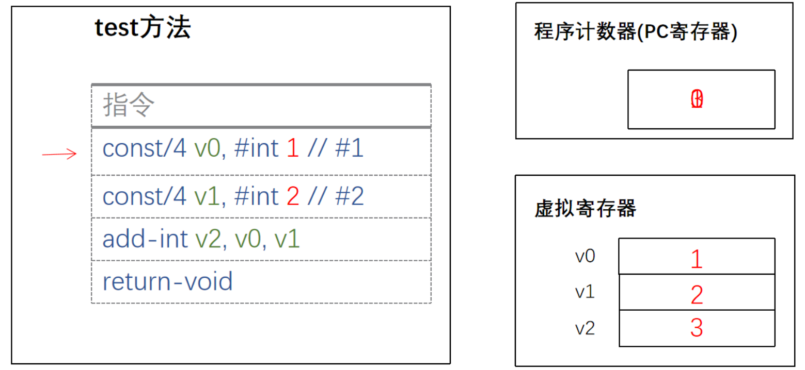

- # 一、介绍
	- 基于寄存器的虚拟机中[[#red]]==**没有操作数栈，但是有很多虚拟寄存器**==。其实和操作数栈相同，[[#red]]==**这些寄存器也存放在运行时栈中，本质上就是一个数组，一块内存区域**==。与JVM相似，在Dalvik VM中每个线程都有自己的PC和调用栈，方法调用的活动记录以帧为单位保存在调用栈上。
- # 二、指令集执行大致流程
  collapsed:: true
	- 
	- 1、遇到第一个指令 把1 存入 虚拟寄存器
	- 2、遇到第二个指令 把2存入虚拟寄存器
	- 3、运算是 把 1，2 发给CPU去计算，运算完 把3返回存入虚拟寄存器
	-
- # 三、总结相当于把 栈式虚拟机 局部变量表 和 操作数栈 合并成一个区域，只用来存储，运算直接交给cpu
	- 少了把数据从局部变量表 和 操作数栈 中移动