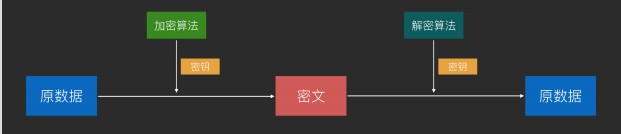

# [[#red]]==加密原理==：
	- 1、通信双⽅使⽤同⼀个密钥
	- 2、加密时，使用加密算法+密钥来加密，得到密文，
	- 3、解密时，使用解密算法 + 同一个秘钥  进行解密  【用的同一个秘钥   算法不同】
	- 
- # [[#red]]==算法==
	- ## DES（废弃）56 位密钥，密钥太短⽽逐渐被弃⽤
	- ## AES（流行）128 位、192 位、256 位密钥， 现在最流⾏
- # 对称加密作⽤
	- 加密通信，防⽌信息在不安全⽹络上被截获后，信息被⼈读取或篡改。
- # [[#red]]==缺点==
	- 密钥泄露：不能在不安全⽹络上传输密钥，⼀旦密钥泄露则加密通信失败