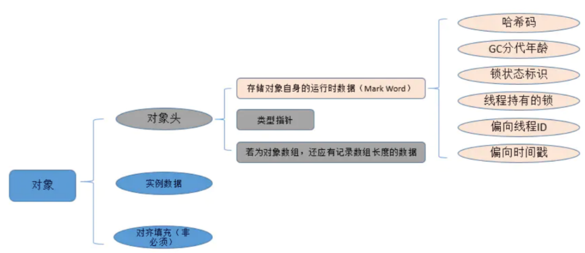
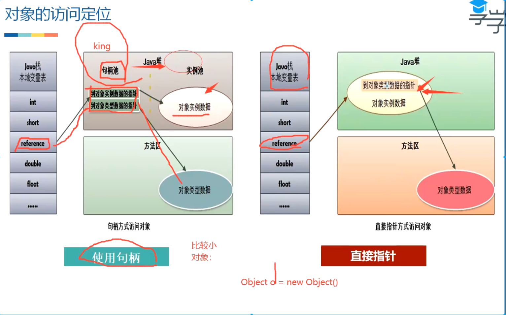

- # 一、[[虚拟机中对象的创建过程]]
- # 二、对象的内存布局
  collapsed:: true
	- 
	- 在HotSpot虚拟机中，对象在内存中存储的布局可以分为3块区域：
	- ## 对象头（Header）
		- 对象头包括两部分信息，第一部分用于存储对象自身的[[#red]]==**运行时数据**==，如哈希码（HashCode）、GC分代年龄、锁状态标志、线程持有的锁、偏向线程ID、偏向时间戳等。
		- 对象头的另外一部分是[[#red]]==**类型指针**==，即对象指向它的类元数据的指针，虚拟机通过这个指针来确定这个对象是哪个类的实例。
		- 如果对象是一个java数组，那么在对象头中还有一块用于**[[#red]]==记录数组长度的数据==**。
	- ## 实例数据（Instance Data）
	- ## 对齐填充（Padding）
		- 第三部分对齐填充并不是必然存在的，也没有特别的含义，它仅仅起着占位符的作用。由于HotSpot VM的自动内存管理系统要求对对象的大小必须是8字节的整数倍。当对象其他数据部分没有对齐时，就需要通过对齐填充来补全。
	-
- # 三、对象的访问定位
  collapsed:: true
	- 建立对象是为了使用对象，我们的Java程序需要通过[[#red]]==**栈上的reference数据来操作堆上的具体对象**==。目前主流的访问方式有使用句柄和直接指针两种。
	- 
	- ## **1、句柄**
		- 如果使用句柄访问的话，那么Java堆中将会划分出一块内存来作为句柄池，reference中存储的就是对象的句柄地址，而[[#red]]==**句柄中包含了对象实例数据与类型数据各自的具体地址信息**==。
	- ## **2、直接指针**
		- 如果使用直接指针访问， reference中存储的直接就是对象地址。
	- ## 方式选择
		- 这两种对象访问方式各有优势，使用句柄来访问的最大好处就是reference中存储的是稳定的句柄地址，在对象被移动（垃圾收集时移动对象是非常普遍的行为）时只会改变句柄中的实例数据指针，而reference本身不需要修改。
		- 使用直接指针访问方式的最大好处就是速度更快，它节省了一次指针定位的时间开销，由于对象的访问在Java中非常频繁，因此这类开销积少成多后也是一项非常可观的执行成本。
		- [[#red]]==**对Sun HotSpot而言**==，它是使用[[#red]]==**直接指针访问方式进行对象访问的**==。
- # 四、[[判断对象的存活算法]]
- # 五、**[[对象的各种引用]]**
- # 六、学习垃圾回收的意义
  collapsed:: true
	- Java与C++等语言最大的技术区别：自动化的垃圾回收机制（GC）
	- 为什么要了解GC和内存分配策略
	- 1、面试需要
	- 2、GC对应用的性能是有影响的；
	- 3、写代码有好处
	- 栈：栈中的生命周期是跟随线程，所以一般不需要关注
	- 堆：堆中的对象是垃圾回收的重点
	- 方法区/元空间：这一块也会发生垃圾回收，不过这块的效率比较低，一般不是我们关注的重点
- # 七、**[[对象的分配策略]]**
- # 八、[[垃圾回收算法]]
- # 九、[[JVM中常见的垃圾收集器]]