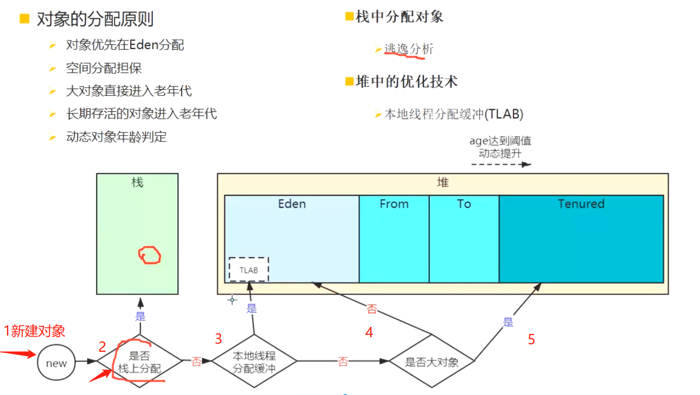

# [[对象分配策略-面试]]
	- 
- # **一、栈上分配**
  collapsed:: true
	- ### 没有逃逸，才可以栈上分配
		- [[#red]]==**即方法中的对象没有发生逃逸**==。
	- ## 逃逸分析的原理：[[#red]]==**分析对象动态作用域**==，
		- 当一个对象在方法中定义后，它可能被外部方法所引用，比如：调用参数传递到其他方法中，这种称之为[[#red]]==**方法逃逸**==
		- 甚至还有可能被外部线程访问到，例如：赋值给其他线程中访问的变量，这个称之为[[#red]]==**线程逃逸**==。
	- [[#red]]==**从不逃逸到方法逃逸到线程逃逸，称之为对象由低到高的不同逃逸程度**==。
		- 如果确定一个对象不会逃逸出线程之外，那么让对象在栈上分配内存可以提高JVM的效率。
		- ### **逃逸分析代码**
		  collapsed:: true
			- ```java
			  public class EscapeAnalysisTest {
			     public static void main(String[] args) throws Exception {
			         long start = System.currentTimeMillis();
			         for (int i = 0; i < 50000000; i++) {
			             allocate();
			        }
			         System.out.println((System.currentTimeMillis() - start) + " ms");
			         Thread.sleep(600000);
			    }
			  
			     static void allocate() {
			         MyObject myObject = new MyObject(2020, 2020.6);
			    }
			  
			     static class MyObject {
			         int a;
			         double b;
			  
			         MyObject(int a, double b) {
			             this.a = a;
			             this.b = b;
			        }
			    }
			  }
			  ```
			- 这段代码在调用的过程中 myboject这个对象属于全局逃逸，JVM可以做栈上分配
			- 然后通过开启和关闭DoEscapeAnalysis开关观察不同。
			- 开启逃逸分析（JVM默认开启）
				- 
			- 查看执行速度
				- 
			- 关闭逃逸分析
				- 
			- 查看执行速度
				- 
		- 测试结果可见，开启逃逸分析对代码的执行性能有很大的影响！那为什么有这个影响？
			- 如果是逃逸分析出来的对象可以在栈上分配的话，那么该对象的生命周期就跟随线程了，就不需要垃圾回收，如果是频繁的调用此方法则可以得到很大的性能提高。
			- 采用了逃逸分析后，满足逃逸的对象在栈上分配
			  collapsed:: true
				- 
				  id:: 64b3c99a-7420-4c41-a1ba-274113093699
			- 逃逸分析，对象都在堆上分配，会频繁触发垃圾回收（垃圾回收会影响系统性能），导致代码运行慢
			  collapsed:: true
				- 
			- **代码验证**
			- 开启GC打印日志
			- -XX:+PrintGC
			- **开启逃逸分析**
				- 
			- 可以看到没有GC日志
			- 关闭逃逸分析
				- 
			- 可以看到关闭了逃逸分析，JVM在频繁的进行垃圾回收（GC），正是这一块的操作导致性能有较大的差别。
- # 二、**对象优先在Eden区分配**
  collapsed:: true
	- 虚拟机参数：
	- -Xms20m
	- -Xmx20m
	- -Xmn10m
	- -XX:+PrintGCDetails
	-
	- -XX:+PrintGCDetails 打印垃圾回收日志，程序退出时输出当前内存的分配情况
	- 注意：新生代初始时就有大小
	- [[#red]]==**大多数情况下，对象在新生代Eden区中分配。当Eden区没有足够空间分配时，虚拟机将发起一次Minor GC。**==
- # **三、大对象直接进入老年代**
  collapsed:: true
	- -Xms20m
	- -Xmx20m
	- -Xmn10m
	- -XX:+PrintGCDetails
	- -XX:PretenureSizeThreshold=4m
	- -XX:+UseSerialGC
	-
	- PretenureSizeThreshold参数只对Serial和ParNew两款收集器有效。
	- [[#red]]==**最典型的大对象是那种很长的字符串以及数组。这样做的目的：1.避免大量内存复制,2.避免提前进行垃圾回收，明明内存有空间进行分配。**==
- # 四、**长期存活对象进入老年代**
  collapsed:: true
	- 如果对象在Eden出生并经过第一次Minor GC后仍然存活，并且能被Survivor容纳的话，将被移动到Survivor空间中，并将对象年龄设为1，对象在Survivor区中每熬过一次 Minor GC，年龄就增加1，当它的年龄增加到一定程度[[#red]]==**(并发的垃圾回收器默认为15),CMS是6时，就会被晋升到老年代中**==。
- # **五、对象年龄动态判定**
  collapsed:: true
	- 为了能更好地适应不同程序的内存状况，虚拟机并不是永远地要求对象的年龄必须达到了MaxTenuringThreshold才能晋升老年代，[[#red]]==**如果在Survivor空间（from和to区）中相同年龄所有对象大小的总和大于Survivor空间的一半，**====**年龄大于或等于该年龄的对象就可以直接进入老年代**==，无须等到MaxTenuringThreshold中要求的年龄
- # 六、**空间分配担保**
  collapsed:: true
	- 1、在发生[[#red]]==**Minor GC（新生代的GC eden from to区）之前**==虚拟机会先检查老年代最大可用的连续空间是否大于新生代所有对象总空间（最坏情况，所有存活），如果这个条件成立，那么Minor GC可以确保是安全的。
	- 2、如果不成立，则虚拟机会查看HandlePromotionFailure设置值[[#red]]==**是否允许担保失败**==。
		- 如果允许，那么会继续检查老年代最大可用的连续空间是否大于历次晋升到老年代对象的平均大小，如果大于，将尝试着进行一次Minor GC，尽管这次Minor GC是有风险的，[[#red]]==**如果担保失败则会进行一次Full GC（新生gc 老年代gc 方法区gc）**==；
		- 如果小于，或者HandlePromotionFailure设置不允许冒险，那这时也要改为进行一次Full GC。
	- （形象理解，贷款担保人，你贷款（新生代）还不上，找你担保人爸妈还（老年代））
- # 七、**本地线程分配缓冲** **(TLAB)**
	- 具体见对象创建的章节
-