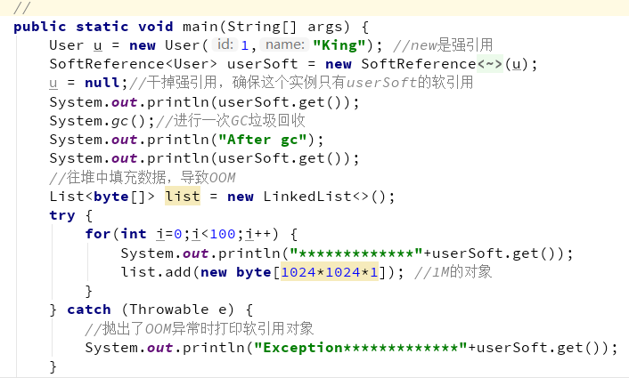
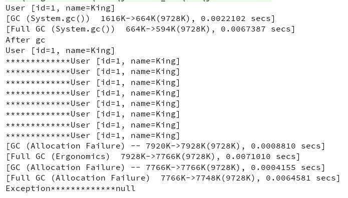
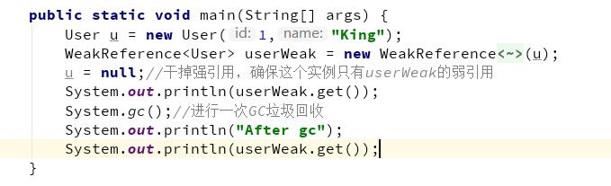
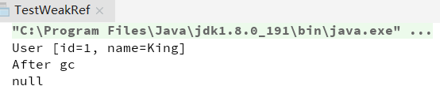

## **强引用**
	- 一般的Object obj[[#red]]==**=**== new Object() ，就**[[#red]]==属于强引用==**。在任何情况下，[[#red]]==**只有有强引用关联（与根可达）还在，垃圾回收器就永远不会回收掉被引用的对象**==。
- ## **软引用 SoftReference**
  collapsed:: true
	- 一些有用但是并非必需，用软引用关联的对象，系统[[#red]]==**将要发生内存溢出（OuyOfMemory）之前，这些对象就会被回收**==（如果这次回收后还是没有足够的空间，才会抛出内存溢出）。参见代码：
	- ==**可以通过 get() 获得引⽤对象**==
	- VM参数 -Xms10m  -Xmx10m -XX:+PrintGC
	- 代码
	  collapsed:: true
		- 
		-
	- 运行结果
	  collapsed:: true
		- 
	- 例如，一个程序用来处理用户提供的图片。如果将所有图片读入内存，这样虽然可以很快的打开图片，但内存空间使用巨大，一些使用较少的图片浪费内存空间，需要手动从内存中移除。如果每次打开图片都从磁盘文件中读取到内存再显示出来，虽然内存占用较少，但一些经常使用的图片每次打开都要访问磁盘，代价巨大。这个时候就可以用软引用构建缓存。
- ## **弱引用 WeakReference**
  collapsed:: true
	- 一些有用（程度比软引用更低）但是并非必需，用弱引用关联的对象，[[#red]]==**只能生存到下一次垃圾回收之前，GC发生时，不管内存够不够，都会被回收。**==
	- ==**可以通过 get() 获得引⽤对象**==
	- 参看代码：
	  collapsed:: true
		- 
	- 结果
	  collapsed:: true
		- 
	- 软引用 SoftReference和弱引用 WeakReference，可以用在内存资源紧张的情况下以及创建不是很重要的数据缓存。当系统内存不足的时候，缓存中的内容是可以被释放的。
	- 实际运用（WeakHashMap、ThreadLocal）
- ## **虚引用 PhantomReference**
	- 幽灵引用，最弱（随时会被回收掉）
	- **[[#red]]==垃圾回收的时候收到一个通知==**，[[#red]]==**就是为了监控垃圾回收器是否正常工作**==
	- **==不能通过 get() 获得引⽤对象==**
- # [[注意这三个弱一点的引用相同功能-gc前将弱引用本身加载队列里]]：