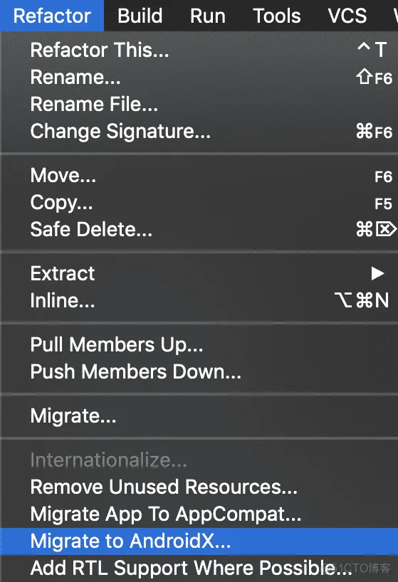

- # 方案一：使用 Android studio 自动迁移工具
	- ## 使用
	  collapsed:: true
		- 我们在 Android 3.2 稳定版中加入了 "Migrate to AndroidX" 选项，方便大家迁移。您可以在 "Refactor" 菜单中找到 "Migrate to AndroidX" 选项:
		- {:height 826, :width 559}
		- 这个按钮的功能，就是迁移源码中的依赖到 AndroidX，理想情况下，它会帮您完成绝大部分工作。
	- ## 缺点：
	  collapsed:: true
		- 1、不能处理xml
		- 2、不能处理混淆文件
- # 方案二：使用自动迁移脚本
	- [官方社区bash脚本](https://github.com/smithasanehalli/androidx-migration)
	  collapsed:: true
		- 使用：
		- 其中之一便是使用 bash 脚本中的 grep 和 sed 命令。在介绍如何使用脚本进行迁移之前，我们要特别感谢 Dan Lew 为我们提供了这个工具。
		- 您可以通过短链接: ​ ​goo.gle/androidx-migration-script​​ 去到脚本源码的 GitHub 页面，在那里您也可以找到更多的社区贡献内容。
		  脚本的工作原理并不复杂，如下所示，您需要手动做的是配置好类型映射表 "androidx-class-mapping.csv" 和工程路径地址，而脚本中真正有效的部分，就只是 grep 命令后跟着一个 sed 命令来替换工程中导入的包名:
- # 方案三：人工迁移
	- 另一个选择，是人工进行迁移工作。在 ​ ​迁移到 AndroidX​​ 中，您能看到前文提到过的 Support Library 与 AndroidX 的类型映射关系表(https://developer.android.google.cn/jetpack/androidx/migrate?hl=zh-cn)。如下图，有了这个映射关系表，您就可以根据具体情况进行替换:
-