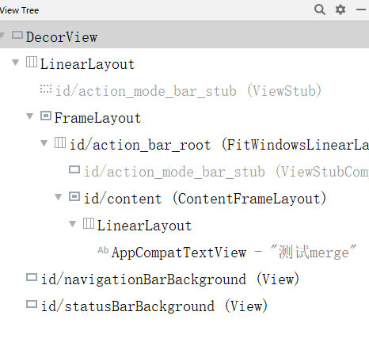

# 使用merge标签
	- 目的就是让布局合法，但是不占有层级
	- ## 背景代码
	  collapsed:: true
		- 当我们有一些布局元素需要被多处使用时，这时候我们会考虑将其抽取成一个单独的布局文件。在需要使用的地方通过include 加载。
		- ```xml
		  <?xml version="1.0" encoding="utf-8"?>
		  <LinearLayout xmlns:android="http://schemas.android.com/apk/res/android"
		      android:layout_width="match_parent"
		      android:layout_height="match_parent"
		      android:background="#000000"
		      android:orientation="vertical">
		      <!-- include layout_merge布局 -->
		      <include layout="@layout/layout_merge" />
		  </LinearLayout>
		      <!-- layout_merge -->
		      
		      <?xml version="1.0" encoding="utf-8"?>
		  <LinearLayout xmlns:android="http://schemas.android.com/apk/res/android"
		  android:layout_width="wrap_content"
		  android:layout_height="wrap_content"
		  android:orientation="vertical">
		      <TextView
		          android:background="#ffffff"
		          android:layout_width="wrap_content"
		          android:layout_height="wrap_content"
		          android:text="测试merge" />
		  </LinearLayout>
		  ```
	- 这时候我们的主布局文件是垂直的LinearLayout，include的 "layout_merge" 也是垂直的LinearLayout，这时候include的布局中使用的LinearLayout就没意义了，使用的话反而减慢你的UI表现。这时可以使用merge标签优化。
	- ## 使用merge
	  collapsed:: true
		- ```java
		  <!-- layout_merge -->
		  <merge xmlns:android="http://schemas.android.com/apk/res/android">
		      <TextView
		          android:background="#ffffff"
		          android:layout_width="wrap_content"
		          android:layout_height="wrap_content"
		          android:text="测试merge" />
		  </merge>
		  ```
	- ## 效果
	  collapsed:: true
		- 修改为merge后，通过LayoutInspector能够发现，include的布局中TextView直接被加入到父布局中。
		- 
- # 使用ViewStub 标签
  collapsed:: true
	- [[#red]]==**当我们布局中存在一个View/ViewGroup，在某个特定时刻才需要他的展示时**==，可能会有同学把这个元素在xml中定义为invisible或者gone，在需要显示时再设置为visible可见。比如在登陆时，如果密码错误在密码输入框上显示提示。
	- >invisible
	  view设置为invisible时，view在layout布局文件中会占用位置，但是view为不可见，该view还是会创建对象，会被初始化，会占用资源。
	  gone
	  view设置gone时，view在layout布局文件中不占用位置，但是该view还是会创建对象，会被初始化，会占用资源。
	- 如果view不一定会显示，此时可以使用 ViewStub 来包裹此View 以避免不需要显示view但是又需要加载view消耗资源。
	- viewstub是一个轻量级的view，它不可见，不用占用资源，只有设置viewstub为visible或者调用其inflater()方法时，其对应的布局文件才会被初始化。
	- ## 使用
		- ```xml
		  <?xml version="1.0" encoding="utf-8"?>
		  <LinearLayout xmlns:android="http://schemas.android.com/apk/res/android"
		      android:layout_width="match_parent"
		      android:layout_height="match_parent"
		      android:background="#000000"
		      android:orientation="vertical">
		      <ViewStub
		          android:id="@+id/viewStub"
		          android:layout_width="600dp"
		          android:layout_height="500dp"
		          android:inflatedId="@+id/textView"
		          android:layout="@layout/layout_viewstub" />
		  </LinearLayout>
		      <!-- layout_viewstub -->
		      <?xml version="1.0" encoding="utf-8"?>
		  <TextView xmlns:android="http://schemas.android.com/apk/res/android"
		      android:layout_width="wrap_content"
		      android:layout_height="wrap_content"
		      android:background="#ffffff"
		      android:text="测试viewStub" />
		  ```
	- 加载viewStub后，可以通过inflatedId 找到layout_viewstub 中的根View。