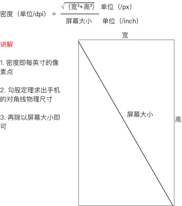

# 1、屏幕尺寸-屏幕的对角线的长度
	- 屏幕尺寸指屏幕的对角线的长度，单位是英寸，1英寸=2.54厘米
	- >比如常见的屏幕尺寸有2.4、2.8、3.5、3.7、4.2、5.0、5.5、6.0等
- # 2、屏幕分辨率
  collapsed:: true
	- 屏幕分辨率是指在横纵向上的像素点数
	- 单位是px，1px=1个像素点。
	- 一般以纵向像素*横向像素，如1960*1080。表示宽度方向上有1080个像素点，在高度方向上有1920个像素点
	- >单位：px（pixel），1px=1像素点
	  Android手机常见的分辨率：320x480、480x800、720x1280、1080x1920\
	  UI设计师的设计图会以px作为统一的计量单位
- # 3、屏幕像素密度
  collapsed:: true
	- ## 概念
		- 屏幕像素密度是指每英寸上的像素点数，单位是dpi，即“dot per inch”的缩写
		- >假设设备内每英寸有160个像素，那么该设备的屏幕像素密度=160dpi
	- ## 常见像素密度
		- 
		- 为简便起见，Android 将所有屏幕密度分组为六种通用密度： 低、中、高、超高、超超高和超超超高。
		- ldpi（低）~ 120dpi
		  mdpi（中）~ 160dpi
		  hdpi（高）~ 240dpi
		  xhdpi（超高）~ 320dpi
		  xxhdpi（超超高） ~ 480dpi
		  xxxhdpi（超超超高）~ 640dpi
- # 4、屏幕尺寸、分辨率、像素密度三者关系
  collapsed:: true
	- 一部手机的分辨率是宽x高，屏幕大小是以寸为单位，那么三者的关系是
	- 
	- 例如
	- 
- # 5、密度无关像素dp/dpi
  collapsed:: true
	- density-independent pixel，叫dp或dip，与终端上的实际物理像素点无关。可以[[#red]]==**保证在不同屏幕像素密度的设备上显示相同的效果**==
	- >Android开发时用dp而不是px单位设置图片大小，是Android特有的单位
	  场景：假如同样都是画一条长度是屏幕一半的线，如果使用px作为计量单位，那么在480x800分
	  辨率手机上设置应为240px；在320x480的手机上应设置为160px，二者设置就不同了；如果使用
	  dp为单位，在这两种分辨率下，160dp都显示为屏幕一半的长度。
	- ## dp与px的转换
		- px = dp * (dpi / 160)
	- 
	- 在Android中，规定以160dpi（即屏幕分辨率为320x480）为基准：1dp=1px
- # 6、独立比例像素sp
  collapsed:: true
	- sp，即scale-independent pixels，与dp类似，但是可以根据文字大小首选项进行放缩，是设置字体大
	  小的御用单位。
- # 7、文件夹对应像素密度-屏幕适配
  collapsed:: true
	- 
	- 对于5种主流的像素密度(mdpi,hdpi,xhdpi,xxhdpi和xxxdpi)应按照2:3:4:6:8的比例进行缩放。例如一个启动图片ic_launcher.png,它在各个像素密度文件夹下大小为：
		- ldpi（低）36*36 (0.75x)
		  mdpi（中）48*48 (1x)
		  hdpi（高）72*72 (1.5x)
		  xhdpi（超高）96*96 (2x)
		  xxhdpi（超超高）144*144 (3x)
		  xxxhdpi（超超超高）192*192 (4x)
	- [[Android SDK加载图片流程]]：