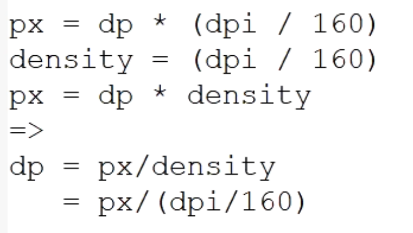
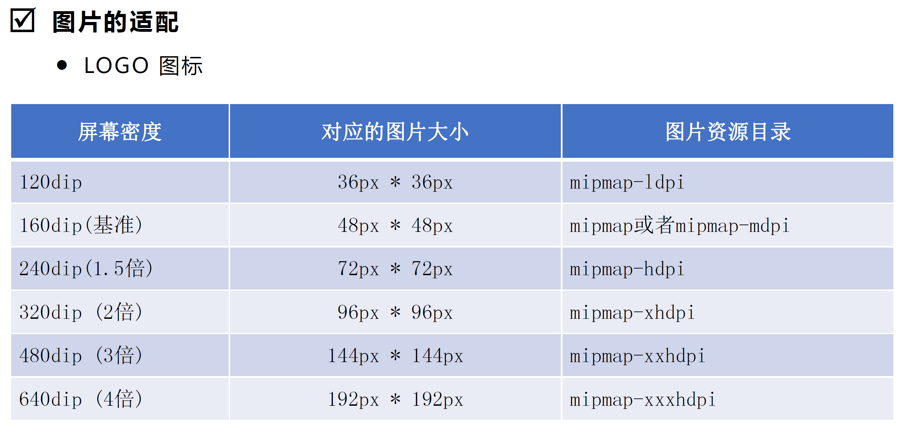

# [[屏幕适配常见概念]]
- # 1、日常开发注意的适配#card
	- 1、布局中单位使用dp，文字使用sp
	- 2、容器使用：相对布局RelativeLayout，线性布局LinearLayout，约束性布局。不使用绝对布局。
	- 3、属性使用wrap_content、match_parent、权重
	- 4、图片适配
		- 某些背景图可以使用.9，部分拉伸
		- 图片放入对应屏幕密度的文件夹下
- # 2、常见适配方案#card
	- ## 1、使用[[#red]]==限定符==文件夹：最小宽度限定符、屏幕方向限定符、多套Layout适配
	- ## 2、[[#red]]==百分比适配==：以某一分辨率为基准，生成所有分辨率对应像素列表。会增加包体积
	- ## 3、[[#red]]==头条适配方案==：根据手机分辨率和
		- ## 背景
			- 1、我们一般按照宽度适配，高度可滑动的。假如设计师UI稿按照宽度360dp设计的。
			- 2、而1080p手机真实宽度是392dp。直接使用UI设计稿的标注就会有问题。
				- 1080的手机屏幕宽度dp = 1080px/（440/160）=  392dp。
		- ## 头条原理
			- 1、根据px-dp转换公式
				- px = dp*（dpi/160）
				                   density = dpi/160
				  px = dp * density
				- [[#red]]==**(这里的density 是指的手机的屏幕密度，由系统提供，不同的手机的density 可能不同)**==
			- 2、所以根据设计稿360dp宽度。计算对应的屏幕密度。再篡改系统的density 来达到适配的目的
			- 3、px = dp*density。 当前手机宽度像素固定1080px。要使用设计稿dp固定 360dp。计算targetDensity
				- 360dp设计稿： targetDensity = 1080px/ 360dp
			- 4、density = dpi/160、targetDensity计算出来后。
				- 360dp设计稿：targetDpi = 160* targetDensity
			- 5、进行替换系统就行。
- # 6、为什么用了dp,还会产生适配问题？#card
	- 因为设计师是按照屏幕宽度360dp来设计的
	- 但是实际手机宽度很多不同，比如
		- 1080的手机屏幕宽度dp = 1080/（440/160）
		                                        =  392
		  dp 不同的屏幕 显示效果是不同
	- 
- # 其他
  collapsed:: true
	- # 2、布局layout的适配
		- ## 最小宽度限定符layout-sw600dp
		  collapsed:: true
			- 最小宽度限定符指定屏幕两侧的最小尺寸，而不考虑设备当前的屏幕方向，因此这是一种指定布局可用
			  的整体屏幕尺寸的简单方法。且使用Dp为单位
			- 示例
				- ```java
				  res/layout/main_activity.xml # For handsets (smaller than 600dp
				  available width)
				  res/layout-sw600dp/main_activity.xml # For 7” tablets (600dp wide and
				  bigger)
				  ```
		- ## 使用屏幕方向限定符
		- ## 多套layout适配
	- # 3、图片适配
	  collapsed:: true
		- ## 某些背景可以使用.9.png图片，部分拉伸
		- ## 图片放入对应的文件夹
		  collapsed:: true
			- 
	- # 5、百分比适配，根据不同屏幕尺寸，生成对应像素列表
	  collapsed:: true
		- 1. [[#red]]==**以某一分辨率为基准，生成所有分辨率对应像素数列表**==
		  2. 将生成像素数列表存放在res目录下对应的values文件下
		  3. 根据UI设计师给出设计图上的尺寸，找到对应像素数的单位，然后设置给控件即可
		- ## 特点
			- 每增加一个屏幕分辨率就需要新生成一套。增加包体积
	- # 4、[[今日头条适配方案]]