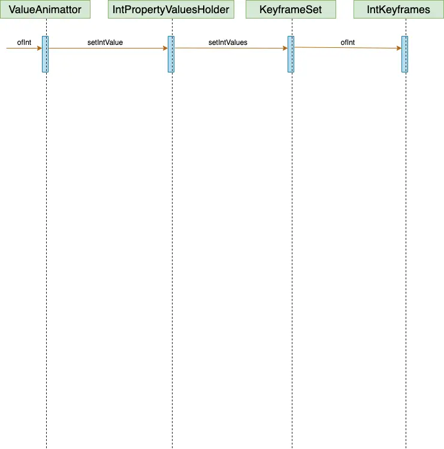

title:: 属性动画 ValueAnimator.ofInt运行原理

	-
- # 前言
  collapsed:: true
	- ```
	  val valueAnimator = ValueAnimator.ofInt(0, 100,300).apply {
	              duration = 1000
	              interpolator = LinearInterpolator()
	              addUpdateListener {
	              }
	          }
	   valueAnimator.start()
	  ```
	- 问题：
	- 0-100 中经过的时间到底是0.5s还是0.33s？
	  ValueAnimator.ofInt(0, 300)有区别吗？
- # 源码解析
	- 那我们先从ValueAnimator.ofInt()开始分析
	  collapsed:: true
		- ```
		  //ValueAnimator
		  public static ValueAnimator ofInt(int... values) {
		          ValueAnimator anim = new ValueAnimator();
		          anim.setIntValues(values);
		          return anim;
		  }
		  ```
	- 我们重点是要查看values的去向,进入anim.setFloatValues(value)方法
	  collapsed:: true
		- ```
		  //ValueAnimator
		  public void setIntValues(int... values) {
		     if (values == null || values.length == 0) {
		          return;
		      }
		      if (mValues == null || mValues.length == 0) {
		          setValues(PropertyValuesHolder.ofInt("", values));
		      } else {
		          PropertyValuesHolder valuesHolder = mValues[0];
		          valuesHolder.setIntValues(values);
		      }
		      // New property/values/target should cause re-initialization prior to starting
		      mInitialized = false;
		  } 
		  ```
	- mValues为null，执行setValues(PropertyValuesHolder.ofInt("", values));最终调用了IntPropertyValuesHolder的构造方法
	  collapsed:: true
		- ```
		  //IntPropertyValuesHolder
		  public IntPropertyValuesHolder(String propertyName, int... values) {
		         super(propertyName);
		         setIntValues(values);
		  }
		  ```
		- ```
		  //IntPropertyValuesHolder
		  public void setIntValues(int... values) {
		        mValueType = int.class;
		        mKeyframes = KeyframeSet.ofInt(values);
		    }
		  ```
	- 这里会生成KeyframeSet
	  collapsed:: true
		- ```
		  //KeyframeSet
		  public static KeyframeSet ofInt(int... values) {
		     int numKeyframes = values.length;
		     IntKeyframe keyframes[] = new IntKeyframe[Math.max(numKeyframes,2)];
		     if (numKeyframes == 1) {
		         keyframes[0] = (IntKeyframe) Keyframe.ofInt(0f);
		         keyframes[1] = (IntKeyframe) Keyframe.ofInt(1f, values[0]);
		     } else {
		         keyframes[0] = (IntKeyframe) Keyframe.ofInt(0f, values[0]);
		         for (int i = 1; i < numKeyframes; ++i) {
		             keyframes[i] =
		                     (IntKeyframe) Keyframe.ofInt((float) i / (numKeyframes - 1), values[i]);
		         }
		     }
		     return new IntKeyframeSet(keyframes);
		  }
		  ```
	- 这里说明了我们在可变参数传一个的时候为什么动画是从0开始，原来在内部在初始化的时候进行了处理,初始化操作就到这里
	  collapsed:: true
		- ```
		  public static Keyframe ofInt(float fraction, int value) {
		     return new IntKeyframe(fraction, value);
		  }
		  
		  /**
		  * Internal subclass used when the keyframe value is of type int.
		  */
		  static class IntKeyframe extends Keyframe {
		  
		     /**
		      * The value of the animation at the time mFraction.
		      */
		     int mValue;
		  
		     IntKeyframe(float fraction, int value) {
		         mFraction = fraction;
		         mValue = value;
		         mValueType = int.class;
		         mHasValue = true;
		     }
		  }
		  ```
	- 在创建每个关键帧时，传入了两个参数，第一个参数就是表示这个关键帧在整个区域之间的位置，第二参数就是它表示的值是多少。看上面的代码， i 表示的是第几帧，numKeyframes 表示的是关键帧的总数量，所以 i/(numKeyframes - 1) 也就是表示这一系列关键帧是按等比例来分配的。
	- 到这里对我们前面提出的问题，还是没有解决？
	  只知道
	  0是第一帧(fraction = 0)
	  100是第二帧(fraction = 1/2)
	  300是第三帧(fraction = 1 )
	- ```
	  //IntKeyframeSet 
	  public IntKeyframeSet(IntKeyframe... keyframes) {
	        super(keyframes);
	   }
	  ```
	- ```java
	  public class KeyframeSet implements Keyframes {
	  
	  int mNumKeyframes;
	  
	  Keyframe mFirstKeyframe;
	  Keyframe mLastKeyframe;
	  TimeInterpolator mInterpolator; // only used in the 2-keyframe case
	  List<Keyframe> mKeyframes; // only used when there are not 2 keyframes
	  TypeEvaluator mEvaluator;
	  
	  public KeyframeSet(Keyframe... keyframes) {
	      mNumKeyframes = keyframes.length;
	      // immutable list
	      mKeyframes = Arrays.asList(keyframes);
	      mFirstKeyframe = keyframes[0];
	      mLastKeyframe = keyframes[mNumKeyframes - 1];
	      mInterpolator = mLastKeyframe.getInterpolator();
	  }
	  ```
	- 总结一下
	  collapsed:: true
		- ValueAnimator.ofInt时序图
			- 
	- 现在ValueAnimator#mValues持有PropertyValuesHolder
	  PropertyValuesHolder#mKeyframes持有IntKeyframeSet
	  IntKeyframeSet#mKeyframes持有IntKeyframe
	  属性动画中什么时候用到了PropertyValuesHolder#mValues
	  那现在我们从入手valueAnimator.start()，看看什么时候用到了mValues
	- ## ValueAnimator.start()源码解析
		- 只能从animator.start()中去寻找答案了
		  collapsed:: true
		  ** ps:本次分析的是ValueAnimator，不是ObjectAnimator**
			- ```
			  @Override
			      public void start() {
			          start(false);
			      }
			      
			  	private void start(boolean playBackwards) {
			          if (Looper.myLooper() == null) {
			              throw new AndroidRuntimeException("Animators may only be run on Looper threads");
			          }
			          mReversing = playBackwards;
			          mSelfPulse = !mSuppressSelfPulseRequested;
			          // Special case: reversing from seek-to-0 should act as if not seeked at all.
			          if (playBackwards && mSeekFraction != -1 && mSeekFraction != 0) {
			              if (mRepeatCount == INFINITE) {
			                  // Calculate the fraction of the current iteration.
			                  float fraction = (float) (mSeekFraction - Math.floor(mSeekFraction));
			                  mSeekFraction = 1 - fraction;
			              } else {
			                  mSeekFraction = 1 + mRepeatCount - mSeekFraction;
			              }
			          }
			          mStarted = true;
			          mPaused = false;
			          mRunning = false;
			          mAnimationEndRequested = false;
			          // Resets mLastFrameTime when start() is called, so that if the animation was running,
			          // calling start() would put the animation in the
			          // started-but-not-yet-reached-the-first-frame phase.
			          mLastFrameTime = -1;
			          mFirstFrameTime = -1;
			          mStartTime = -1;
			          addAnimationCallback(0);
			  
			          if (mStartDelay == 0 || mSeekFraction >= 0 || mReversing) {
			              // If there's no start delay, init the animation and notify start listeners right away
			              // to be consistent with the previous behavior. Otherwise, postpone this until the first
			              // frame after the start delay.
			              startAnimation();
			              if (mSeekFraction == -1) {
			                  // No seek, start at play time 0. Note that the reason we are not using fraction 0
			                  // is because for animations with 0 duration, we want to be consistent with pre-N
			                  // behavior: skip to the final value immediately.
			                  setCurrentPlayTime(0);
			              } else {
			                  setCurrentFraction(mSeekFraction);
			              }
			          }
			      }
			  ```
		- 调用了内部的 start(boolean) 方法，前面无外乎就是一些变量的初始化，然后好像调用了很多方法，我们知道AnimationHandler是统一处理属性动画的，那么就找和AnimationHandler相关的逻辑。
		- ok找到了，在addAnimationCallback(0)中，我们找到了和AnimationHandler相关的逻辑，来看看：
			- ```
			  private void addAnimationCallback(long delay) {
			         if (!mSelfPulse) {
			             return;
			         }
			         getAnimationHandler().addAnimationFrameCallback(this, delay);
			  }
			  ```
			- ```
			   public void addAnimationFrameCallback(final AnimationFrameCallback callback, long delay) {
			   		/**
			   		* 重点
			   		*/
			          if (mAnimationCallbacks.size() == 0) {
			              getProvider().postFrameCallback(mFrameCallback);
			          }
			          if (!mAnimationCallbacks.contains(callback)) {
			              mAnimationCallbacks.add(callback);
			          }
			  
			          if (delay > 0) {
			              mDelayedCallbackStartTime.put(callback, (SystemClock.uptimeMillis() + delay));
			          }
			      }
			  ```
			- ```
			  /ValueAnimator
			  private AnimationFrameCallbackProvider getProvider() {
			          if (mProvider == null) {
			              mProvider = new MyFrameCallbackProvider();
			          }
			          return mProvider;
			   }
			  ```
			-
	-