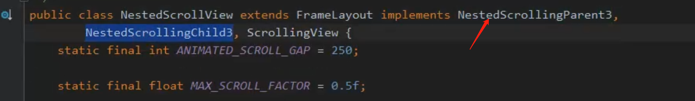
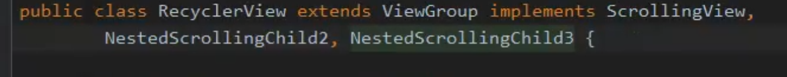

## 嵌套滑动2个角色参与才可以的
	- 1、父亲（NestedScrollView，它可以充当父亲也可以充当孩子，看他的实现类）
		- 
	- 2、孩子(RecyclerView，实现了child2 child3)
		- 
	- ## 但是嵌套滑动主动者是孩子，由孩子触发的
- ## 嵌套滑动的三个版本
	- 1、
- ## NestedScrollingChild2比child1 多增加了类型
  collapsed:: true
	- touch-手指滑动
	- non_touch-惯性滑动
- ## [[嵌套滑动流程图]]
- # [[模仿淘宝首页滑动]]