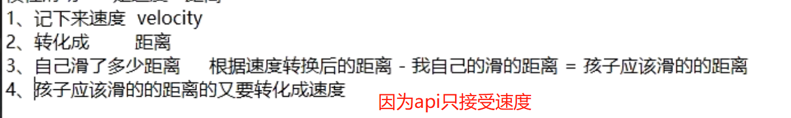

- [[嵌套滑动流程图]]
- > [[#red]]==**这里的子view为最里层的recyclerview.父view为 NestedScrollview**==
- 1、嵌套滑动主动者是孩子，由孩子触发的，所以子view先得开启支持嵌套滑动
  collapsed:: true
	- 子view初始化时，调用setNestedScrollingEnabled。开启支持嵌套滑动
	- recyclerView初始化时，默认打开。这边打log可以看到
		- ```java
		      /**
		       * 开启支持嵌套滑动
		       * @param enabled true to enable nested scrolling, false to disable
		       *
		       */
		      @Override
		      public void setNestedScrollingEnabled(boolean enabled) {
		          Log.e("RecyclerViewNestedLog", "setNestedScrollingEnabled");
		          super.setNestedScrollingEnabled(enabled);
		      }
		  ```
- > onTouchevent触发时，Action_Down事件触发就开始下边
- 2、子view走开始滑动的回调[[#red]]==**startNestedScroll**==：逐层向上找到第一个支持嵌套滑动的父view。
  collapsed:: true
	- ```java
	      // axes是滑动的方向
	      @Override
	      public boolean startNestedScroll(int axes) {
	          Log.e("RecyclerViewNestedLog", "startNestedScroll");
	          return super.startNestedScroll(axes);
	      }
	  ```
	- RecyclerView里是将嵌套滑动封装成了help
	  collapsed:: true
		- ```java
		      @Override
		      public boolean startNestedScroll(int axes) {
		          return getScrollingChildHelper().startNestedScroll(axes);
		      }
		  ```
	- NestedScrollingChildHelper。[[#red]]==**嵌套滑动都是通过这个帮助类实现的**==
	  collapsed:: true
		- ```java
		      /**
		       * Start a new nested scroll for this view.
		       *
		       * <p>This is a delegate method. Call it from your {@link android.view.View View} subclass
		       * method/{@link androidx.core.view.NestedScrollingChild} interface method with the same
		       * signature to implement the standard policy.</p>
		       *
		       * @param axes Supported nested scroll axes.
		       *             See {@link androidx.core.view.NestedScrollingChild#startNestedScroll(int)}.
		       * @return true if a cooperating parent view was found and nested scrolling started successfully
		       */
		      public boolean startNestedScroll(@ScrollAxis int axes) {
		          return startNestedScroll(axes, TYPE_TOUCH);
		      }
		      /**
		       * Start a new nested scroll for this view.
		       *
		       * <p>This is a delegate method. Call it from your {@link android.view.View View} subclass
		       * method/{@link androidx.core.view.NestedScrollingChild2} interface method with the same
		       * signature to implement the standard policy.</p>
		       *
		       * @param axes Supported nested scroll axes.
		       *             See {@link androidx.core.view.NestedScrollingChild2#startNestedScroll(int,
		       *             int)}.
		       * @return true if a cooperating parent view was found and nested scrolling started successfully
		       */
		      public boolean startNestedScroll(@ScrollAxis int axes, @NestedScrollType int type) {
		          if (hasNestedScrollingParent(type)) {
		              // Already in progress
		              return true;
		          }
		          // 判断RecyclerView是否打开了嵌套滑动
		          if (isNestedScrollingEnabled()) {
		              ViewParent p = mView.getParent();
		              View child = mView;
		              while (p != null) {
		                  if (ViewParentCompat.onStartNestedScroll(p, child, mView, axes, type)) {
		                      setNestedScrollingParentForType(type, p);
		                      ViewParentCompat.onNestedScrollAccepted(p, child, mView, axes, type);
		                      return true;
		                  }
		                  if (p instanceof View) {
		                      child = (View) p;
		                  }
		                  p = p.getParent();
		              }
		          }
		          return false;
		      }
		  ```
	- 逐层向上找到第一个支持嵌套滑动的父view。就是需要继承嵌套滑动那个3个类NestedScrollingParent3
	- 这里看流程图，逐层问父view是否支持嵌套滑动，会回调父view的[[#red]]==**onStartNestedScroll**==方法
	- 走NestedScrollview的onStartNestedScroll方法。看他只支持纵向滑动
		- ```java
		     // axes 是滑动方向 
		     @Override
		      public boolean onStartNestedScroll(@NonNull View child, @NonNull View target, int axes,
		              int type) {
		          return (axes & ViewCompat.SCROLL_AXIS_VERTICAL) != 0;
		      }
		  ```
	- ### 支持的话父view调用 [[#red]]==**onNestedScrollAccepted**==。设置找到了
- > 下边开始Action_move事件的。代码回调
- > move的时候，我要父亲能滑动的时候，先让她滑动，它滑不动了。我再滑动
- 3、[[#red]]==**重点**==子view滑动前，调用dispatchNestedPreScroll，先问父亲能不能滑，父view回调onNestedPreScroll。去处理自己能不能滑动
	- 子view的dispatchNestedPreScroll
	  collapsed:: true
		- ```java
		      @Override
		      public boolean dispatchNestedPreScroll(int dx, int dy, int[] consumed, int[] offsetInWindow) {
		          Log.e("RecyclerViewNestedLog", "dispatchNestedPreScroll");
		          return super.dispatchNestedPreScroll(dx, dy, consumed, offsetInWindow);
		      }
		  ```
	- 会调用到NestedScrollView的onNestedPreScroll。因为NestedScrollView即可以当孩子也可以当父亲（看实现嵌套的接口）。它这个函数。还是去问他的父亲。我们淘宝首页滑动。明确知道布局里它就是父亲。所以我们重写这个方法。直接处理。不用再让NestedScrollView问他的父亲
	- onNestedPreScroll源码
	  collapsed:: true
		- ```java
		      @Override
		      public void onNestedPreScroll(@NonNull View target, int dx, int dy, @NonNull int[] consumed) {
		          onNestedPreScroll(target, dx, dy, consumed, ViewCompat.TYPE_TOUCH);
		      }
		      @Override
		      public void onNestedPreScroll(@NonNull View target, int dx, int dy, @NonNull int[] consumed,
		              int type) {
		          dispatchNestedPreScroll(dx, dy, consumed, null, type);
		      }
		  ```
	- 直接重写处理。我能滑动我先滑动。不能滑动再让子view滑动
	  collapsed:: true
		- ```java
		      /**
		       *  子view 让我先滑动。我划不动它再滑
		       * @param target View that initiated the nested scroll
		       * @param dx Horizontal scroll distance in pixels
		       * @param dy Vertical scroll distance in pixels
		       * @param consumed Output. The horizontal and vertical scroll distance consumed by this parent
		       *                 父亲消费的距离。消费完后剩下的 子view再滑动。这里 数组 0为x 1为y
		       * @param type the type of input which cause this scroll event
		       */
		      @Override
		      public void onNestedPreScroll(@NonNull View target, int dx, int dy, @NonNull int[] consumed, int type) {
		          Log.i("NestedScrollLayout", getScrollY()+"::onNestedPreScroll::"+topView.getMeasuredHeight());
		          // 向上滑动。若当前topview可见，需要将topview滑动至不可见。即吸顶的时候我就不滑动了
		          boolean hideTop = dy > 0 && getScrollY() < topView.getMeasuredHeight();
		          if (hideTop) {
		              // 滑动我自己
		              scrollBy(0, dy);
		              // 消费掉我滑动的距离，省的子view在我滑动的时候，它也滑动
		              consumed[1] = dy;
		          }
		      }
		  ```
	- 父亲滑动完了，move事件还有就走流程图第9 10 步。子view自己滑动
- > [[#red]]==**以上手动嵌套滑动+吸顶处理完毕了。下边看惯性滑动**==
- 4、下边处理惯性滑动，惯性滑动不属于嵌套滑动里的。嵌套滑动是父亲带着孩子一起滑动
	- 4-1、惯性滑动在父亲里叫fling.传入一个速度
	  collapsed:: true
		- ```java
		      /**
		       * 惯性滑动的时候回调
		       * @param velocityY The initial velocity in the Y direction. Positive
		       *                  numbers mean that the finger/cursor is moving down the screen,
		       *                  which means we want to scroll towards the top.
		       */
		      @Override
		      public void fling(int velocityY) {
		          super.fling(velocityY);
		          if (velocityY <= 0) {
		              this.velocityY = 0;
		          } else {
		              // 记录惯性滑动的速度
		              isStartFling = true;
		              this.velocityY = velocityY;
		          }
		      }
		  
		  ```
	- 4-2、 
	- [[速度根据阻尼转换距离]]：
-
-
- [[完整嵌套滑动+吸顶+惯性的NestedScrollView]]