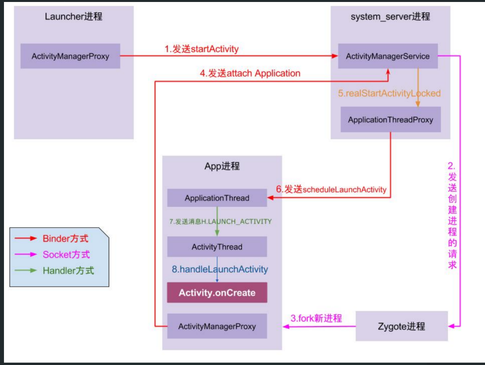

- # 1、序列化
	- 将==数据结构或对象==转换成[[#red]]==二进制串==的过程。
- # 2、反序列化
	- 将在序列化过程中所生成的[[#red]]==二进制串==转换成==数据结构或者对象==的过程
- # 3、Activity之间用intent传递为啥用序列化？
  collapsed:: true
	- 
	- Intent在启动其他组件时，会离开当前应用程序进程，进入ActivityManagerService进程（intent.prepareToLeaveProcess()），
	- 这也就意味着，Intent所携带的数据要能够在不同进程间传输。
	- 首先我们知道，Android是基于Linux系统，不同进程之间的java对象是无法传输，
	- 所以我们此处要对对象进行序列化，从而实现对象在 应用程序进程 和 ActivityManagerService进程 之间传输。
- # 4、序列化/反序列化场景/目的
  collapsed:: true
	- 数据持久化
		- 永久的保存对象数据(将对象数据保存在文件当中,或者是磁盘中）
	- 网络传输
		- 通过序列化操作将对象数据在网络上进行传输(由于网络传输是以字节流的方式对数据进行传输的.因此序列化的目的是将对象数据转换成字节流的形式)
	- 进程间通信IPC
		- 将对象数据在进程之间进行传递(Activity之间传递对象数据时,需要在当前的Activity中对对象数据进行序列化操作.在另一个Activity中需要进行反序列化操作讲数据取出)
- # 5、Serializable 有以下几个特点：
	- 可序列化类中，未实现 Serializable 的属性状态无法被序列化/反序列化
	- 也就是说，反序列化一个类的过程中，它的非可序列化的属性将会调用无参构造函数重新创建
	- 因此这个属性的无参构造函数必须可以访问，否者运行时会报错
	- 一个实现序列化的类，它的子类也是可序列化的
- # 6、serialVersionUID的作用
	- serialVersionUID 用来表明类的不同版本间的兼容性。如果你修改了此类, 要修改此值。否则以前用老版本的类序列化的类恢复时会报错: InvalidClassException，导致反序列化失败
- # 7、Serializable序列化流程
	- 1、实现Serializable接口
	- 2、调用序列化方法[[序列化与反序列化Serializable]]
		- ObjectOutputStream.writeObject
		- ObjectInputStream.readObject
- # 8、[[Serializable需要注意的坑]]
- # 9、Seralizable和Parcelable的区别
  collapsed:: true
	- ## Seralizable
		- java提供的
		- 基于磁盘
	- ## Parcelable
		- android提供的
		- 基于内存的
		- 效率更高
		-
- # 10、[[两种序列化如何选择]]
- # 11、面试官：Android里面为什么要设计出Bundle而不是直接用Map结构
	- 1、[[#red]]==Bundle内部是由ArrayMap实现的==，ArrayMap的内部实现是两个数组，一个int数组是存储对象数据对应下标，一个对象数组保存key和value，内部使用二分法对key进行排序，所以在添加、删除、查找数据的时候，都会使用二分法查找，只==适合于小数据量操作==，如果在数据量比较大的情况下，那么它的性能将退化。
	- 而**==HashMap内部则是数组+链表结构==**，所以在==数据量较少==的时候，HashMap的Entry Array比ArrayMap==占用更多的内存==。因为使用[[#red]]==Bundle的场景大多数为小数据量==，我没见过在两个Activity之间传递10个以上数据的场景，所以相比之下，在这种情况下使用ArrayMap保存数据，在操作速度和内存占用上都具有优势，[[#red]]==**因此使用Bundle来传递数据，可以保证更快的速度和更少的内存占用。**==
	-
	- 2、另外一个原因，则是在==Android中如果使用Intent来携带数据==的话，需要数据是基本类型或者是可序列化类型，[[#red]]==HashMap使用Serializable进行序列化，而Bundle则是使用Parcelable进行序列化==。而在Android平台中，更推荐使用Parcelable实现序列化，虽然写法复杂，但是开销更小，所以为了更加快速的进行数据的序列化和反序列化，系统封装了Bundle类，方便我们进行数据的传输。
- # 12、Android中Intent/Bundle的通信原理及大小限制
	- Intent 中的 Bundle 是使用 Binder 机制进行数据传送的。
	- 普通进程开辟的binder内核空间是1M-8k,binder内核是4M
	- 而一个进程默认有 16 个 Binder 线程，所以一个线程能占用的缓冲区就更小了（有人以前做过测试，大约一个线程可以占用 128 KB）。所以当你看到 The Bindertransaction failed because it was too large 这类 TransactionTooLargeException 异常时，你应该知道怎么解决了
- # 13、为何Intent不能直接在组件间传递对象而要通过序列化机制？
	- Intent在启动其他组件时，会离开当前应用程序进程，进入ActivityManagerService进程（intent.prepareToLeaveProcess()），这也就意味着，Intent所携带的数据要能够在不同进程间传输。首先我们知道，Android是基于Linux系统，不同进程之间的java对象是无法传输，所以我们此处要对对象进行序列化，从而实现对象在 应用程序进程 和 ActivityManagerService进程 之间传输。而Parcel或者Serializable都可以将对象序列化，其中，Serializable使用方便，但性能不如Parcel容器，后者也是Android系统专门推出的用于进程间通信等的接口
	- 
- # 14、反序列化后的对象，需要调用构造函数重新构造吗？
	- 不会，数据来源，根据存储的二进制流 构造的
- # 15、序列化前的对象和序列化后的对象是什么关系？是==还是equals,是[[浅复制还是深复制]]
	- 对象的地址是变了的。equals为true，内容一样
	- 深复制，序列化里边的成员对象 也会序列化。反序列化都是副本
- # 16、序列化和持久化的关系和区别？
	- 序列化 是跨进程用
	- 持久化 存文件保存