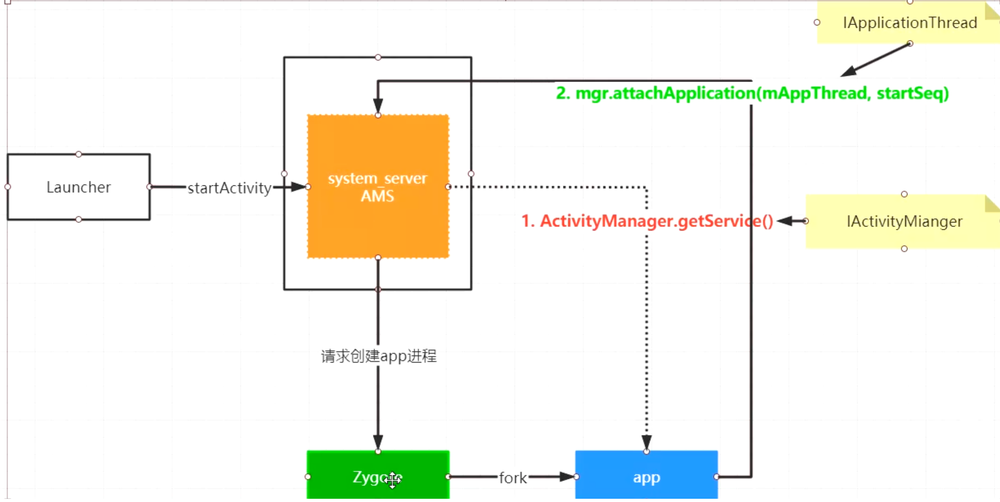
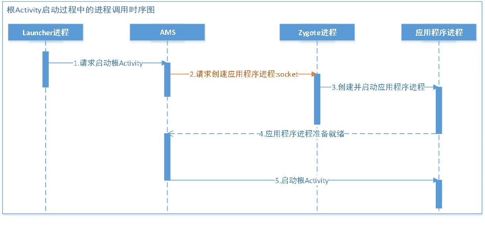

- 
- ## 1、Launcher进程，点击app请求创建根Activity
- ## 2、SystemServer进程中的AMS会通过socket向Zygote进程发消息，请求创建应用程序进程
- ## 3、Zygote进程 fork()创建应用程序进程
- > AMS和App进程通信，binder是互为CS的，当AMS给APP进程发消息时，APP为Service端，AMS为client。反之相反。客户端根据名字拿服务端AMS binder比较好拿，反过来AMS直接和APP进程通信不好操作
- > APP进程被fork出来后，有个AMS的attach过程。将app进程的代理对象appRroxy通过attach方法传递AMS. 。AMS有APP进程的代理对象（IApplicationThread），就可以调用APp进程的方法。具体就是上述的1，2
- > IApplicationThread.aidl中有个bindApplication方法，就是ams和app进程建立联系的方法
- ## 4、AMS向应用程序进程请求创建 根Activity
- # 时序图
	- 