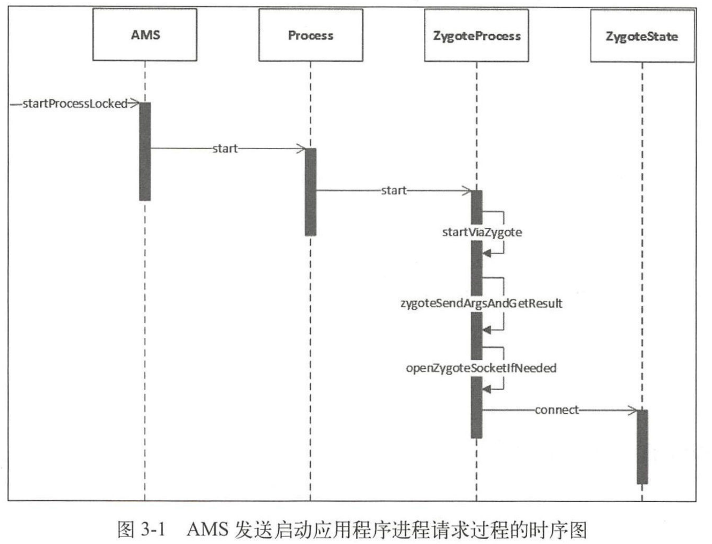

- # 一、简介
	- 启动一个应用程序首先要保证该应用程序的进程已经被启动
	- “应用程序进程启动过程”，不是“应用程序启动过程”，应用程序启动过程是  (根 Activity 启动过程)
	- AMS 在`启动应用程序`时会检查这个应用程序需要的应用程序进程是否存在，不存在就会请求Zygote 进程启动需要的应用程序进程
	- 我们知道在 Zygote 在Java 框架层中会创建 Server 端的 Socket ，这个 Socket 用来等待 AMS 请求 Zygote 来创建新的应用程序进程。
	- Zygote 进程通过 fock 自身创建应用程序进程，这样应用程序进程就会获得 Zygote进程在启动时创建的虚拟机实例
	- 应用程序进程创建过程中除了获取虚拟机实例外，还创建了 Binder 线程地和消息循环，这样运行在应用进程中的应用程序就可以方便地使用 Binder 进行进程间通信以及处理消息了。
- # 二、应用程序进程启动过程，过程复杂关注2部分
	- ## 2-1、AMS 发送启动应用程序进程请求
		- {:height 579, :width 746}
		- AMS 通过调用 startProcessLocked 方怯向 Zygote 进程发送请求，
		- 在Process sta1i 方陆中只调用了 ZygoteProcess start 方法，其中 ygoteProcess
		  用于保持与 Zygote 进程的通信状态
	- ## 2-2、Zygote 接收请求 创建 应用程序进程
-
-