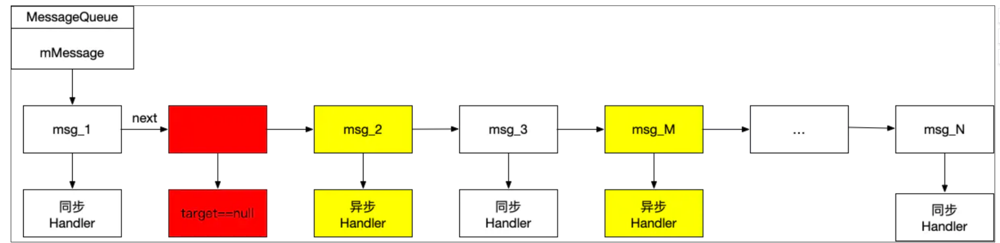

## 背景
	- 当消息队列开启同步屏障的时候（即标识为 msg.target == null ），消息机制在处理消息的时候，优先处理异步消息。这样，同步屏障就起到了一种过滤和优先级的作用。
	- 
	- 在消息队列中有同步消息和异步消息（黄色部分）以及一道墙----同步屏障（红色部分）。有了同步屏
	- 障的存在，msg_2 和 msg_M 这两个异步消息可以被优先处理，而后面的 msg_3 等同步消息则不会被处理。那么这些同步消息什么时候可以被处理呢？那就需要先移除这个同步屏障，即调用 removeSyncBarrier() 。
- 1、正常的发送同步消息会调用Handler中的发送消息方法,调用到Handler.enqueueMessage,里给msg.target = this（赋值handler）
	- Handler.java
		- ```java
		      private boolean enqueueMessage(@NonNull MessageQueue queue, @NonNull Message msg,
		              long uptimeMillis) {
		          msg.target = this;
		          msg.workSourceUid = ThreadLocalWorkSource.getUid();
		  
		          if (mAsynchronous) {
		              msg.setAsynchronous(true);
		          }
		          return queue.enqueueMessage(msg, uptimeMillis);
		      }
		  ```
- 2、而msgQueue从[[MessageQueue.next()]]取消息的时候，会有个判断，[[#red]]==**是否target == null，走取异步消息的轮询,遍历消息队列，直到找到一个异步消息返回**==
	- MessageQueue.java  next()
		- ```java
		  Message next() {
		    xxx
		                        // 处理异步消息的地方，同步消息屏障
		                  if (msg != null && msg.target == null) {
		                      // Stalled by a barrier.  Find the next asynchronous message in the queue.
		                      do {
		                          prevMsg = msg;
		                          msg = msg.next;
		                      } while (msg != null && !msg.isAsynchronous());
		                  }
		    xxx
		  }
		  ```
	- msg.target == null 时，会遍历队列直到找到一个非同步消息（异步消息），next()返回该消息
- 3、那么什么时候Target == null，添加消息屏障的时候见[[同步消息屏障]]开启
- 4、那么这些同步消息什么时候可以被处理呢？那就需要先移除这个同步屏障，即调用 removeSyncBarrier()