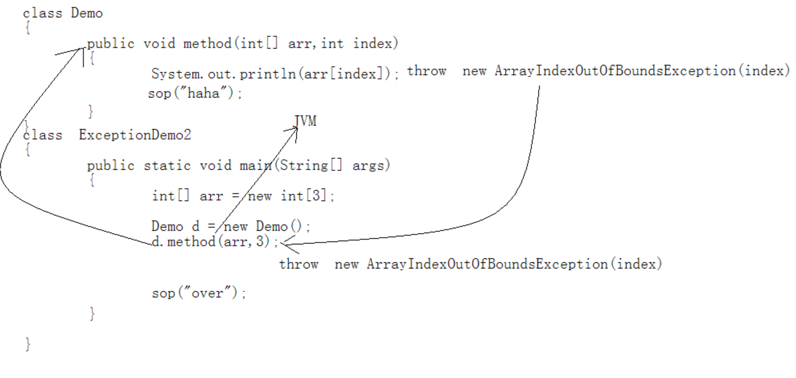
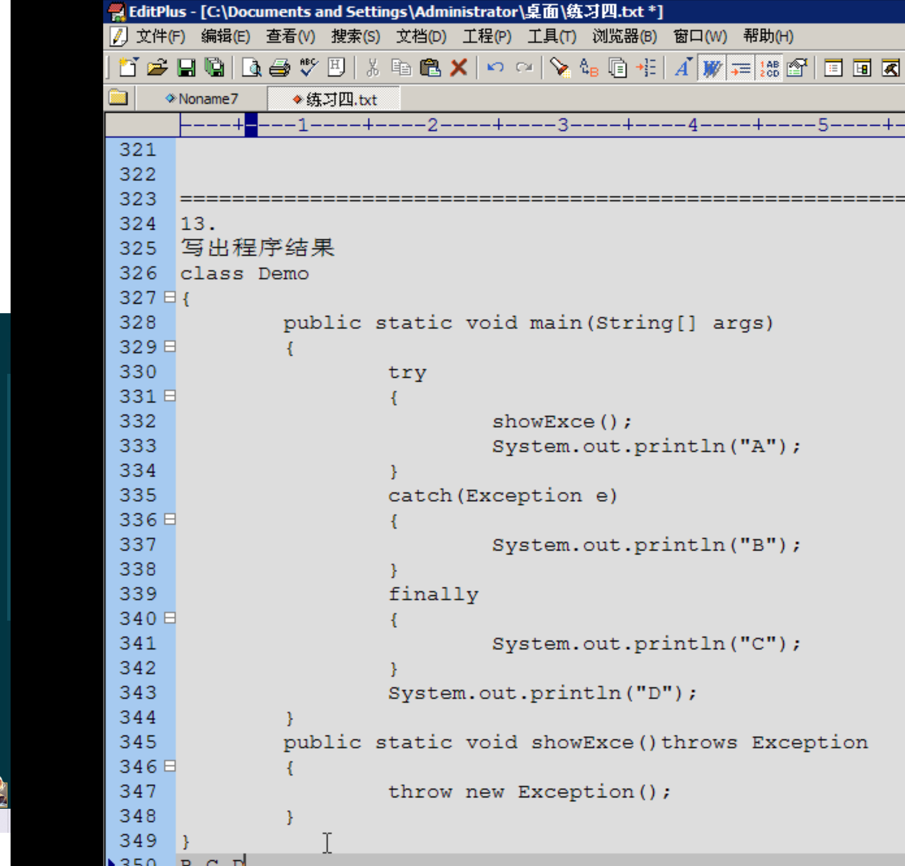

# 一、概述
	- 是在运行时期发生的不正常情况
	- 以前正常流程代码和问题处理代码相结合，
	  现在将正常流程代码和问题处理代码分离。提高阅读性.
	- 其实异常就是java通过面向对象的思想将问题封装成了对象.
	- 用异常类对其进行描述。
	  不同的问题用不同的类进行具体的描述。 比如角标越界。空指针等等。
	- 问题很多，意味着描述的类也很多，
	  将其共性进行向上抽取，形成了异常体系。
- # 二、异常类
	- 在java中用类的形式对不正常情况进行了描述和封装对象。
	- 描述不正常的情况的类，就称为异常类。
- # 三、异常分类
  collapsed:: true
	- Throwable:[[#red]]==**还是异常，问题，问题发生就应该可以抛出**==，让调用者知道并处理。
	  			//[[#red]]==**该体系的特点就在于Throwable及其所有的子类都具有可抛性**==。
		- |--1，一般不可处理的。Error
			- 特点：是由jvm抛出的严重性的问题。
			- 这种问题发生一般不针对性处理。直接修改程序
		- |--2，可以处理的。Exception
	- 可抛性到底指的是什么呢？怎么体现可抛性呢？
		- 其实是通过两个关键字来体现的。
		- throws throw ,凡是可以被这两个关键字所操作的类和对象都具备可抛性.
- # 四、该体系的特点：
	- 子类的后缀名都是用其父类名作为后缀，阅读性很强。
- # 五、异常原理
  collapsed:: true
	- 
	- 虚拟机运行到这行代码，发现数组越界会创建 对应的异常 抛出来
	- ==**抛出异常之后的代码是执行不到的，起到结束功能的作用**==
- # 六、自定义异常
  collapsed:: true
	- ## 背景：
		- 对于角标是整数不存在，可以用角标越界表示，
		  对于负数为角标的情况，准备用负数角标异常来表示。
		- 负数角标这种异常在java中并没有定义过。
		  那就按照java异常的创建思想，面向对象，将负数角标进行自定义描述。并封装成对象。
	- 这种自定义的问题描述成为自定义异常。
	- 注意：如果让一个类称为异常类，必须要继承异常体系，因为只有称为异常体系的子类才有资格具备可抛性。
	- 才可以被两个关键字所操作，throws throw
	- ## 代码
		- ```java
		  class FuShuIndexException extends Exception
		  {
		  	FuShuIndexException()
		  	{}
		  
		  	
		  	FuShuIndexException(String msg)
		  	{
		  		super(msg);
		  	}
		  }
		  
		  ```
	- ## 自定义异常声明后 需要提示用户,方法上throws出去/捕捉
		- ```java
		  class Demo
		  {
		  	public int method(int[] arr,int index) throws FuShuIndexException//throws NullPointerException//FuShuIndexException
		  	{		
		  
		  		if(arr==null)
		  			throw new NullPointerException("数组的引用不能为空！");
		  
		  		if(index>=arr.length)
		  		{
		  			throw new ArrayIndexOutOfBoundsException("数组的角标越界啦，哥们，你是不是疯了？："+index);
		  		}
		  		if(index<0)
		  		{
		  			throw new FuShuIndexException("角标变成负数啦！！");
		  		}
		  		return arr[index];
		  	}
		  }
		  
		  ```
- # 七、异常的分类
  collapsed:: true
	- 1，[[#red]]==**编译时**==被检测[[#red]]==**异常:**==只要是Exception和其子类都是，除了特殊子类RuntimeException体系。
		- 这种问题一旦出现，希望在编译时就进行检测，让这种问题有对应的处理方式。
		  这样的问题都可以针对性的处理。
	- 2，编译时不检测异常([[#red]]==**运行时异常**==):就是Exception中的RuntimeException和其子类。
		- 这种问题的发生，无法让功能继续，运算无法进行，更多是因为调用者的原因导致的而或者引发了内部状态的改变导致的。
		  那么这种问题一般不处理，直接编译通过，在运行时，让调用者调用时的程序强制停止,让调用者对代码进行修正。
	- 所以自定义异常时，要么继承Exception。要么继承RuntimeException。
- # 八、异常捕获
  collapsed:: true
	- ```java
	  具体格式是：
	  
	  try
	  {
	  	//需要被检测异常的代码。
	  }
	  catch(异常类 变量)//该变量用于接收发生的异常对象
	  {
	  	//处理异常的代码。
	  }
	  finally
	  {
	  	//一定会被执行的代码。
	  }
	  
	  ```
	- e.printStackTrace();//jvm默认的异常处理机制就是调用异常对象的这个方法。
- # 九、异常处理的原则：
  collapsed:: true
	- 1，函数内容如果抛出需要检测的异常，那么函数上必须要声明。
	  	否则必须在函数内用trycatch捕捉，否则编译失败。
	- 2，如果调用到了声明异常的函数，要么trycatch要么throws，否则编译失败。
	- 3，什么时候catch，什么时候throws 呢？
		- 功能内容可以解决，用catch。
		- 解决不了，用throws告诉调用者，由调用者解决 。
	- 4，一个功能如果抛出了多个异常，那么调用时，必须有对应多个catch进行针对性的处理。
	  	内部又几个需要检测的异常，就抛几个异常，抛出几个，就catch几个
- # 十、多catch父类的catch放在最下面。
  collapsed:: true
	- ```java
	  class  ExceptionDemo4
	  {
	  	public static void main(String[] args) 
	  	{
	  		int[] arr = new int[3];		
	  		Demo d = new Demo();
	  		try
	  		{
	  			int num = d.method(null,-1);
	  			System.out.println("num="+num);
	  			
	  		}
	  		
	  		catch(NullPointerException e)
	  		{
	  			System.out.println(e.toString());
	  		}
	  		catch (FuShuIndexException e)
	  		{
	  			System.out.println("message:"+e.getMessage());
	  			System.out.println("string:"+e.toString());
	  
	  			e.printStackTrace();//jvm默认的异常处理机制就是调用异常对象的这个方法。
	  
	  			System.out.println("负数角标异常!!!!");
	  		}
	  		/*
	  		catch(Exception e)//多catch父类的catch放在最下面。
	  		{
	  			
	  		}
	  		*/
	  		System.out.println("over");
	  	}
	  	
	  }
	  ```
- # 十一、finally
	- 作用：通常用于关闭(释放)资源。
	  collapsed:: true
		- ```java
		  
		  class ExceptionDemo5 
		  {
		  	public static void main(String[] args) 
		  	{
		  		Demo d = new Demo();
		  		try
		  		{
		  			
		  			int num = d.show(-1);
		  			System.out.println("num="+num);
		  		}
		  		catch (ArrayIndexOutOfBoundsException e)
		  		{
		  			System.out.println(e.toString());
		  
		  //			return ;
		  //			System.exit(0);//退出jvm。
		  		}
		  		finally//通常用于关闭(释放)资源。
		  		{
		  			System.out.println("finally");
		  		}
		  
		  		System.out.println("over");
		  
		  	}
		  }
		  ```
- # 十二、try catch finally代码块组合特点
	- 1,try catch finally
	- 2,try catch(多个)当没有必要资源需要释放时，可以不用定义finally。
	- 3,try finally 异常无法直接catch处理，但是资源需要关闭。
- # 十三、异常注意事项
  collapsed:: true
	- 异常的注意事项：
	- 1，子类在覆盖父类方法时，父类的方法如果抛出了异常，
		- 那么子类的方法只能抛出父类的异常或者该异常的子类。
	- 2，如果父类抛出多个异常，那么子类只能抛出父类异常的子集。
	- 简单说：子类覆盖父类只能抛出父类的异常或者子类或者子集。
	- 注意：如果父类的方法没有抛出异常，那么子类覆盖时绝对不能抛，就只能try .
	- ```java
	  Exception
	  	|--A
	  		|--B
	  	|--C
	  
	  
	  class Fu
	  {
	  	void show()throws A
	  	{}
	  }
	  
	  class Zi extends Fu
	  {
	  	void show()throws A/B  // (子类的方法只能抛出父类的异常或者该异常的子类)
	  	{
	  	
	  	}
	  }
	  
	  ```
- # 面试题
	- 
	- BCD