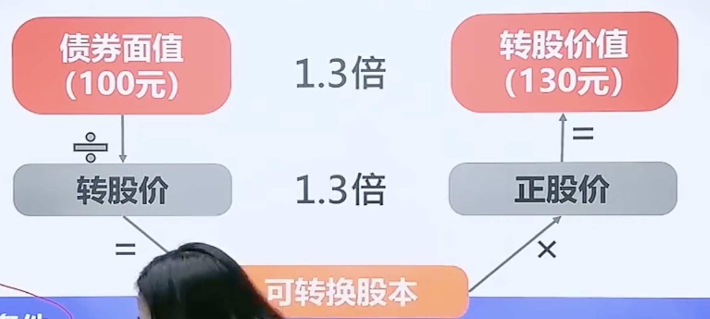
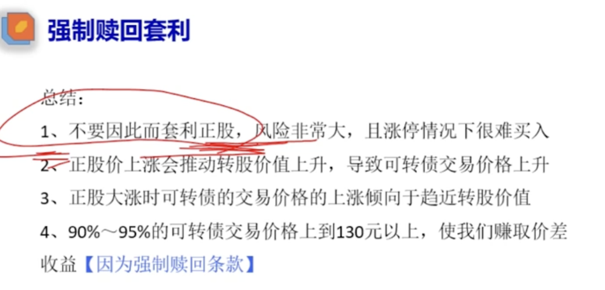
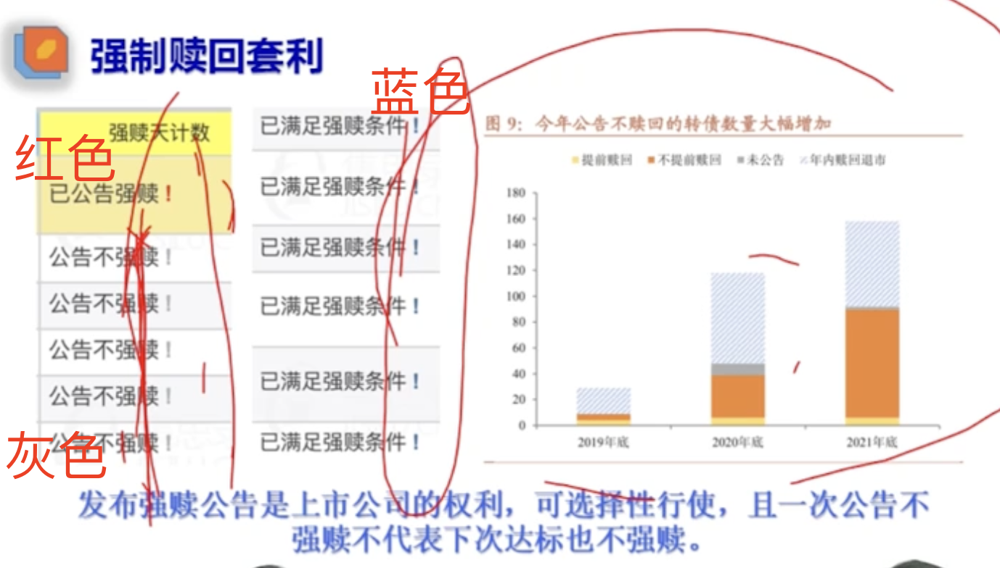
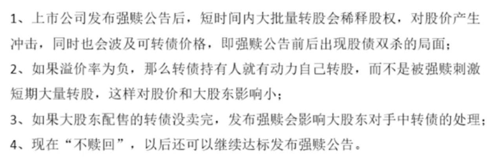
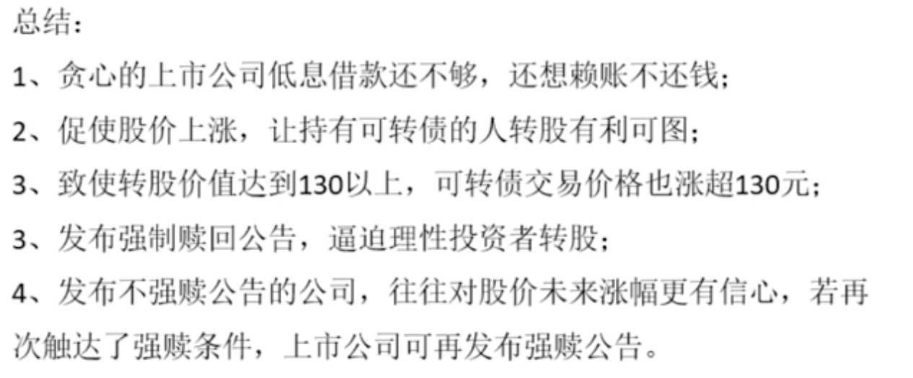

- # 一、强制赎回条款
	- {:height 343, :width 746}
	- 1、转股期内
	- 2、正股价涨到转股价的1.3倍
	- 3、转股价值涨到130元，且维持15天
	- 公司就可以发布强制赎回公告了
		- 为了刺激转股不还钱，拉伸正股触发强制赎回，会发一个公告 比如债面值170，强制赎回103，大家都会去转股
- #  
 二、套利逻辑

  collapsed:: true
	- 
	- ## 情况1、拉伸正股价(拉伸到转股价的1.3倍)
		- 首先为了强赎，上市公司肯定将正股价 拉到 转股价的  1.3倍。比如 转股价 10块   正股价需要拉伸到13块，那么转债价格也会拉伸。
	- ## 情况2、转股价下修(那么正股价很容易拉伸到转股价的1.3倍)
- # 三、套利拉伸股价，那么到底买债券还是正股
  collapsed:: true
	- 1、债券具有确定性(最低换本付息，最高有收益)，股票具有不确定性
	- 2、股票不确定：
		- 1、下调转股价的话，正股价很容易达到转股价的1.3倍，没准不拉伸也可以达到。那么此时买正股就被套
		- 2、一些股票，受大盘 信息影响大，涨幅快 但是不持续，并不是为了强赎拉伸的，容易被套
- # 四、强赎标志
  collapsed:: true
	- 
- # 五、不发布强赎公告的原因
  collapsed:: true
	- 
	- 发布强赎刺激转股，会稀释股权
	- 溢价率主动转股，会股东影响小
	- 不强赎，股东对公司股价有信心的
- # 六、总结
	- {:height 318, :width 746}