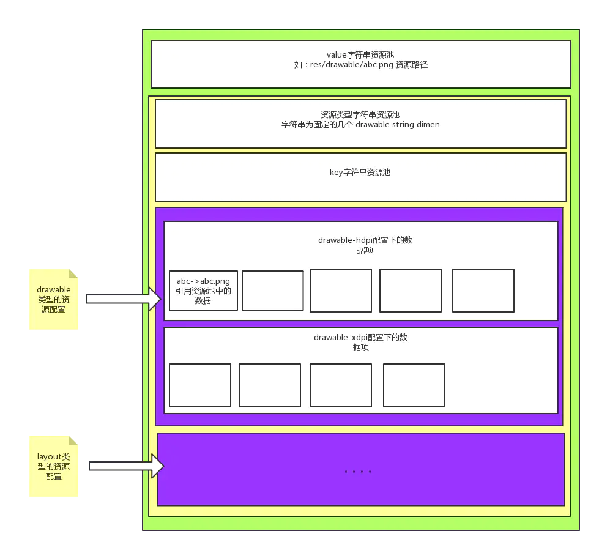

title:: 微信的AndResGuard对resource.arsc文件混淆，减少大小

- [[#red]]==**主要为了混淆资源ID长度(例如将res/drawable/welcome.png混淆为r/s/a.png)，同时利用7z深度压缩**==
- Android在构建过程中会根据资源生成R文件，里面包含了资源索引，使用该索引可以在最终生成的resources.arsc资源映射表中找到对应资源，对于开发者来说在代码中引用资源很方便。
- 资源混淆主要为了混淆资源ID长度(例如将res/drawable/welcome.png混淆为r/s/a.png)，同时利用7z深度压缩，大大减少了安装包体积，同时提升了反破解难度。
- 介绍微信的AndResGuard前，先看一下resource.arsc文件的结构，有助于我们更好的理解ResGuard原理
	- {:height 632, :width 657}
- resources.arsc一共有五种chunk类型：
- –table，是整个reousces table的开始，它的chunksize即是整个文件的大小。
- –package，指的是一个package的开始，其实在resources,arsc是可以有多个package的。而packageID即是资源resID的最高八位，一般来说系统android的是1(0x01)，普通的例如com.tencent.mm会是127(0x7f)，剩下的是从2开始起步。当然这个我们在aapt也是可以指定的(1-127即八位的合法空间,一些混合编译就是改这个packageID)。
- –string, 代表stringblock，我们一共有三种类型的stringblock。分别是table stringblock,typename stringblock, specsname stringblock。
- –type，这里讲的是typename stringblock里面我们用到的各种type(用到多少种类型的type,就有多少个type chunk)，例如attr, drawable, layout, id, color, anim等，Type ID是紧跟着Package ID。
- –config, 即是Android用来描述资源维度，例如横竖屏，屏幕密度，语言等。对于每一种type，它定义了多少种config，它后面就紧跟着多少个config chunk,例如我们定义了drawable-mdpi,drawable-hdpi,那后面就会有两个config。
- –entry，尽管没有entry这个chunk,但是每个config里面都会有很多的entry，例如drawable-mdpi中有icon1.png,icon2.png两个drawable,那在mdpi这个config中就存在两个entry。
- ## ResTable_header(资源索引表头)
	- 
	- ResTable_header的chunk(02 00 0C 00 6895 01 00 01 000000)
	  02 00 位置0~ 1,共2字节，表示该chunk的类型，值为0x0002表示类型为RES_TABLE_TYPE.
	  0C 00 位置2 ~ 3 ,共2字节，表示该chunk类型的头长度，
	  值为0x000C表示该类型的头长度为12字节长度。
	  6895 01 00位置4~7，共4字节，表示该chunk的总长度
	  ，值为0x00019568表示该chunk的总长度(这里为整个文件的大小)为103784字节长度。
	  01 000000 被编译的资源包的个数，这里只有一个。
- ## ResStringPool_header(全局字符串资源)
	- 紧跟着资源索引表头部的是资源项的全局字符串资源,这个字符串资源池包含了所有的在资源包里面所定义的资源项的全局字符串,包括android工程中部分资源文件名（如res/drawable-hdpi/ic_launcher.png，res/layout/activity_main.xml等）及res/values/strings.xml中的字符串值
	- 上图简化如下：
		- 
	- AndResGuard流程：
		- 1. table stringblock	把文件指向路径改变，例如res/layout/test.xml,改为res/layout/a.xml
		  2. 资源的文件名	需要将资源的文件名改为对应1，即将test.xml重命名为a.xml
		  3. specsname stringblock	旧的specsname除了白名单部分全部废弃，替换成所有我们混淆方案中用到的字符。由于大家都重复使用[a-z0-9_],specsname的总数量会大大减少。
		  4. entry中指向的specsname 中的id	例如原本test.xml它指向specsname中的第十项，我们需要用混淆后的a项的位置改写。
		  5. table chunk的大小	修改table chunk的最后大小
		  {:height 826, :width 640}