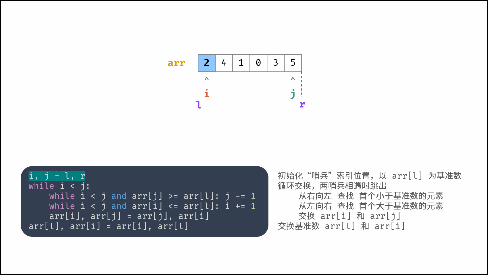
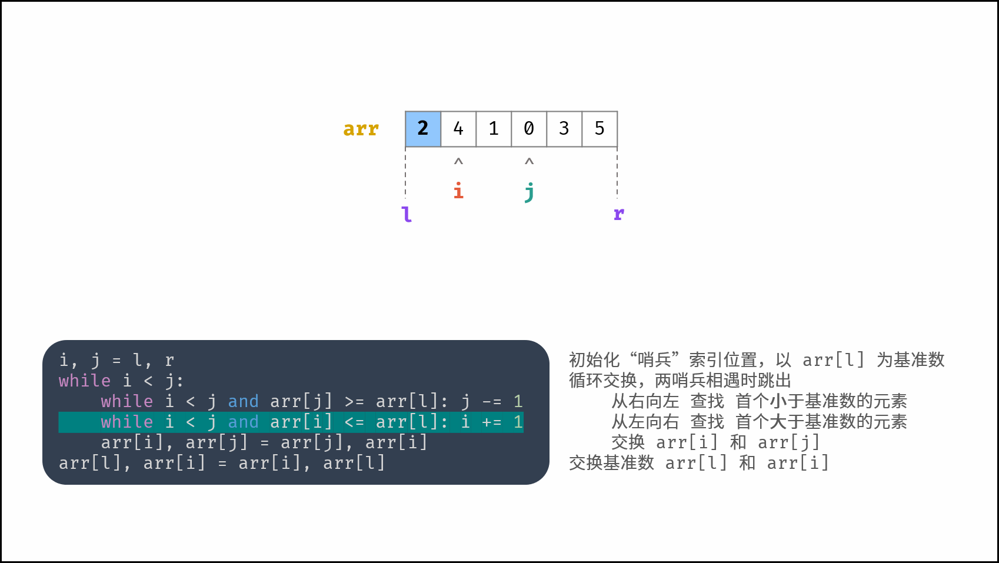
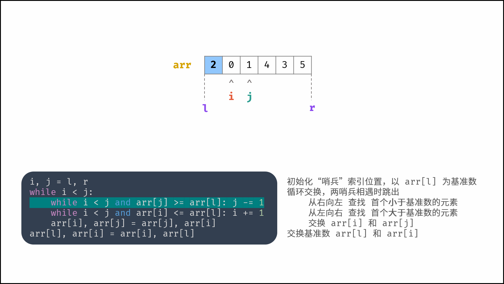
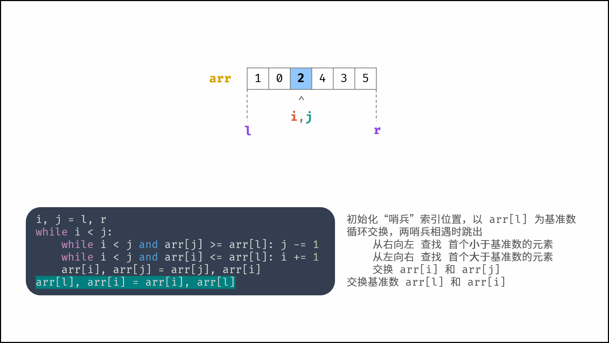
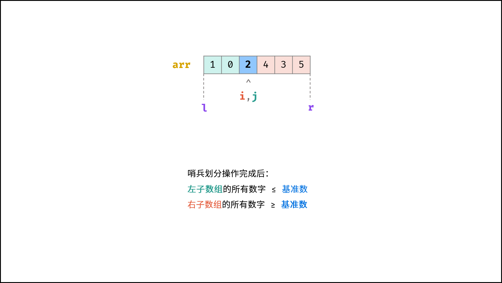

- ## 简介：
	- 快速排序是一种在实际应用中经常用到的排序算法
- ## 应用场景：
  collapsed:: true
	- 是大规模的数据排序，并且实际性能要好于归并排序。
## 原理：
	- 它的基本原理是从数组中选取一个元素，把所有大于这个元素的数都放到它的后面，所有小于这个元素的数都放到它的前面，然后这个元素就把原数组切分成了两个部分，再分别对这个两个部分进行同样的操作，直到数组不能再切分的时候，此时数组为有序。
- ## 核心点
	- 快速排序算法有两个核心点，分别为 “哨兵划分” 和 “递归” 。
	- ## ==**一、哨兵划分**==
		- 以数组某个元素（一般选取首元素）为 **基准数** ，将所有小于基准数的元素移动至其左边，大于基准数的元素移动至其右边。
		- >如下图所示，为哨兵划分操作流程。通过一轮 **哨兵划分** ，可将数组排序问题拆分为 **两个较短数组的排序问题** （本文称之为左（右）子数组）。
		- ## 图解
		  collapsed:: true
			- 
			- 
			- 
			- 
			- 
			- 
			- 
			- 
			- 
	- ## [[#red]]==**二、左右子数组递归**==
		- 对 **左子数组** 和 **右子数组** 递归执行 **哨兵划分**，直至子数组长度为 1 时终止递归，即可完成对整个数组的排序。
	- 如下图所示，为示例数组 [2,4,1,0,3,5] 的快速排序流程。观察发现，快速排序和 二分法 的原理类似，都是以 log 时间复杂度实现搜索区间缩小。
	  collapsed:: true
		- 
- # 复杂度
	- 时间：O(NlogN)
	- 空间：O(N)
- ## 代码
	- ```java
	  class Solution {
	      public int[] getLeastNumbers(int[] arr, int k) {
	          quickSort(arr, 0, arr.length - 1);
	          return Arrays.copyOf(arr, k);
	      }
	    
	      // 快速排序
	      private void quickSort(int[] arr, int left, int right) {
	          // 子数组长度为 1 时终止递归
	          if (left >= right) return;
	          // 哨兵划分操作（以 arr[left] 作为基准数）
	          int i = left, j = right;
	          while (i < j) {
	              // 从右向左 查找 首个小于基准数的元素
	              while (i < j && arr[j] >= arr[left]) j--;
	              // 从左向右 查找 首个大于基准数的元素
	              while (i < j && arr[i] <= arr[left]) i++;
	              // 交换 aar[i]  arr[j]
	              swap(arr, i, j);
	          }
	          // 交换基准点到中间
	          swap(arr, i, left);
	          // 递归左（右）子数组执行哨兵划分
	          quickSort(arr, left, i - 1);
	          quickSort(arr, i + 1, right);
	      }
	      // 交换
	      private void swap(int[] arr, int i, int j) {
	          int tmp = arr[i];
	          arr[i] = arr[j];
	          arr[j] = tmp;
	      }
	  }
	  ```
	-