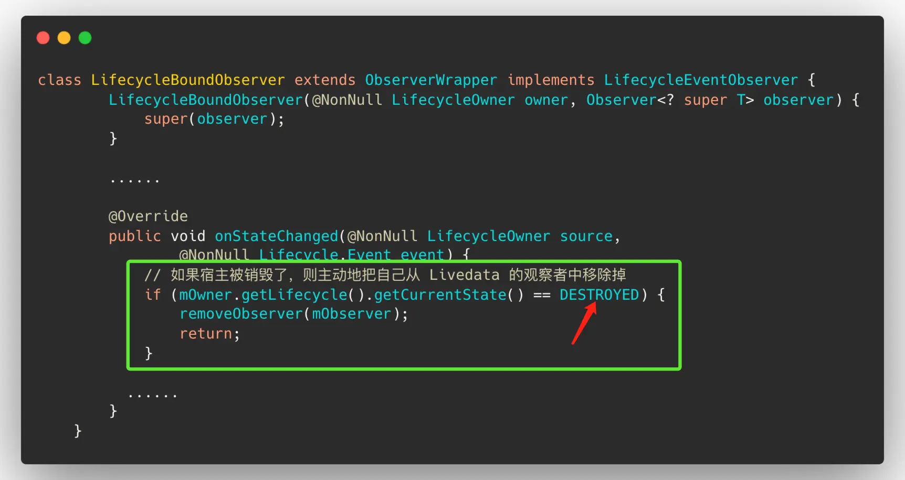

- LiveData 是借助 Lifecycle 的能力实现了对宿主生命周期的监听，每当宿主的生命周期变化的时候，都会回调 LifecycleBoundObserver 的 onStateChanged 方法，那么，可以在 onStateChanged 方法里判断宿主当前的生命周期，从而做一些操作。
- 在 onStateChanged 方法里，首先会判断宿主当前的状态是否为 DESTROYED，即销毁状态，如果条件成立，则会主动移除掉观察者，即反注册，从而避免了内存泄露。
- {:height 390, :width 719}