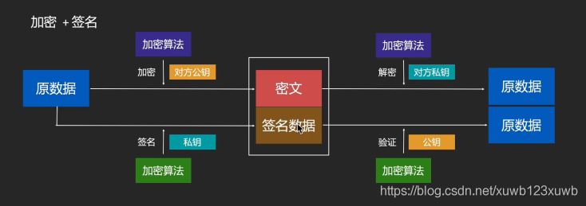

- 
- ## 发送方：
	- 用对方的公钥对原数据进行加密得到[[#red]]==**密文**==；
	- 用自己的私钥对原数据进行签名得到[[#red]]==**签名数据**==      将签名数据和 密文一起发送
- ## 接收方：
	- 用自己的私钥对密文解密 得到原数据
	- 用发送方的公钥对签名数据 进行非对称加密后得到 原数据
	- 然后 对比解密 和验证后两个原数据  完成验证