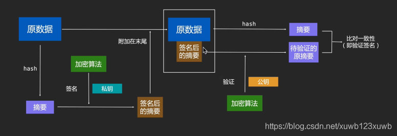

- 
- # 发送方：
	- 首先 对原数据进行一次hash,[[#red]]==**得到摘要**==（数据量很小）；用来签名认证，小数据量
	- 用自己的==**私钥对摘要**== 进程非对称加密得到==**签名**==后的摘要
	- 然后 用 对方的==**公钥对原数据 进行加密 得到密文**==
	- 最后将 密文 和 签名后的摘要一起发给接收方
- # 接收方：
	- 一方面 用自己的私钥对 密文解密 得到  原数据，然后用hash对原数据处理 得到摘要
	- 另一方面：用发送方的公钥对签名数据   进行非对称加密后得到 签名后的摘要
	- 既拿到了原数据   对比签名后的摘要 也 验证了身份，传输数据量经过hash也增加微乎其微