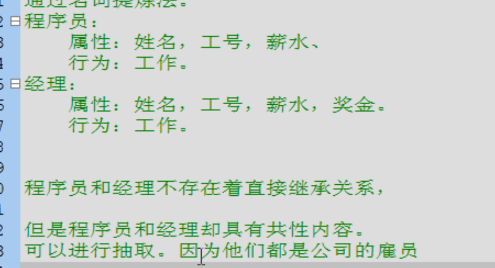

- # 一、概念
	- 抽象：模糊的，不具体的。
- # 二、特点
  collapsed:: true
	- 1、方法只有声明没有实现时，该方法就是抽象方法，需要被abstract修饰
		- 抽象方法必须定义在抽象类中，该类必须也被abstract修饰
	- 2、抽象类不可以被实例化，为什么？
		- 因为调用抽象方法没意义，没有方法体
	- 3、抽象类必须其子类覆盖所有抽象方法，才能被实例化，否则其子类还是抽象类
	-
- # 三、细节
  collapsed:: true
	- 1、抽象类中有构造函数吗？
		- 有，即使不能创建对象，也有，
		- 用于给子类对象进行初始化
	- 2、抽象类可以不定义抽象方法吗？
		- 可以，目的不让这个类创建对象
		- 通常有方法体{}，但是没有具体的内容
			- ```java
			  abstract class Demo{
			  	void show1(){}
			      void show2(){}
			  } 
			  ```
	- 3、抽象关键字不可以和哪些关键字共存？
		- private: 抽象本来要被覆盖，私有的不可以被继承，就不能被覆盖，没有意义
		- static：静台方法不需要创建对象，直接类调用，但是抽象方法没有方法体，调用也没有用
		- final:
	- 4、抽象类和一般类的异同点？
		- 相同点：
			- 抽象类和一般类都是用来描述事物的，都在内部定了成员
		- 不同
			- 1、一般类有足够的信息描述事物
				- 抽象类描述事物的信息有可能不足
			- 2、一般类中不能定义抽象方法，只能定非抽象方法
				- 抽象类中可定义抽象方法，同时也可以定义非抽象方法
			- 3、一般类可以被实例化
				- 抽象类不可以被实例化
	- 5、抽象类一定时父类吗？
		- 是的，需要子类覆盖其方法后才可以对子类实例化
- # 四、什么时候直接用继承，什么时候用抽象类抽取再继承？
	- 虽然具有共性，但是不存在直接继承关系，可以都向上[[#red]]==**抽取抽象类。**==
		- 
	- 实例2：大象和动物就可以直接继承，有继承关系