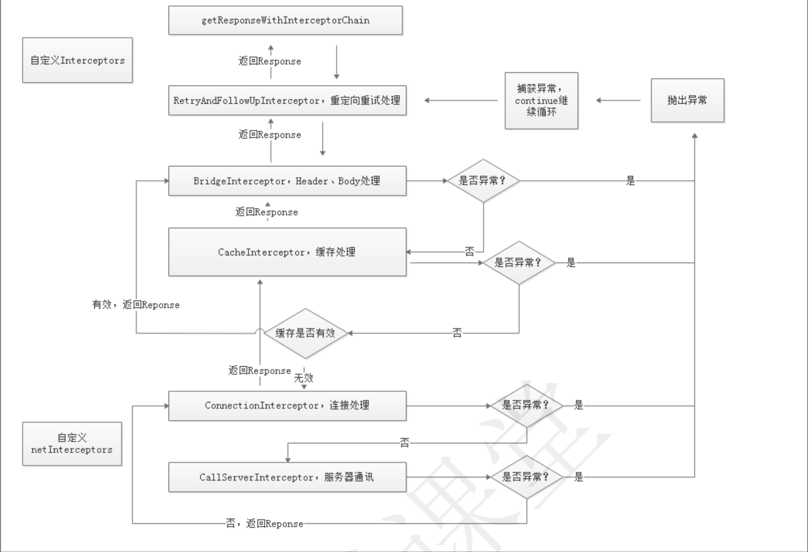
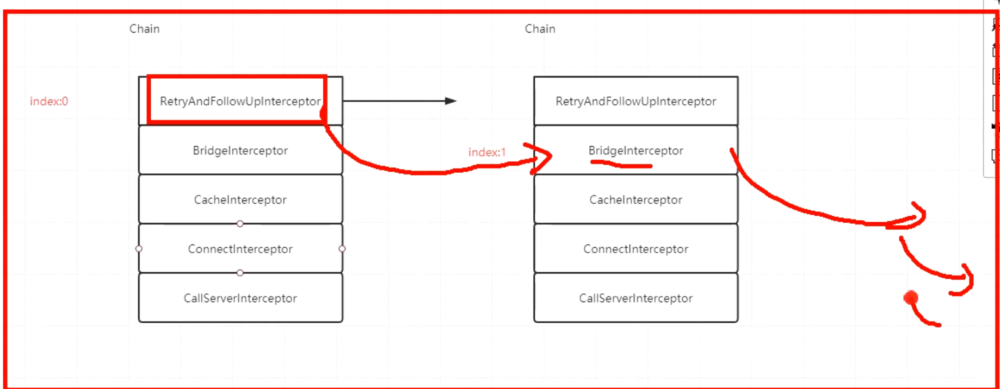
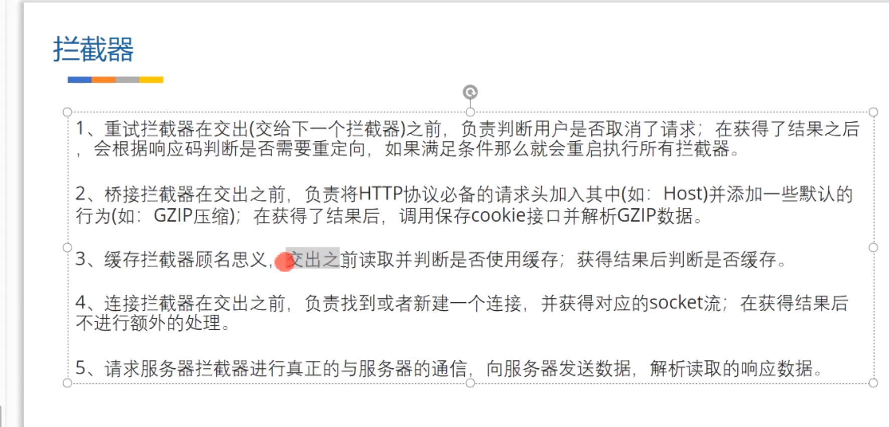

- ### 而OkHttp中的  [[getResponseWithInterceptorChain]] 中经历的流程为
  collapsed:: true
	-
	- 
- ## 流程图
  collapsed:: true
	- 
- ## 实际代码执行过程
  collapsed:: true
	- 
	- 1、链条对象持有所有的拦截器列表。和一个下标
	- 2、chain.proceed时 执行第一个拦截器。内部创建把chain拷贝一个新的链接对象，下边置为2.再去执行
	- 3、反复执行到最后一个。再把结果挨个返回
- 请求会被交给责任链中的一个个拦截器。默认情况下有五大拦截器
	- 
	- ## 1. [[RetryAndFollowUpInterceptor重试及重定向拦截器]]
		- [[#red]]==**第一个接触到请求，最后接触到响应**==；负责判断是否需要重新发起整个请求
	- ## 2. [[BridgeInterceptor桥接拦截器]]
		- 补全请求头，并对响应进行额外处理
	- ## 3. [[CacheInterceptor缓存拦截器]]
		- 请求前查询缓存，获得响应并判断是否需要缓存
	- ## 4. [[ConnectInterceptor连接拦截器]]
		- 与服务器完成TCP连接
	- ## 5. [[CallServerInterceptor请求拦截器]]
		- 与服务器通信；封装请求数据与解析响应数据(如：HTTP报文)