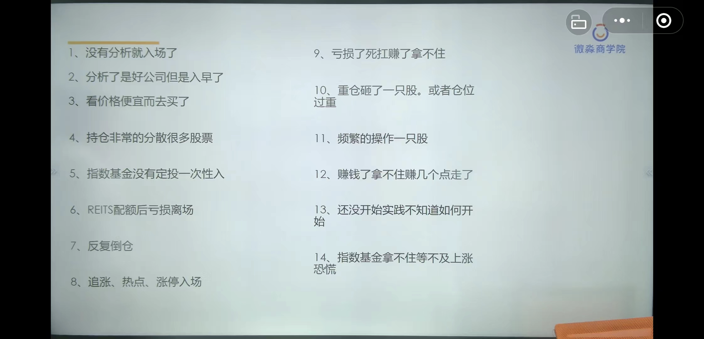

- 
- 1、没有分析就入场？
	- 需要18步+商业模式等 分析公司
- 2、分析了好公司但是买入早了
	- 需求等待好价格，按照上边的策略建仓==严格执行==
- 3、看价格便宜买的
	- ==便宜没好货==
- 4、持仓非常的分散很多股票
	- 根据资金量 最多 5-7只
	- 太多过于分散，没时间研究全部、或者过于分散，仓位较轻，收益低
- 5、指数基金没有定投一次性入的
	- 需要看指数估值
	- 按投资策略 分批买入
- 6、Reits配额后亏损离场
	- 配额配的比较少，不必要亏损就离场，比如房子要出租，一时没租出去，就卖房吗，肯定不会
	- 一般好reits为好价格买入，持有
- 7、反复倒仓
	- 倒仓：这个亏了看着那个好，买那个。来回倒
	- 频繁交易：手续费很多，便宜证券了
- 8、追涨、热点、涨停入场
	- 心里：看着涨的厉害，我就不贪心赚2-3个点就出来。
	- 现象：涨停版接涨停板，拿着的人不想卖，想买的人买不到，所以一直喊涨，一直涨停。你想卖的时候，其他人也会卖。一路跌
- 9、亏损了死扛，赚了拿不住
	-
- 10、重仓拿了一只股，或者仓位过重
- 11、频繁的操作一只股
- 12、赚钱了拿不住，赚几个点走了
- 13、还没开始实践，不知道如何开始
- 14、指数基金拿不住，等不及上涨恐慌