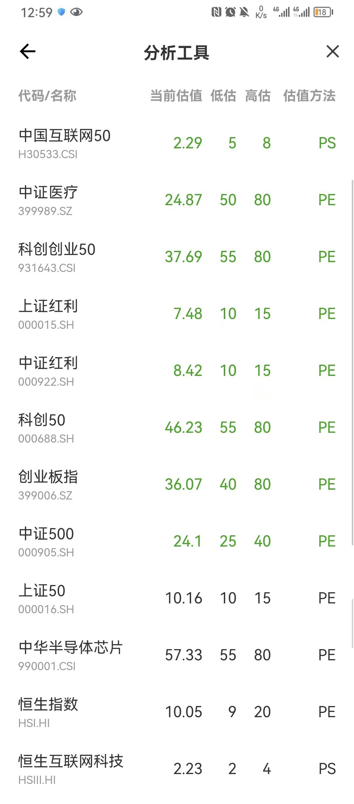
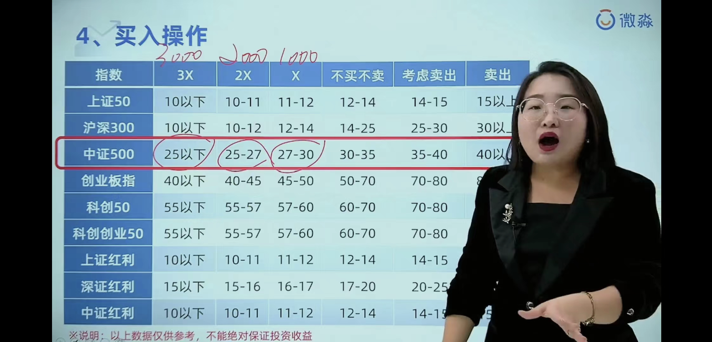
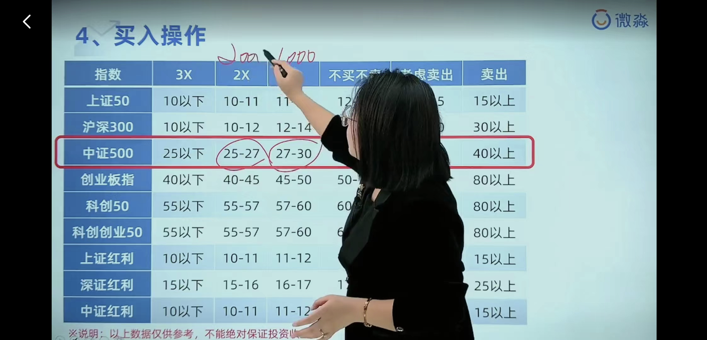

- ## 概念：
	- 溢价率：提价的产品，贵，容易被套
	- 折价率：打折的产品，便宜
	- 跟踪误差：是指基金和指数配置仓位比重的相似度，越相似说明基金是按照指数标准配置的。
		- 跟踪指数的误差越小越好
- ## 一、看指数估值
  collapsed:: true
	- 分析工具、常用工具、指数估值
	- 
- ## 二、基金ETF筛选
	- 方式一、通过微淼开发工具筛选
	  collapsed:: true
		- 1、分析工具、常用工具、基金查询
		- 2、选择对应的指数
		- 3、跳到爱问财，选择基金规模最大的一支即可
	- 方式二、富途牛牛，筛选ETF
	  collapsed:: true
		- 规则：
			- 1、溢价率低的越好
			- 2、按成交量排序，选成交量高的。便于买卖
- ## 三、买入标准：低价格、低估值
  collapsed:: true
	- 平时看低估值，低价格，历史市盈率
- ## 四、指数基金定投
  collapsed:: true
	- 方式一：定期定额
	- 方式二：定期变额==比较好==
	  collapsed:: true
		- 
		- 
- ## 五、还可以有套利逻辑
	- 溢价率：负的最好，可以考虑买入，大于3%过高，考虑卖出，大于5%就不要买这个ETF
	- 折价率，超过3%的考虑买，5%求知不得
-