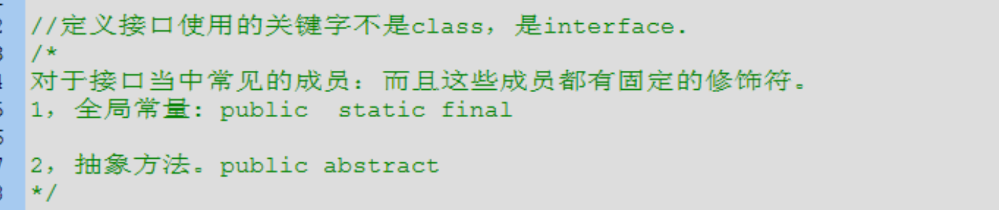
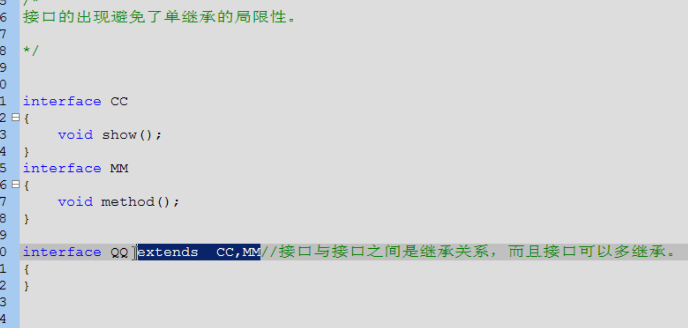

## 一、成员都是public，方法和常量都有固定修饰符
	- 
	- 即使不写，也会默认加上的
- ## 二、特点
  collapsed:: true
	- 1、接口不能实例化，只能子类覆盖所有抽象方法后，其子类才能实例化，否则子类就是抽象类
	- 2、抽象类单继承，接口多实现
	- 3、
	- 
	- 可以联想 USB接口，具有以上特性
- ## 三、接口与接口之间的关系
  collapsed:: true
	- 2个接口之间是可以继承的，而且可以多继承，
	- ## 原因？
		- 类的多继承不支持，因为如果有方法体，运行时会导致调用的不确定性。
		- 接口多继承在于方法体是否有内容，接口的方法体都没有内容，不会造成不同内容的不确定性
	- 
- ## [[接口和抽象类的区别]]