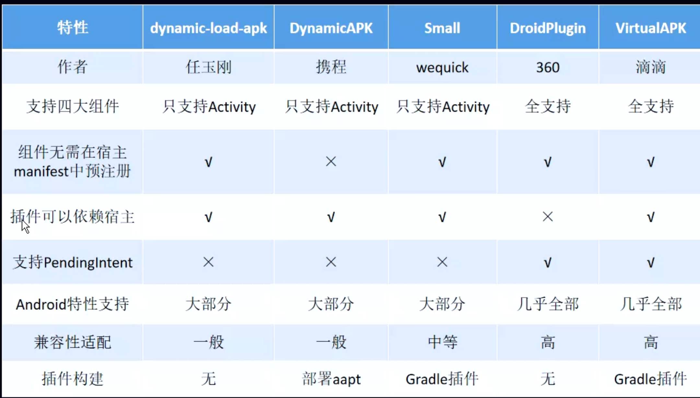

- 
- # [[什么是插件化]]
- # 应用场景
  collapsed:: true
	- 动态更新
	- 热修复（有点大材小用）
	- 功能扩展（ABtest）
	- ## [[插件化换肤]]
- # 开源框架对比
  collapsed:: true
	- 
- 首先我们要知道，插件apk是没有安装的，那我们怎么加载它呢？一个 apk 主要就是由代码和资源组成，所以上面的问题我们可以变为：如何加载插件的类？如何加载插件的资源？
- # 1、[[如何加载插件的类，和热修复一样，合并dexElements]]
- # 2、[[如何加载插件的资源]]
- # 3、[[如何启动插件的四大组件]]
- # 面试题
	- ## [[插件化面试题]]