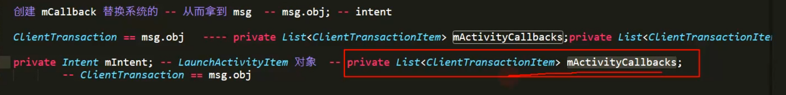

- > 两次Hook
  第一次HookAMS，替换Intent，绕过Activity的注册验证
                         第二次回到APP进程后，把占位Activity替换回目标插件apk里的Activity的继续启动
- 1、宿主APK清单文件里注册一个占位Activity（AMS检测要启动的Activity是否注册，需要有个已注册的来绕过验证）
  collapsed:: true
	- 清单
	  collapsed:: true
		- ```java
		  <?xml version="1.0" encoding="utf-8"?>
		  <manifest xmlns:android="http://schemas.android.com/apk/res/android"
		      package="com.enjoy.leo_plugin">
		  
		      <uses-permission android:name="android.permission.WRITE_EXTERNAL_STORAGE" />
		      <uses-permission android:name="android.permission.READ_EXTERNAL_STORAGE" />
		  
		      <application
		          android:name=".MyApplication"
		          android:allowBackup="true"
		          android:icon="@mipmap/ic_launcher"
		          android:label="@string/app_name"
		          android:roundIcon="@mipmap/ic_launcher_round"
		          android:supportsRtl="true"
		          android:theme="@style/AppTheme">
		          <activity android:name=".MainActivity">
		              <intent-filter>
		                  <action android:name="android.intent.action.MAIN" />
		  
		                  <category android:name="android.intent.category.LAUNCHER" />
		              </intent-filter>
		          </activity>
		          <activity android:name=".ProxyActivity" />
		      </application>
		  
		  </manifest>
		  ```
	- 占位Activity
	  collapsed:: true
		- ```java
		  public class ProxyActivity extends Activity {
		  
		      @Override
		      protected void onCreate(@Nullable Bundle savedInstanceState) {
		          super.onCreate(savedInstanceState);
		          Log.e("leo", "onCreate:  我是宿主的代理Activity");
		      }
		  }
		  
		  ```
- 2、根据Activity的启动流程，寻找第一个Hook点，hookAMS
  collapsed:: true
	- Activity类
	  collapsed:: true
		- 1-1、public void [[#red]]==**startActivity**==(Intent intent, @Nullable Bundle options)
		- 1-2、startActivityForResult
	- Instrumentation类的
	  collapsed:: true
		- execStartActivity[[#red]]==**【Hook点 ActivityTaskManager.getService().startActivity】**==
		  collapsed:: true
			- ```java
			      public ActivityResult execStartActivity(
			              Context who, IBinder contextThread, IBinder token, Activity target,
			              Intent intent, int requestCode, Bundle options) {
			          IApplicationThread whoThread = (IApplicationThread) contextThread;
			          Uri referrer = target != null ? target.onProvideReferrer() : null;
			          if (referrer != null) {
			              intent.putExtra(Intent.EXTRA_REFERRER, referrer);
			          }
			          if (mActivityMonitors != null) {
			              synchronized (mSync) {
			                  final int N = mActivityMonitors.size();
			                  for (int i=0; i<N; i++) {
			                      final ActivityMonitor am = mActivityMonitors.get(i);
			                      ActivityResult result = null;
			                      if (am.ignoreMatchingSpecificIntents()) {
			                          result = am.onStartActivity(intent);
			                      }
			                      if (result != null) {
			                          am.mHits++;
			                          return result;
			                      } else if (am.match(who, null, intent)) {
			                          am.mHits++;
			                          if (am.isBlocking()) {
			                              return requestCode >= 0 ? am.getResult() : null;
			                          }
			                          break;
			                      }
			                  }
			              }
			          }
			          try {
			              intent.migrateExtraStreamToClipData(who);
			              intent.prepareToLeaveProcess(who);
			              int result = ActivityTaskManager.getService().startActivity(whoThread,
			                      who.getBasePackageName(), who.getAttributionTag(), intent,
			                      intent.resolveTypeIfNeeded(who.getContentResolver()), token,
			                      target != null ? target.mEmbeddedID : null, requestCode, 0, null, options);
			              checkStartActivityResult(result, intent);
			          } catch (RemoteException e) {
			              throw new RuntimeException("Failure from system", e);
			          }
			          return null;
			      }
			  ```
	- ### [[#red]]==**具体hook代码,android-30**==
	  collapsed:: true
		- ```java
		  private static final String TARGET_INTENT = "target_intent";
		  
		      public static void hookAMS() {
		          try {
		              // 获取 singleton 对象，
		              // 因为IActivityTaskManagerSingleton在 ActivityTaskManager是单例singleton包括的
		              Field singletonField = null;
		              if (Build.VERSION.SDK_INT < Build.VERSION_CODES.O) { // 小于8.0
		                  Class<?> clazz = Class.forName("android.app.ActivityManagerNative");
		                  singletonField = clazz.getDeclaredField("gDefault");
		              } else { // android- 30
		                  Class<?> clazz = Class.forName("android.app.ActivityTaskManager");
		                  singletonField = clazz.getDeclaredField("IActivityTaskManagerSingleton");
		              }
		  
		              singletonField.setAccessible(true);
		              // 拿到singleton对象，下边根据ActivityTaskManager中 的singleton对象，来拿具体的IActivityTaskManagerSingleton对象
		              Object singleton = singletonField.get(null);
		  
		  
		  
		  
		              // 获取 系统的 IActivityTaskManager 对象
		              Class<?> singletonClass = Class.forName("android.util.Singleton");
		              Field mInstanceField = singletonClass.getDeclaredField("mInstance");
		              mInstanceField.setAccessible(true);
		              // 传入singleton就是反射拿 该singleton对象的get方法
		              // mInstance 就是ActivityTaskManager类中 拿到的IActivityTaskManagerSingleton实例。我们将代理对象 替换这个
		              final Object mInstance = mInstanceField.get(singleton);
		  
		              
		              
		              Class<?> iActivityManagerClass = Class.forName("android.app.IActivityTaskManager");
		              // 创建动态代理对象
		              Object proxyInstance = Proxy.newProxyInstance(Thread.currentThread().getContextClassLoader(),
		                      new Class[]{iActivityManagerClass}, new InvocationHandler() {
		                          @Override
		                          public Object invoke(Object proxy, Method method, Object[] args) throws Throwable {
		                              // do something
		                              // Intent的修改 -- 过滤
		                              /**
		                               * IActivityManager类的方法
		                               * startActivity(whoThread, who.getBasePackageName(), intent,
		                               *                         intent.resolveTypeIfNeeded(who.getContentResolver()),
		                               *                         token, target != null ? target.mEmbeddedID : null,
		                               *                         requestCode, 0, null, options)
		                               */
		                              // 过滤
		                              if ("startActivity".equals(method.getName())) {
		                                  int index = -1;
		  
		                                  for (int i = 0; i < args.length; i++) {
		                                      if (args[i] instanceof Intent) {
		                                          index = i;
		                                          break;
		                                      }
		                                  }
		                                  // 启动插件的
		                                  Intent intent = (Intent) args[index];
		  
		                                  Intent proxyIntent = new Intent();
		                                  proxyIntent.setClassName("com.enjoy.leo_plugin",
		                                          "com.enjoy.leo_plugin.ProxyActivity");
		  
		                                  proxyIntent.putExtra(TARGET_INTENT, intent);
		  
		                                  args[index] = proxyIntent;
		                              }
		                              // 替换完Intent 还是需要调用系统的对应方法
		                              // args  method需要的参数  --- 不改变原有的执行流程
		                              // mInstance 系统的 IActivityTaskManager 对象
		                              return method.invoke(mInstance, args);
		                          }
		                      });
		  
		              // ActivityManager.getService() 替换成 proxyInstance
		              // 反射设置 singleton对象的 mInstanceField的字段值。如果调用就返回代理对象proxyInstance
		              mInstanceField.set(singleton, proxyInstance);
		  
		          } catch (Exception e) {
		              e.printStackTrace();
		          }
		      }
		  
		  ```
	- Hook具体做的事，
		- 1、反射拿到系统的IActivityTaskManager 对象
		- 2、通过动态代理创建IActivityTaskManager 代理对象。
		- 3、反射将系统的IActivityTaskManager 对象，替换成我们动态代理创建出的IActivityTaskManager 代理对象
		- 4、StartActivity时，会先进入代理对象中，走InvocationHandler的invoke方法。替换完Intent后，再通过系统的IActivityTaskManager 对象。调用同名方法
- 3、通过AMS验证后，回到APP进程，ActivityThread启动Activity时，需要将Intent替换回目标Activity
	- [[#red]]==**APi26**==[[#red]]==**hookHandler，callBack**==替换Intent(case 100)
		- 通过Handler 中调用handleLaunchActivity。传入ActivityClientRecord里包含Intent。
	- [[#red]]==**API28 30**== case 159,通过LaunchActivityItem 替换Intent
		- 
	- 代码
	  collapsed:: true
		- ```java
		     public static void hookHandler() {
		          try {
		              // 获取 ActivityThread 类的 Class 对象
		              Class<?> clazz = Class.forName("android.app.ActivityThread");
		  
		              // 获取 ActivityThread 对象
		              Field activityThreadField = clazz.getDeclaredField("sCurrentActivityThread");
		              activityThreadField.setAccessible(true);
		              Object activityThread = activityThreadField.get(null);
		  
		              // 获取 mH 对象
		              Field mHField = clazz.getDeclaredField("mH");
		              mHField.setAccessible(true);
		              final Handler mH = (Handler) mHField.get(activityThread);
		  
		              Field mCallbackField = Handler.class.getDeclaredField("mCallback");
		              mCallbackField.setAccessible(true);
		  
		              // 创建的 callback
		              Handler.Callback callback = new Handler.Callback() {
		  
		                  @Override
		                  public boolean handleMessage(@NonNull Message msg) {
		                      // 通过msg  可以拿到 Intent，可以换回执行插件的Intent
		  
		                      // 找到 Intent的方便替换的地方  --- 在这个类里面 ActivityClientRecord --- Intent intent 非静态
		                      // msg.obj == ActivityClientRecord
		                      switch (msg.what) {
		                          case 100:
		                              try {
		                                  Field intentField = msg.obj.getClass().getDeclaredField("intent");
		                                  intentField.setAccessible(true);
		                                  // 启动代理Intent
		                                  Intent proxyIntent = (Intent) intentField.get(msg.obj);
		                                  // 启动插件的 Intent
		                                  Intent intent = proxyIntent.getParcelableExtra(TARGET_INTENT);
		                                  if (intent != null) {
		                                      intentField.set(msg.obj, intent);
		                                  }
		                              } catch (Exception e) {
		                                  e.printStackTrace();
		                              }
		                              break;
		                          case 159:
		                              try {
		                                  // 获取 mActivityCallbacks 对象
		                                  Field mActivityCallbacksField = msg.obj.getClass()
		                                          .getDeclaredField("mActivityCallbacks");
		  
		                                  mActivityCallbacksField.setAccessible(true);
		                                  List mActivityCallbacks = (List) mActivityCallbacksField.get(msg.obj);
		  
		                                  for (int i = 0; i < mActivityCallbacks.size(); i++) {
		                                      if (mActivityCallbacks.get(i).getClass().getName()
		                                              .equals("android.app.servertransaction.LaunchActivityItem")) {
		                                          Object launchActivityItem = mActivityCallbacks.get(i);
		  
		                                          // 获取启动代理的 Intent
		                                          Field mIntentField = launchActivityItem.getClass()
		                                                  .getDeclaredField("mIntent");
		                                          mIntentField.setAccessible(true);
		                                          Intent proxyIntent = (Intent) mIntentField.get(launchActivityItem);
		  
		                                          // 目标 intent 替换 proxyIntent
		                                          Intent intent = proxyIntent.getParcelableExtra(TARGET_INTENT);
		                                          if (intent != null) {
		                                              mIntentField.set(launchActivityItem, intent);
		                                          }
		                                      }
		                                  }
		                              } catch (Exception e) {
		                                  e.printStackTrace();
		                              }
		                              break;
		                      }
		                      // 必须 return false
		                      return false;
		                  }
		              };
		  
		              // 替换系统的 callBack
		              mCallbackField.set(mH, callback);
		          } catch (Exception e) {
		              e.printStackTrace();
		          }
		      }
		  ```
-