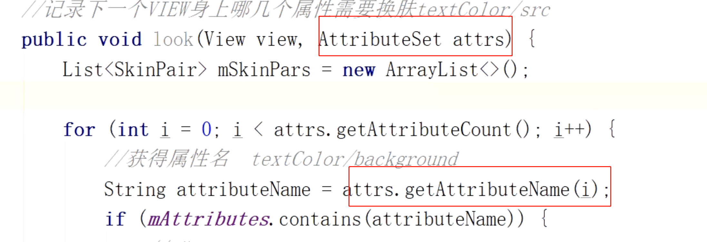

## 前提知识
	- 1、打包的apk里有一个[[#red]]==**resources.arsc 二进制文件，记录着res**==里的颜色和图片等信息，是在哪个xml文件里
	- 2、当我们加载一个apk时，会有一个类去读取这个文件resources.arsc 和res包
	- 
	- 
	- 属性读取
		- 
		- AttributeSet  读取的就是上述二进制文件里的东西，不是xml里 R.color.xxx这样
- ## [[资源加载流程]]
- ## [[插件化换肤的思路]]