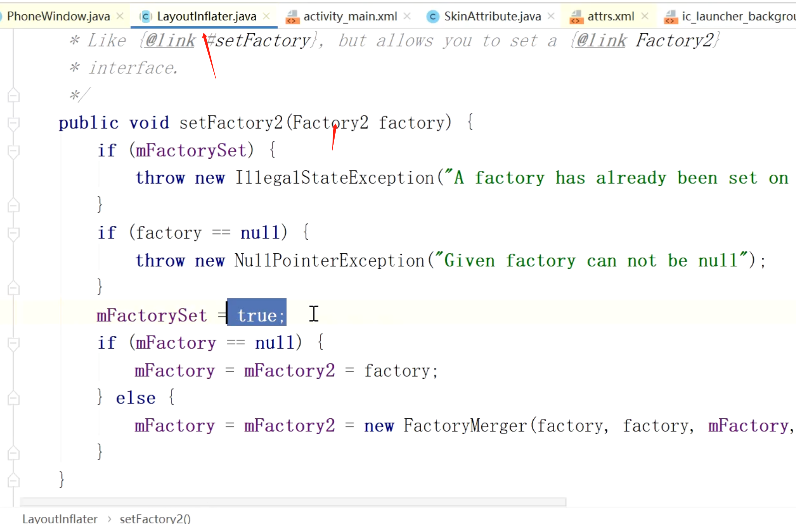
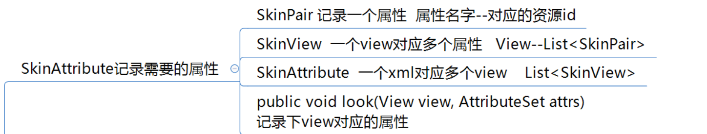
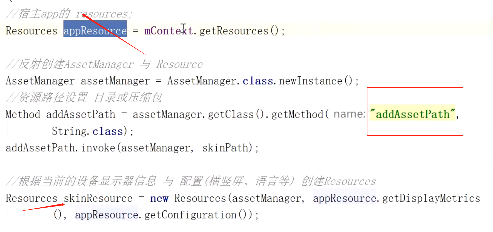

## 涉及view实例化过程+资源Resource加载过程
- ## 1、制作皮肤包插件
	- 生成一个无代码的，资源和宿主资源名字一样插件APK.
- ## 2、搜集宿主APK，所有根据xml创建view的属性
	- 1、因为所有的xml里的View都是通过LayoutInflater反射创建的
	- 2、可以通过给LayoutInflater 设置 [[#red]]==**自定义的VIew实例化工厂**==（实现了Factory2接口）收集所有创建的VIew以及属性
	- 3、筛选可替换的属性：[[#red]]==**比如定义在res/color下的**==（而不是在XML里写死的颜色值）
- ## 3、加载插件APK的资源，创建插件的Resource
	- 由资源的加载过程得知，AssetManager会根据APK路径读取对应apk里的资源，生成resources.arsc 二进制文件
	- 1、我们反射调用AssetManager 中的 addAssetPath方法[[#red]]==**传入插件apk路径，读取插件apk的资源**== 创建插件的Resource
- ## 4、执行换肤，将资源包中的资源应用到运行中的APP
	- 通过收集的view属性，根据属性对应的==**二进制资源文件的id，去插件Resource查找对应属性**==。
	- 找到的话，通过setBackground,setImageDrawable,setTextcolor==**代码设置皮肤包资源**==
-
-
- # 整体思路
  collapsed:: true
	- 0、[[#red]]==**制作皮肤包**==：资源定义在res里，[[#red]]==**生成一个无代码的APK文件即可，资源和宿主名字一样**==
	- 1、[[#red]]==**利用LayoutInflater中 view实例化过程，收集宿主包XML数据，每个view都用了什么属性**==
	  collapsed:: true
		- 背景：利用View的实例化流程，都是通过LayoutInflater.inflate中实例化的
		- 利用：通过Factory2接口，自定义SkinLayoutInflaterFactory，
			- 设置自己的view创建工厂
			- 
			- 设置一下变为true：意味着工厂只能用一次
			- 每次换肤需要反射修改这个值
	- 2、[[#red]]==**收集1**==拿到所有[[#red]]==**创建的view**==。新建一个类（SkinAttribute），用集合去存储view[[#red]]==**的属**==性，看哪些是可以直接修改资源的（在res目录下定义的color）非layout # 写死的
	  collapsed:: true
		- 2-1、
			- 
		- 2-2、
	- 3、反射调用AssetManager 中的 addAssetPath方法[[#red]]==**读取皮肤包的资源**== Resource
		- 需要先将插件apk资源加载进来
		- 
	- 4、执行换肤。将资源包中的资源应用到运行中的APP
		- 通过二进制资源文件的id，去从皮肤包里读取对应属性，如果有的话
		- 代码设置皮肤包的资源，setBackground,setImageDrawable,setTextcolor
	- 实现换肤效果
-
- ## 问题：上述能统计到系统view的属性比如background,textColor,自定义view自定义属性怎么处理？
	- 这个没办法只能内置换肤接口了。自己实现自定义属性的换肤