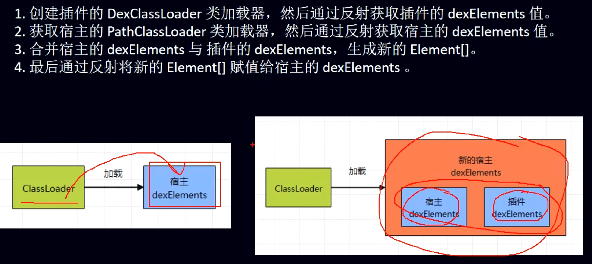

## 1、[[什么是插件化]]
- ## 2、[[插件化换肤的思路]]
- ## 3、最难的是欺骗系统，版本适配
- ## 4、应用场景
	- 动态更新、热修复（有点大材小用）、功能扩展（ABtest）
- ## 5、[[类的生命周期]]
- ## 6、插件化的步骤，或者要点
	- 1、加载插件apk里的类-类加载机制
	  collapsed:: true
		- 由类加载机制可知[[双亲委托+类加载流程-面试]]，非framwork的类最终会从DexPathList的dexElements里加载的。那么
		- 
	- 2、加载插件apk里的资源-Assetmanager 资源管理器
		- [[如何加载插件的资源]]
	- 3、启动插件中的四大组件-[[HookActivity]]启动流程
- ## 7、插件化和热修复插入点的区别
	- 插入点都是在DexPathlist类的 dexElements数组中，DexPathlist又是BaseDexClassLoader的对象
	- 两个都是合并宿主的dexElements 和 插件的dexElements/补丁的dexElements
	  id:: 64e42c0a-22f3-4bbb-b0ac-dacda2feda4f
	- ## 插件化是合并时把宿主的dexElements放前边，由类加载机制放前边的先加载。插件化优先宿主
	- ## 热修复是优先把补丁的dexElements放前边，达到覆盖的效果，优先加载正确的
- ## 8、raw文件夹和assets文件夹有什么区别
	- raw(res目录下) : Android会自动的为这目录中的所有资源文件生成一个ID,这意味着很容易就可以访问到这个资源，甚至在xml 中都是可以访问的，使用ID访问速度是最快的。
	- assets : 不会生成ID，只能通过AssetManager访问，xml中不能访问，访问速度会慢些，不过操作更加方便。