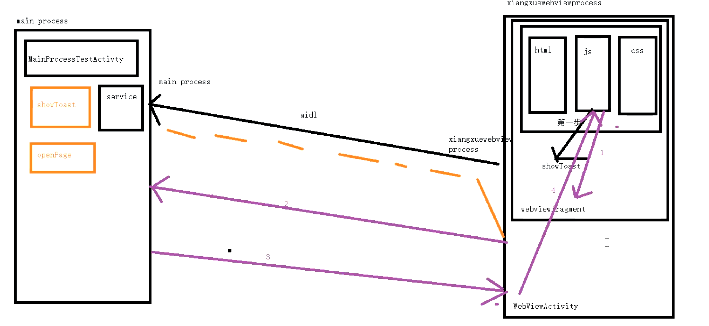

- # 一、单个互调使用
	- ### [[js 调用 Native 通过addJavascriptInterface]]
	- ###  [[JS调用Native传了个callBack过去，Native通过evaluateJavascript调用js的callBack方法]]
- # 二、项目实际WebView框架搭建
	- 
	- ## Native端
	  collapsed:: true
		- ## 1、addJavascriptInterface添加对象映射
			- js使用的时候先通过Window获取xiangxuewebview，拿到对象 才能调方法
			- ```kotlin
			      public void init() {
			          WebViewProcessCommandDispatcher.getInstance().initAidlConnection();
			          WebViewDefaultSettings.getInstance().setSettings(this);
			          // 参数1 映射对象  参数2 接口名
			          addJavascriptInterface(this, "xiangxuewebview");
			      }
			  
			  ```
		- ## 2、 通过@JavascriptInterface 声明可调的方法
			- js拿到对象映射可以调这个方法。调用takeNativeAction这个方法
			- ```kotlin
			      // 定义一个参数，ios侧只能接受一个参数 ，通过json再解析
			     @JavascriptInterface
			      public void takeNativeAction(final String jsParam) {
			          Log.i(TAG, jsParam);
			          if (!TextUtils.isEmpty(jsParam)) {
			              final JsParam jsParamObject = new Gson().fromJson(jsParam, JsParam.class);
			              if (jsParamObject != null) {
			                // 根据命令去分发   
			                WebViewProcessCommandDispatcher.getInstance().executeCommand(jsParamObject.name, new Gson().toJson(jsParamObject.param), this);
			              }
			          }
			      }
			  ```
		- ## 3、[[收到js调用后，Native解析参数，获取命令去分发处理]]
	- # [[Js侧]]
	- # [[实际工作完整的功能]]
	- ## [完整工程地址](https://github.com/FarmCoder007/WebviewModule)
-