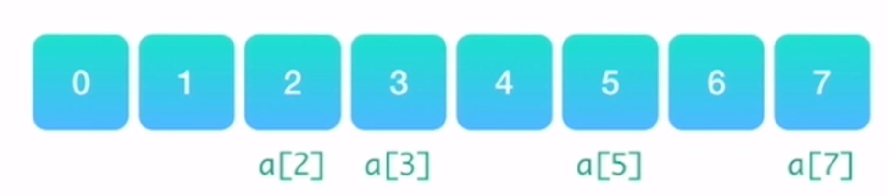

- 
- # 一、优点
	- ## 1、构建数组简单
	- ## 2、能让我们在O(1)时间里根据数组下标（index）查询某个元素
- # 二、缺点
	- ## 1、构建时必须分配一段连续的空间
	- ## 2、查询某个元素是否存在时，需要遍历整个数组，耗费O(n)的时间（其中n为元素的个数）
	- ## 3、删除和添加某个元素时，同样需要耗费O(n)的时间
- ## 算法题
	- [[2455. 可被三整除的偶数的平均值-简单]]
	- [[剑指 Offer 03. 数组中重复的数字-简单]]
-