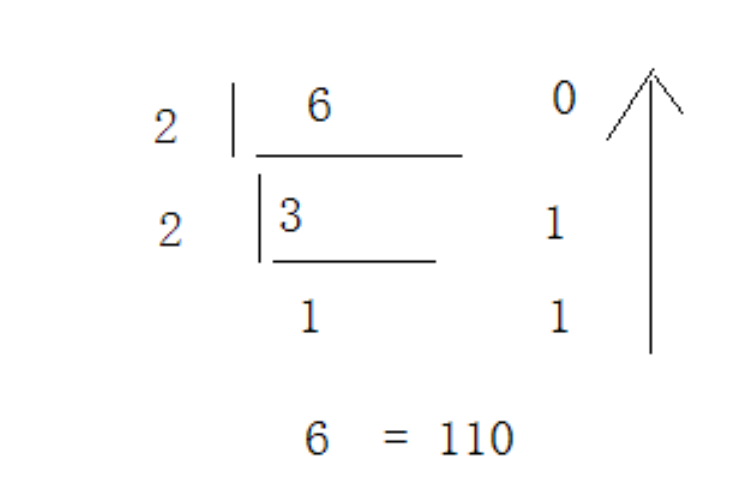
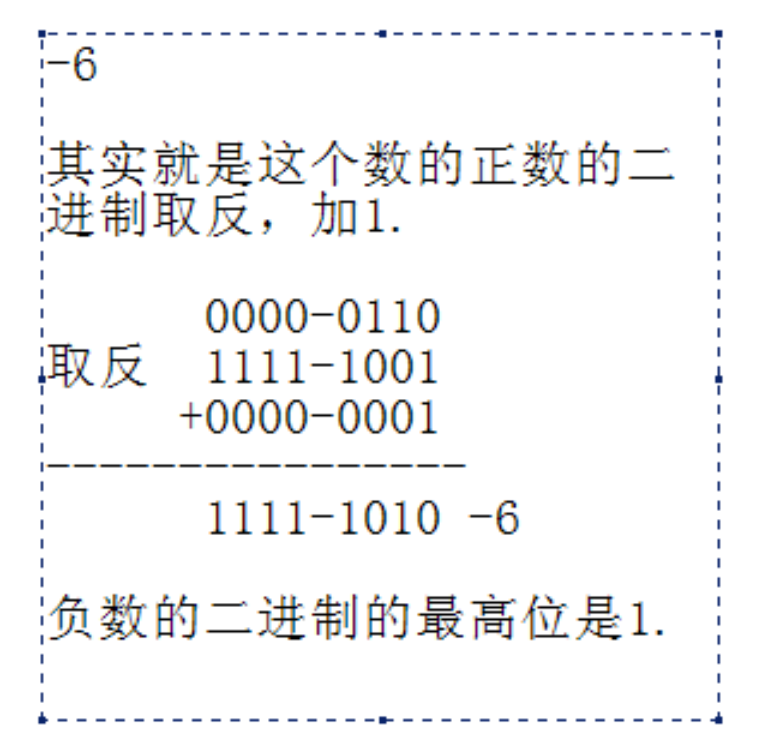

- 进制：计数方式
- # 一、区分
	- ## 二进制：满2进1
		- 0,1
	- ## 八进制：满8进1，用0开头表示
		- 八进制数：其实就是3个二进制位一个8进制位
		  id:: 6486ec45-21ef-4211-ad47-04b4f62c2143
		- 0-7
		- 示例：023
	- ## 十进制：满10进1
		- 0-9
		- 示例：23
	- ## 十六进制：满16进1，用0x开头表示
		- 十六进制数：其实就是4个二进制位一个16进制位
		- 0-9，A-F
		- 示例：0x23
- # 二、进制表示
	- ## 752为十进制数，那么**[[#red]]==十进制表示形式==**
		- 752：2（0位）5（1位） 7（2位） （位数代表10的多少次幂）
		- ==**752的十进制表示形式为： 2 * 10（0次幂）+5 * 10（1次幂）+7 * 10（2次幂）**==
	- ## 1011为2进制数，那么表示形式为
		- 1011：从低位到高位：1（0位）1（1位）0（2位）1（3位）（位数代表2的多少次幂）
		- 二进制的表示形式为：1*2（0次幂）+1*2（1次幂）+0*2（2次幂）+1*2（3次幂）
		- **[[#red]]==简单计算方式：==**
			- ```java
			  第几位：就那个位数字*2的几次幂
			    1		1		1		1		1		1		1		1
			   2（7） 2（6）  2（5）   2（4）  2（3）  2（2）	2（1）  2(0次幂) 
			    128   64      32		16		8		4		2		1
			  ```
- # 三、进制转换
	- ## 3-1、二进制->其它进制转换
		- ## 二进制 -> 十进制
			- 比如：二进制数，01010011转十进制
			- 01010011 = 1*2（0）+1*2（1）+1*2（4）+1*2（6） = 1+2+16+64 = 83
			- 那么这个二进制 代表的十进制 83
		- ## 二进制 -> 八进制：3个二进制代表一个八进制
			- 01010011按照3个划分，不足3个0补全：001   010   011，分别计算每块的值
			- ```java
			  （001）         （010）            （011）
			  1*2(0次幂)      1*2（1）       1*2（0）+1*2（1）
			  	1				2                3
			    
			    所以八进制表示为0123
			  ```
			-
		- ## 二进制 -> 十六进制：4个二进制代表一个十六进制
		  collapsed:: true
			- 01010011按照4个划分，不足4个0补全：0101   0011，分别计算每块的值
			- ```java
			       （0101）         			        （0011）            
			  1*2(0次幂)+1*2（2次幂）     			 1*2（0）+1*2（1）      
			  	    5						             3              
			    
			    所以十六进制表示为0x53
			  ```
			-
		-
	- ## 3-2、其他进制转换二进制
		- ## 十进制->2进制：除2取余数
		  collapsed:: true
			- 6
				- 
		- ## 十六进制->2进制
			- 表格
				- ```java
				   0      |   0000
				   1      |   0001
				   2      |   0010
				   3      |   0011
				   4      |   0100
				   5      |   0101
				   6      |   0110
				   7      |   0111
				   8      |   1000
				   9      |   1001
				   A      |   1010
				   B      |   1011
				   C      |   1100
				   D      |   1101
				   E      |   1110
				   F      |   1111
				  ```
			- 比如0x3A->0011 1010
			- 从左到右依次将每个十六进制位转换为对应的四位二进制数。例如，如果要将十六进制数 "3A" 转换为二进制数，按照上述表格，将 "3" 转换为 "0011"，将 "A" 转换为 "1010"。
		- ## 八进制->2进制
			- 表格
				- ```java
				   0      |   000
				   1      |   001
				   2      |   010
				   3      |   011
				   4      |   100
				   5      |   101
				   6      |   110
				   7      |   111
				  ```
			- 从左到右依次将每个八进制位转换为对应的三位二进制数。例如，如果要将八进制数 "36" 转换为二进制数，按照上述表格，将 "3" 转换为 "011"，将 "6" 转换为 "110"。
	- ## 其他之间转换，都先转成2进制 过渡
- # 四、负数的二进制表现形式
  collapsed:: true
	- 
	-
	- 6的二进制：        0000-0110
	- 取反                     1111  -1001
	- +1（1的二进制）  0000-0001      （相加的时候满2进1）