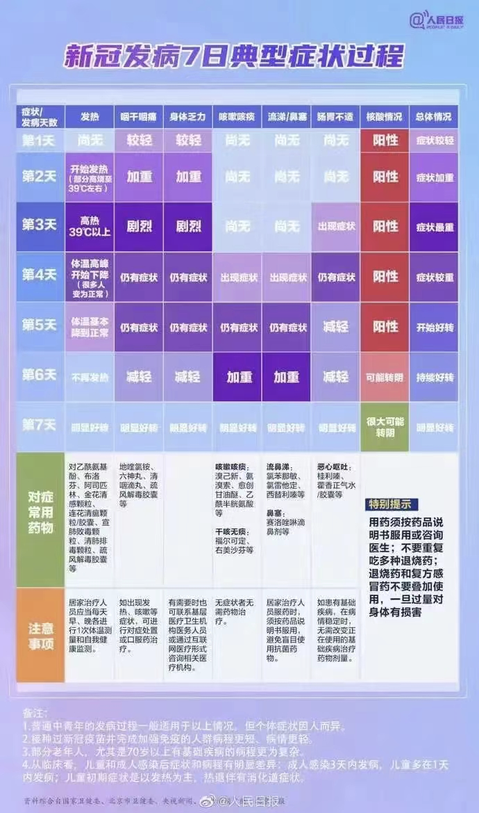

- # 一、7日典型症状
  collapsed:: true
	- {:height 1177, :width 690}
- # 二、常备物资
  collapsed:: true
	- 1、75%酒精
	- 2、一次性医用手套
	- 3、N95口罩
	- 4、体温计
	- 5、一次性食品袋
	- 6、84消毒剂 500ml兑2瓶盖  墩地
- # 三、常备药物
  collapsed:: true
	- ## 解热镇痛
	  collapsed:: true
		- ### 大人
			- 布洛芬
			- 对乙酰氨基酚
			- 阿司匹林
			- 金花清感颗粒
			- 连花清瘟胶囊
			- 宣肺败毒颗粒
			- 清肺排毒颗粒
			- 疏风解毒胶囊
		- ## 孩子
			- 美林
			- 泰诺林
			-
	- ## 咽干咽痛
		- 地喹氯铵
		- 六神丸
		- 清咽滴丸
		- 疏风解毒胶囊
	- ## 咳嗽咳痰
		- 溴已新
		- 氨溴索口服液
		- 愈创甘油醚
		- 乙酰半胱氨酸
	- ## 干咳无痰
		- 福尔可定
		- 右美沙芬
	- ## 流鼻涕
		- 氯苯那敏
		- 氯雷他定
		- 西替利嗪
	- ## 鼻塞
		- 赛洛唑林滴鼻计
	- ## 恶心呕吐
		- 藿香正气水
	- ## 止泻
	  collapsed:: true
		- 蒙脱石散
	- 电解质水— 一勺子盐一勺子糖 混合
	-
- # 四、孩子备药
  collapsed:: true
	- 退烧
		- 美林        婴儿装
		- 泰诺林    小儿装
	- 抗病毒
		- 小儿豉翘清热颗粒
		- 蒲地蓝消炎口服液
	- 止咳
		- 小葵花小儿肺热咳喘口服液
	- 比赛流鼻涕
		- 海盐水
	- 化痰
		- 氨溴索口服液
		- 乙酰半胱氨酸
	- 止泻
		- 蒙脱石散
	- 电解质
		- 口服补液盐
- # 五、注意事项
  collapsed:: true
	- 1、退烧药不能多种一起吃
	- 2、对乙酰氨基酚每日最大剂量不超过2g
	  collapsed:: true
		- 市面上0.5g每片、间隔6小时
		- 复方对乙酰氨基酚 看含量表 一般每片含150mg
	- 3、退烧超过38.5度吃
	- 4、嗓子疼禁忌
		- 避免摄入增加血管通透性的食物——洋葱（目前已知唯一含有前列腺素A的食材），以及葱姜蒜辣椒等食材，越吃这些刺激性食材，喉咙越肿痛
- # 六、阳性康复后衣服处理
  collapsed:: true
	- “新十条”公布之后，很多新冠阳性感染者可以在家进行自我隔离，那么，阳性感染者康复过程中，在家中用过的东西、穿过的衣服是否有造成二次感染的可能性？该如何正确处理？
	- 专家表示，从医学角度说，病毒需要营养的获得，衣物上没有营养供应，这种情况下病毒不容易存活。另外，病毒需要在活体细胞内才能复制，衣物提供不了这种环境。病毒在低温下存活时间长，高温下存活时间短，包括56℃或者以上，用热水浸泡衣物就可以解决，不必太过于担心这一问题。
- # 七、缓解症状食疗
  collapsed:: true
	- 1、电解质
		- 一杯水+糖+盐
	- 2、咽喉嗓子疼
	  collapsed:: true
		- 1、西红柿拌白糖
			- 糖尿病患者直接生吃西红柿（去皮或者洗干净）
			- 想办法摄入降低血管通透性的食物——西红柿，它含有维生素P，也就是一种特殊黄酮苷C27H30O16，可以抗炎、抗过敏和抗病毒，同时还可以增强和保护维生素C的抗氧化作用。
		- 2、热荞麦茶
			- 肠胃吃冷食容易拉肚子的朋友，可以考虑喝热荞麦茶，因为苦荞麦也富含有大量的黄酮类维生素P，降低喉部血管通透性。
		- 橙子P泡水
- # 八、阳性日常注意
	- 1、日常垃圾、每日一袋消毒处理掉
	- 2、碗筷分离、可蒸汽消毒