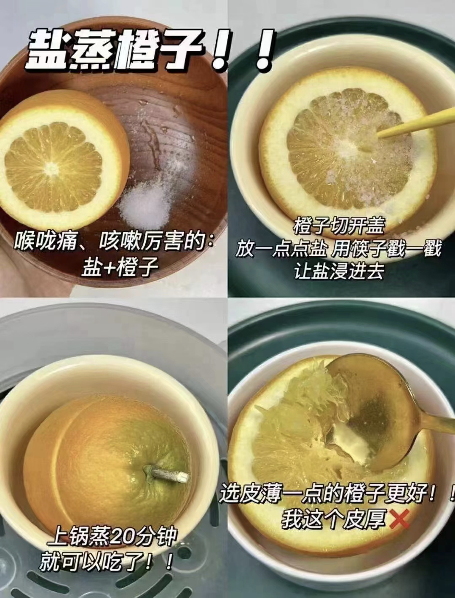

- # 一、7日典型症状
  collapsed:: true
	- {:height 1177, :width 690}
- # 二、常备物资
  collapsed:: true
	- 1、75%酒精
	- 2、一次性医用手套
	- 3、N95口罩
	- 4、体温计
	- 5、一次性食品袋
	- 6、84消毒剂 500ml兑2瓶盖  墩地
- # 三、常备药物
  collapsed:: true
	- ## 解热镇痛
	  collapsed:: true
		- ### 大人
			- 布洛芬
			- 对乙酰氨基酚
			- 阿司匹林
			- 金花清感颗粒
			- 连花清瘟胶囊
			- 宣肺败毒颗粒
			- 清肺排毒颗粒
			- 疏风解毒胶囊
		- ## 孩子
			- 美林
			- 泰诺林
			-
	- ## 咽干咽痛
		- 地喹氯铵
		- 六神丸
		- 清咽滴丸
		- 疏风解毒胶囊
	- ## 咳嗽咳痰
		- 溴已新
		- 氨溴索口服液
		- 愈创甘油醚
		- 乙酰半胱氨酸
	- ## 干咳无痰
		- 福尔可定
		- 右美沙芬
	- ## 流鼻涕
		- 氯苯那敏
		- 氯雷他定
		- 西替利嗪
	- ## 鼻塞
		- 赛洛唑林滴鼻计
	- ## 恶心呕吐
		- 藿香正气水
	- ## 止泻
	  collapsed:: true
		- 蒙脱石散
	- 电解质水— 一勺子盐一勺子糖 混合
	-
- # 四、孩子备药
  collapsed:: true
	- 退烧
		- 美林        婴儿装
		- 泰诺林    小儿装
	- 抗病毒
		- 小儿豉翘清热颗粒
		- 蒲地蓝消炎口服液
	- 止咳
		- 小葵花小儿肺热咳喘口服液
	- 比赛流鼻涕
		- 海盐水
	- 化痰
		- 氨溴索口服液
		- 乙酰半胱氨酸
	- 止泻
		- 蒙脱石散
	- 电解质
		- 口服补液盐
- # 五、注意事项
  collapsed:: true
	- 1、退烧药不能多种一起吃
	- 2、对乙酰氨基酚每日最大剂量不超过2g
	  collapsed:: true
		- 市面上0.5g每片、间隔6小时
		- 复方对乙酰氨基酚 看含量表 一般每片含150mg
	- 3、退烧超过38.5度吃
	- 4、嗓子疼禁忌
		- 避免摄入增加血管通透性的食物——洋葱（目前已知唯一含有前列腺素A的食材），以及葱姜蒜辣椒等食材，越吃这些刺激性食材，喉咙越肿痛
- # 六、阳性康复后衣服处理
  collapsed:: true
	- “新十条”公布之后，很多新冠阳性感染者可以在家进行自我隔离，那么，阳性感染者康复过程中，在家中用过的东西、穿过的衣服是否有造成二次感染的可能性？该如何正确处理？
	- 专家表示，从医学角度说，病毒需要营养的获得，衣物上没有营养供应，这种情况下病毒不容易存活。另外，病毒需要在活体细胞内才能复制，衣物提供不了这种环境。病毒在低温下存活时间长，高温下存活时间短，包括56℃或者以上，用热水浸泡衣物就可以解决，不必太过于担心这一问题。
- # 七、缓解症状食疗
  collapsed:: true
	- 1、电解质 
	  collapsed:: true
		- 一杯水+糖+盐
		- 
	- 2、咽喉嗓子疼
	  collapsed:: true
		- 1、西红柿拌白糖
			- 糖尿病患者直接生吃西红柿（去皮或者洗干净）
			- 想办法摄入降低血管通透性的食物——西红柿，它含有维生素P，也就是一种特殊黄酮苷C27H30O16，可以抗炎、抗过敏和抗病毒，同时还可以增强和保护维生素C的抗氧化作用。
		- 2、热荞麦茶
			- 肠胃吃冷食容易拉肚子的朋友，可以考虑喝热荞麦茶，因为苦荞麦也富含有大量的黄酮类维生素P，降低喉部血管通透性。
		- 3、盐蒸橙子
			- 
		-
	- 3、咳嗽喉咙干
	  collapsed:: true
		- 
	- 4、红糖姜汤
	  collapsed:: true
		- 
- # 八、阳性日常注意
  collapsed:: true
	- 1、日常垃圾、每日一袋消毒处理掉
	- 2、与阳性人员碗筷分离、可蒸汽消毒
	- 3、接触阳性相关东西，带一次性医用手套，接触完扔掉
	- 4、其他人员日夜带N95口罩。可借助绳子防勒耳朵
	- 5、500ml水兑2瓶盖84墩地
	- 6、勤通风
- # 九、小阳人日常饮食
  collapsed:: true
	- 1、多喝水/电解质水:
		- 日常1500-2000ML [小口慢喝]
	- 2、多吃奶制品、豆浆等补充蛋白质
		- 至少每日一个鸡蛋
		- 酸奶也行
	- 3、杂粮粥、米饭、面条等碳水多吃
	- 
- # 十、几种情况建议就医
	- “感染了新冠去不去急诊”，成了最近困扰很多人的难题。面对人满为患的急诊，不去，可能会耽误病情；去了，不仅排队时间长，还有交叉感染的风险。今天，就让北京协和医院急诊科专家带您一文了解四类脆弱人群什么情况下需要来急诊，赶快收藏起来——
	- ## 一、老年人
	  collapsed:: true
		- 老年人的新冠感染重症死亡率比年轻人要高出很多。
		- 很多高龄老人的新冠感染症状非常隐秘、不典型，如感染后出现肺炎，却没有咳嗽或发烧，只表现为意识的改变、乏力和嗜睡，也就是现在常说的“沉默性低氧”。老年人在感染新冠病毒后，还出现继发的各种细菌感染，如果护理不当，发烧后盲目给予过量的水分摄入，还有可能诱发心力衰竭。所以老年人在患病后的护理更要小心。
		- 如果出现以下情况，建议老年人尽快就医：
		- 1、体温升高≥38.5℃超过3天。
		- 2、相比患病前，进食变差，小便量明显减少，或新出现多次大便失禁。
		- 3、反应/精神状态比之前明显迟钝、嗜睡、交流障碍、不认人，不知道自己在什么地方，以前能够完成的事情都不能完成了（如走路、聊天）。
		- 4、新出现了憋气、呼吸困难，不能平躺。
		- 5、咳嗽或喘息加重，甚至出现口唇发白发紫的情况。
		- 6、周围人听到老人喉咙有明显的痰鸣音，难以咳出。
		- 7、平时氧饱和度正常，此次起病后自测氧饱和度≤93%。
		- 8、如果老年人还合并了慢性肺病、心脏病、糖尿病等基础疾病，不宜在家过多饮水或强迫进食，如果出现了基础疾病症状的加重，更应及时就医
	- ## 二、基础疾病的人群
		- 慢性肺病、心脏病、糖尿病、慢性肾脏病和慢性免疫功能抑制是最常见出现新冠重症感染的危险因素。有这些疾病的人群一旦感染了新冠病毒，一定要密切观察，即便体力能够支持，也最好不要看护儿童或照顾宠物，每日测量体温、心率、血压和血氧情况。
		- 如果出现以下情况，建议有基础疾病的人群尽快就医：
		- 1、上厕所或进行很轻微活动时也会出现憋气或呼吸困难。
		- 2、血压比平日的基础血压升高或降低≥20mmHg，并出现头晕、乏力等情况。
		- 3、新出现胸痛、胸闷、心悸、且休息后不能好转，或难以平卧。
		- 4、体温持续≥38.5℃，且服用退热药后体温不好转，甚至出现意识模糊、进食差、尿量减少等症状。
		- 5、平时氧饱和度正常（≥95%），但起病后家中自测氧饱和度＜94%；或平时有基础肺病（氧饱和度＜95%），但此次起病后的氧饱和度比平时水平更低。
	- ## 三、孕妇
		- 如果准妈妈出现以下症状，请尽快就医：
		- 1、持续超过39℃的高热，且服用退热药后效果不佳。
		- 2、持续的剧烈的头痛，且在服用药物或休息后疼痛感不会消失。
		- 3、出现头晕或晕倒，甚至出现短暂的意识丧失。
		- 4、感觉呼吸急促，喉咙或胸部紧绷，平躺时感觉呼吸困难，需要垫高枕头才能入睡。
		- 5、新出现胸痛，如胸部中央的紧绷感或压迫感，或除了胸部以外，疼痛还蔓延至背部、颈部或手臂，或出现咯血的情况。
		- 6、突然出现心跳变化，如感觉心脏砰砰直跳，自己测量脉搏跳动不规律，且休息后不好转。在心跳改变的过程中，同时感到头晕，乏力。
		- 7、严重的恶心和呕吐。胃部突然出现的严重不适感，远超出平时（孕早期）的恶心和呕吐感。
		- 8、突然出现的腹痛，且随着时间的推移而疼痛加重。
		- 9、自觉胎动减少或停止。
		- 10、怀孕期间新出现的阴道出血或流液。
	- # 四、儿童
		- 跟以往的毒株相比，奥密克戎感染导致重症死亡率在全世界都有明显的下降。但由于它在人群中的传染非常广泛，特别是在儿童中的传播比以往的毒株有明显增加。虽然儿童感染新冠的死亡率非常低，但是也可能导致儿童重症，特别是有基础疾病的儿童，重症的风险将增加。与成人类似，患有肥胖、糖尿病、哮喘、慢性肺病或免疫抑制的儿童，患重症的风险也可能增加。
		- 如果儿童出现以下症状，请尽快就医：
		- 1、持续高热超过3天。
		- 2、出现呼吸急促（小于2 月龄，呼吸次数≥60 次/分；2～12月龄， 除外发热和哭闹的影响，呼吸次数≥50 次/分；1～5 岁，呼吸次数≥40 次/分；5 岁以上，呼吸次数≥30 次/分）。
		- 3、活动能力或意识水平下降，如出现昏睡、刺激后也不能清醒、持续哭闹，甚至出现抽搐。
	- 4、拒食或进食困难、反复呕吐或腹泻、尿量明显减少。
	- 5、出现皮肤或口唇苍白、四肢发紫。
	- 6、本身有其他疾病的孩子，有任何拿不准的情况，建议及时就医。