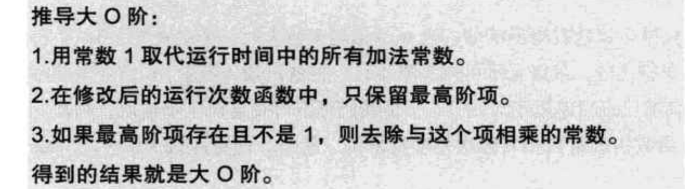
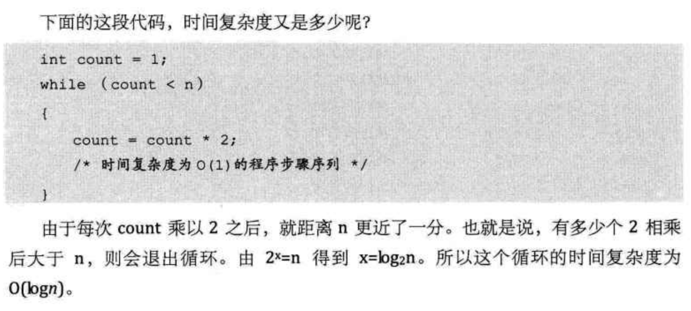
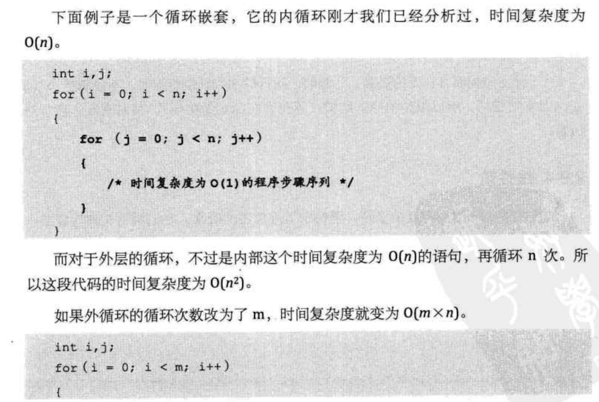
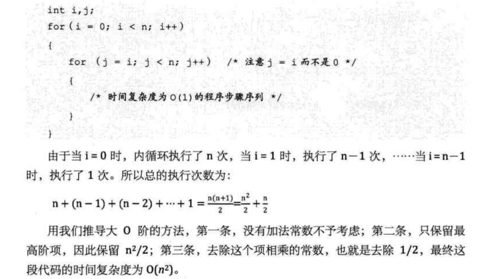
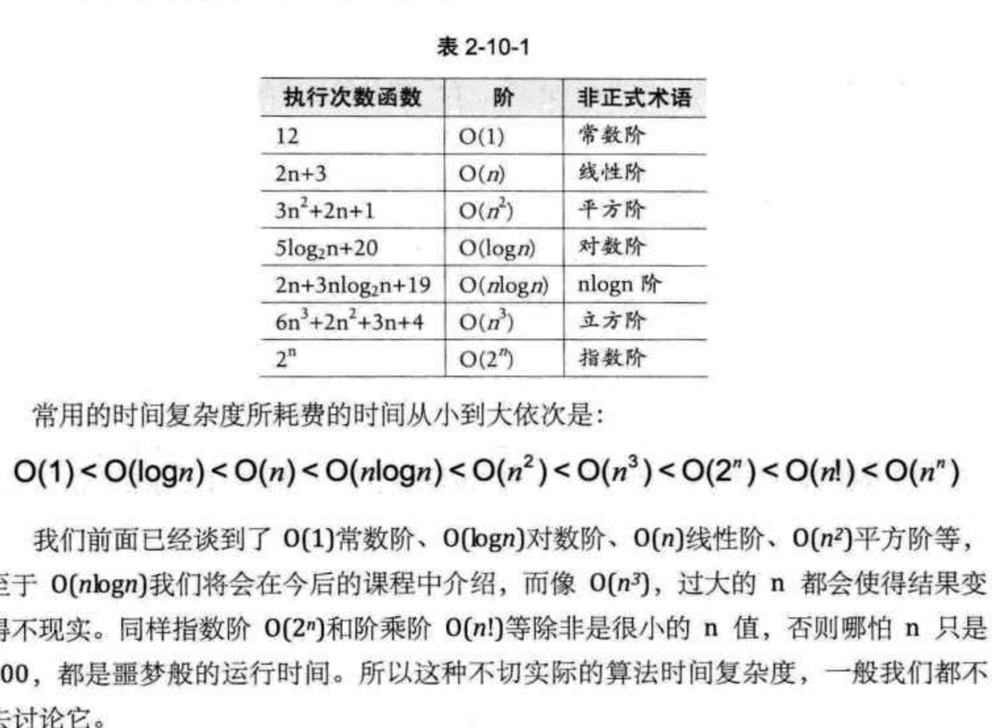
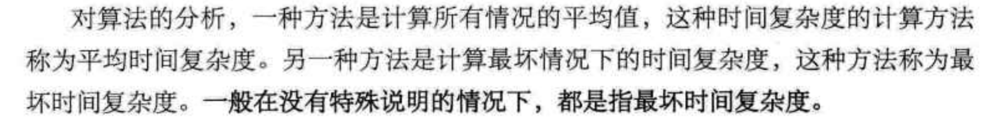
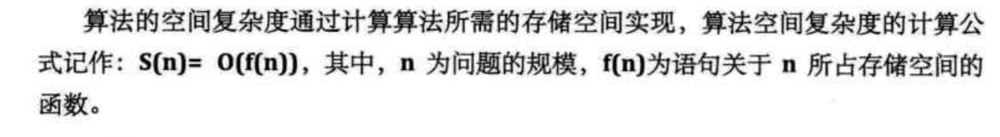

# 一、时间复杂度（Time Complexity）
	- ## 概念
		- 时间复杂度描述的是算法执行所需的时间量级，也就是算法的运行时间与问题规模之间的关系。它告诉我们算法的执行时间随着问题规模的增长而如何变化。
	- ## 表示
		- 时间复杂度通常使用大O表示法（Big O notation）来表示。在大O表示法中，我们关注算法执行时间的增速，忽略常数因子和低阶项。
		- 常见的时间复杂度包括：O(1)、O(log n)、O(n)、O(n log n)、O(n^2) 等。
	- ## 举例
	  collapsed:: true
		- 1、假设有一个数组，要找到数组中是否存在某个元素。如果使用简单的线性搜索算法，在最坏情况下需要遍历整个数组。时间复杂度为O(n)，其中n是数组的大小。
		- 2、如果使用二分查找算法在已排序的数组中查找元素，则每次可以将搜索范围缩小一半。时间复杂度为O(log n)，其中n是数组的大小。
	- ## 指导大O阶方法
	  collapsed:: true
		- 1、 
	- ## 常见的时间复杂度
	  collapsed:: true
		- O(1) ：常数阶
			- 无论代码执行3行，6行O(3)，O(6)都叫常数阶O(1)
		- O(n)：线性阶
			- 关键分析循环结构的运行情况，for循环n次 那么时间复杂度为O(n)
		- O（logn）:对数阶
		  collapsed:: true
			- 
		- O(n²): 平方阶
		  collapsed:: true
			- 示例1：
			  collapsed:: true
				- 
			- 示例2：
				- 
		- 常见阶表
			- 
	- ## 平均和最坏时间复杂度
		- 
- # 二、空间复杂度
	- ## 概念
		- 空间复杂度描述的是算法执行所需的额外空间量级，也就是算法使用的额外内存空间随问题规模增长的趋势。
		- 
	- ## 表示
		- 空间复杂度同样使用大O表示法来表示。它衡量的是算法所需的额外空间与问题规模之间的关系。常见的空间复杂度包括：O(1)、O(n)、O(n^2) 等。
	- ## 举例：
		- 如果需要使用一个与输入规模n无关的固定大小的数组来存储中间结果，那么空间复杂度为O(1)。
		- 如果需要创建一个与输入规模n相关的数组来存储结果，那么空间复杂度为O(n)。
	-