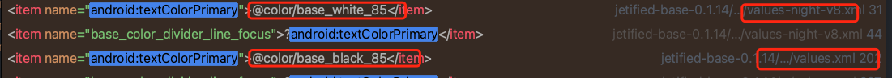
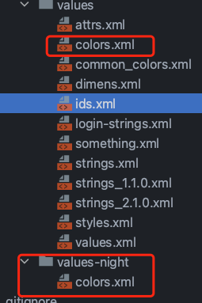
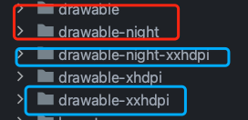
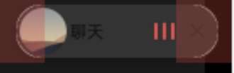

# [官方文档](https://developer.android.com/guide/topics/ui/look-and-feel/darktheme?hl=zh-cn)
- ## 一、字色等适配
  collapsed:: true
	- ### 方式1、使用系统提供字色
		- 
	- ### 方式2、自定义深色颜色
	  collapsed:: true
		- 
		- color的id一致，深暗色 色值不一致
- ## 二、drawable适配
  collapsed:: true
	- 
- ## 三、forceDarkAllowed使用
  collapsed:: true
	- xml 指定view 添加
- ### 4、CardView圆角处，深色模式有白边
	- 表现
	  collapsed:: true
		- 
	- 处理:app:cardBackgroundColor="@color/transparent"
		- ```xml
		  <androidx.cardview.widget.CardView
		          android:layout_width="wrap_content"
		          android:layout_height="wrap_content"
		          android:layout_margin="8dp"
		          app:cardCornerRadius="15dp"
		          app:cardElevation="3dp"
		          app:cardMaxElevation="3dp"
		          app:cardBackgroundColor="@color/transparent">
		  ```