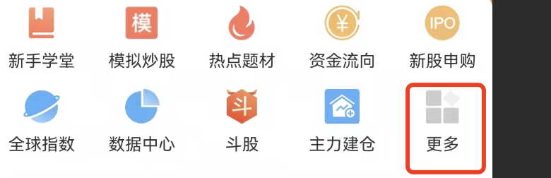
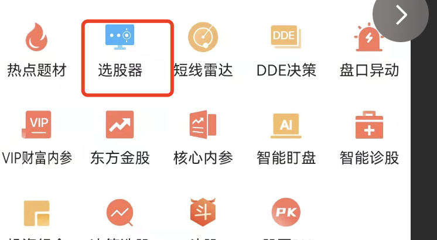
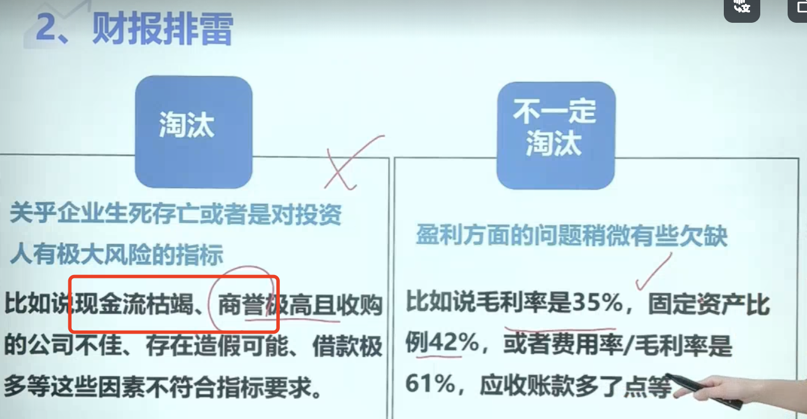
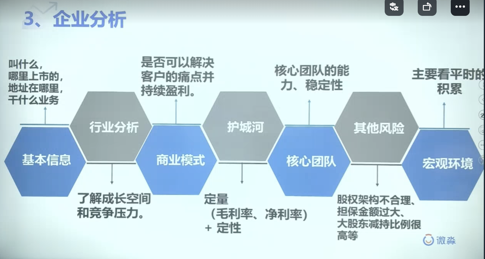
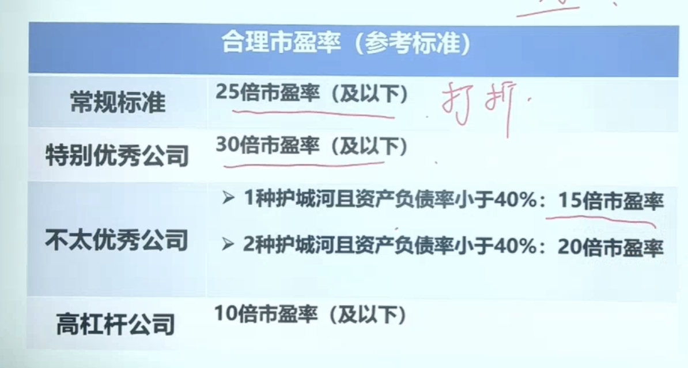
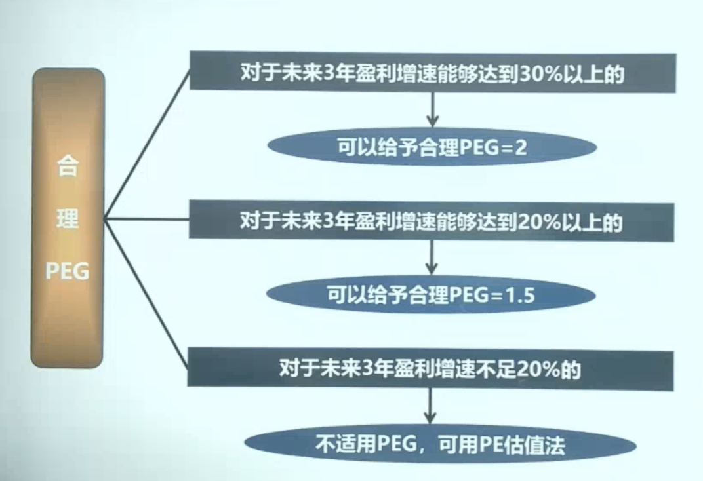
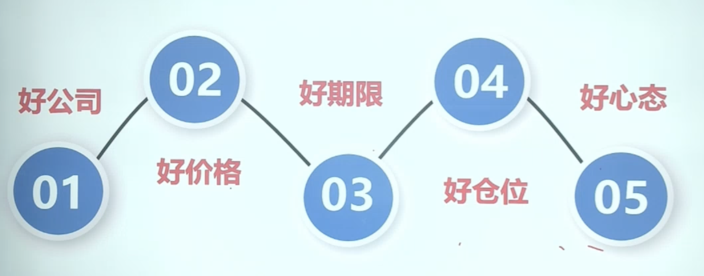
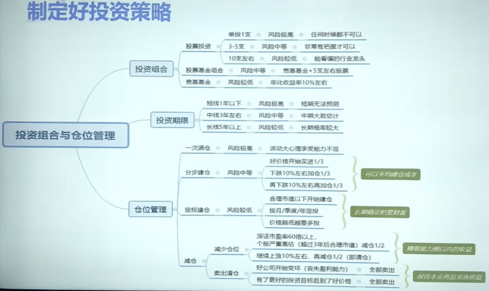

- # 序、正确的投资认知的建立
  collapsed:: true
	- ## 1、认清本质
		- 价格循环往复上涨下跌，买入卖出看时机
		- 低估买入，贵的时候卖出
	- ## 2、控制风险
		- 1、选择优质资产投资
		- 2、好价格买入
	- ## 3、树立标准
		- 制定适合自己的投资标准
	- ## 4、大道至简
		- 好价格买入好公司，长期持有
	-
- # 一、筛选好公司
	- ## 初筛
		- ## 一、[[初筛好公司底层逻辑]]
		- ## 二、方法
			- 方法一：[爱问财](http://www.iwencai.com/stockpick?qs=return_stock)
			  collapsed:: true
				- 年初2-4月份财报还没出的时候，需要用年份控制
					- 2017到2021年，ROE大于15%，净利润现金含量大于80%，上市大于3年
				- 条件1严格的：过去5年ROE大于15%，过去5年净利润现金含量大于80%，连续5年毛利率大于30%，上市满3年
				- 某年的初步筛选五大指标: 2021年ROE>20%,净利润现金比率>100%,资产负债率<60%,毛利率>30%,分红率>30%
				- 全条件：2018年到2022年，ROE大于15%，净利润现金含量大于80%，毛利率大于40%，资产负债率小于60%，近五年股利支付率大于25%，上市满3年
			- 方法二：微淼计算器：
			  collapsed:: true
				- 实现财务自由的财务指标组：
				- ■ 1. ROE>20%
				- ■ 2.净利润现金比率>100%
				- ■ 3.资产负债率<60%
				- ■ 4.毛利率>40%
				- ■ 5.营业利润率>20%
				- ■ 6.营业收入增长率>10%
				- ■ 7.固定资产比率<40%
				- ■ 8.分红率>30%
			- 方法三：武林绝学：看大佬持仓
				- ## 一、大佬策略全把握
					- 法1，http://cwzx.shdjt.com/    看高领资本，“香港中央结算有限公司”代表北上资金
						- 仓位更新慢，只做参考，可以看大幅加仓减仓
					- 法2，微淼，常用工具，仓位在线
				- ## 二、机构动态巧追踪
					- 2-1，看机构调研次数
						- 法1，手机下载APP:"东方财富"
							- 看机构对上市公司的调研次数
								- 首页-》
								- 
								- 策略类，选股器：
								- 
								- 进入创建选股条件页面、消息面选股、
								- 
							-
						- 法2，微淼平台-》常用工具-》机构调研
				- ## 三、看公司被机构的持有数
					- 2-2，看公司机构持股数
						- 方法同上
				- ## 四、接力指数ETF，看股票型指数基金的持仓
				-
				-
	- ## 财报分析-十八步法排雷
	  collapsed:: true
		- 十八步法，满足条件的，[不满足的，不是很重要的可以打折]
		- {:height 346, :width 650}
	- ## 企业分析
	  collapsed:: true
		- 1、行业规模，竞争格局
		- 2、盈利模式
		- 3、护城河 是否大于3
		- 4、核心团队
		- 
	- ## 商业模式分析-十一步法看未来
- # 二、计算合理的估值
  collapsed:: true
	- ## PE估值
	  collapsed:: true
		- 
		-
	- ## PEG 估值法
	  collapsed:: true
		- 
- # 三、制定好[[理财策略]]
  collapsed:: true
	- 
	- 好期限：3-5年
	- 好仓位：3个不同行业+ 指数基金+股票
	- 好心态：
	- 
-