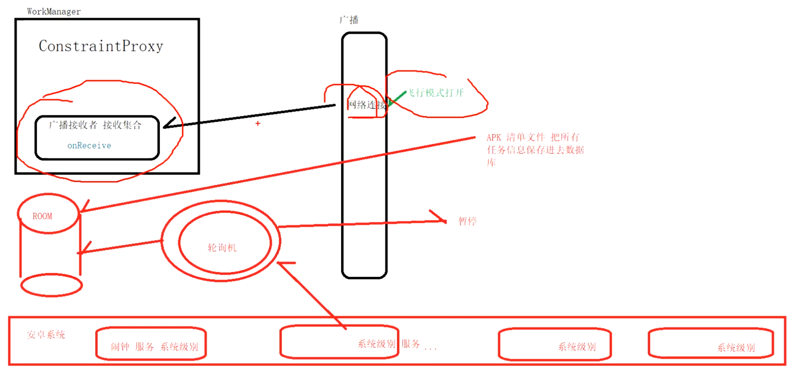

- 
- 1、workManager会自动在apk清单文件注册了很多比如电量，联网广播接受者
- 2、当比如联网，充电等，系统会发出广播。而约束条件代理ConstraintProxy就是个广播接受者.收到广播
- 3、通过ACTION_CONSTRAINTS_CHANGED 启动SystemAlarmService 系统服务，
- 4、在onHandleIntent中进行标记改变ACTION_DELAY_MET。再次执行onHandleIntent
- 5、在对应标记上 执行Processor().startWork，就和无条件执行一样了