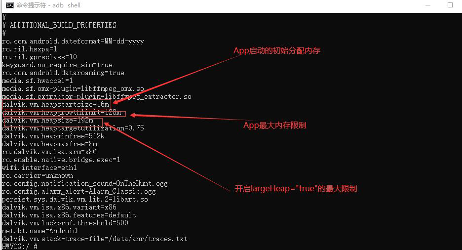
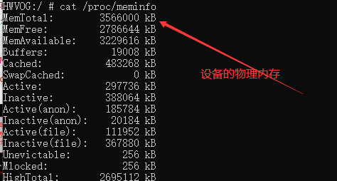

## 1、命令行，这里16M是默认大小
	- ```java
	  adb shell cat /system/build.prop
	  ```
	- 
	- 
- > APP启动初始分配内存16M 最大内存限制128M 开启大内存192M
- 这些只是初始限制，每个手机厂商系统定制不一样。厂商可以修改，应用修改不了
- ## 2、代码获取
	- ```java
	  ActivityManager activityManager =
	  (ActivityManager)context.getSystemService(Context.ACTIVITY_SERVICE)
	  activityManager.getMemoryClass();//以m为单位
	  ```
- ## 3、修改
  collapsed:: true
	- \frameworks\base\core\jni\AndroidRuntime.cpp
		- ```java
		  int AndroidRuntime::startVm(JavaVM** pJavaVM, JNIEnv** pEnv, bool zygote)
		  {
		  /*
		  * The default starting and maximum size of the heap. Larger
		  * values should be specified in a product property override.
		  */
		  parseRuntimeOption("dalvik.vm.heapstartsize", heapstartsizeOptsBuf,
		  "-Xms", "4m");
		  parseRuntimeOption("dalvik.vm.heapsize", heapsizeOptsBuf, "-Xmx",
		  "16m");//修改这里
		  * }
		  ```
	- 修改platform/dalvik/+/eclair-release/vm/Init.c
		- ```java
		  gDvm.heapSizeStart = 2 * 1024 * 1024; // Spec says 16MB; too big for us.
		  gDvm.heapSizeMax = 16 * 1024 * 1024; // Spec says 75% physical mem
		  ```