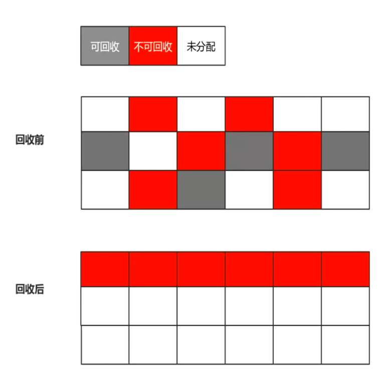

- # 一、算法
	- 首先[[#red]]==**标记出所有需要回收的对象**==，在标记完成后，后续步骤不是直接对可回收对象进行清理，而是[[#red]]==**让所有存活的对象都向一端移动**==，然[[#red]]==**后直接清理掉端边界以外的内存**==。
- # 二、特点
	- 标记整理算法虽然
		- 没有内存碎片，但是
		- 移动对象
		- 引用更新
		- 用户线程暂停
		- [[#red]]==**效率偏低**==。
		- 