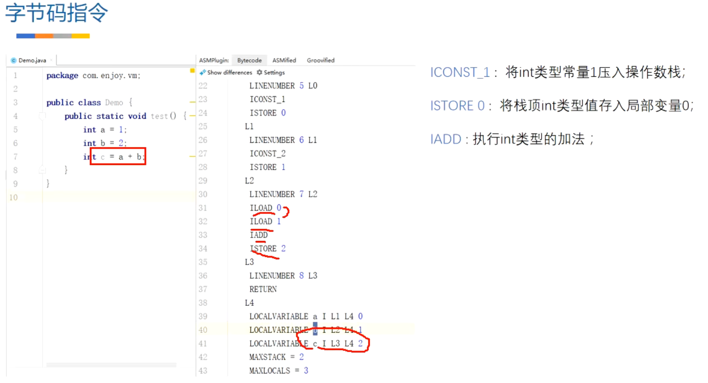
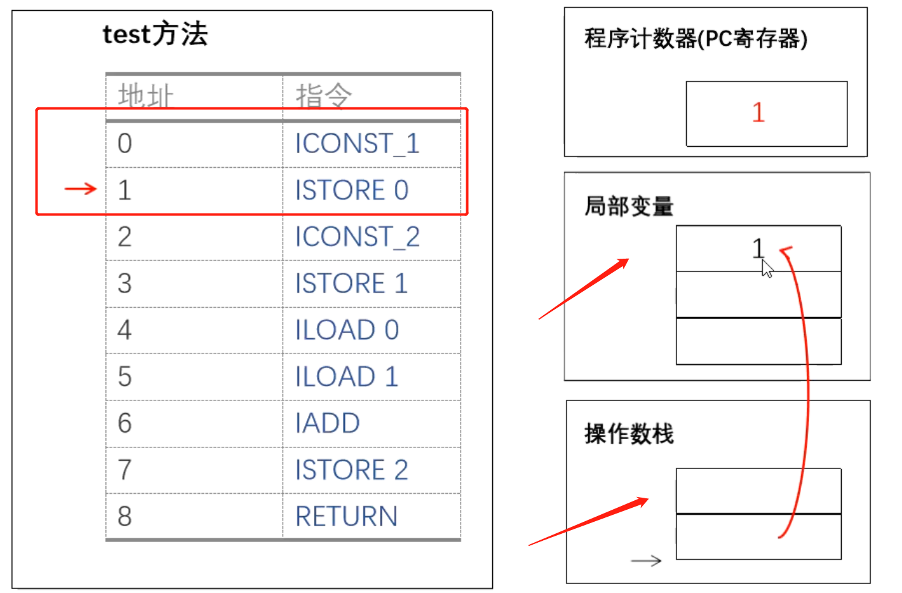
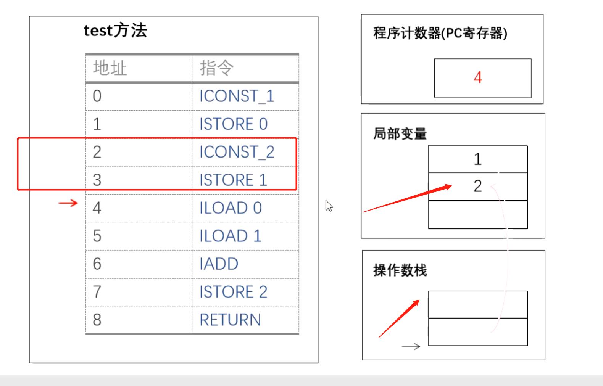
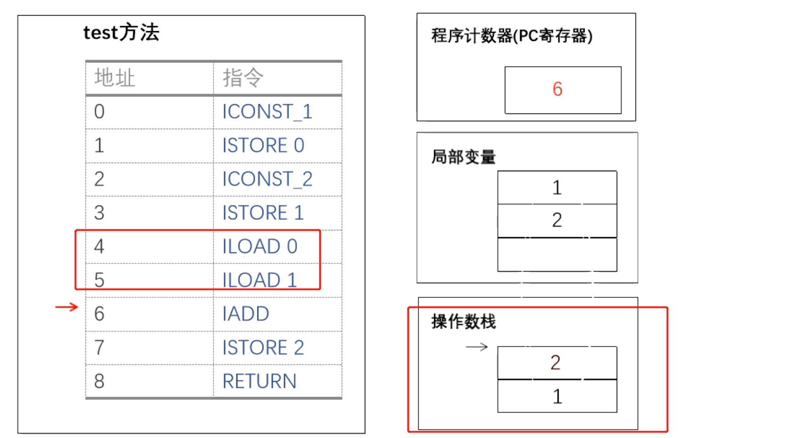
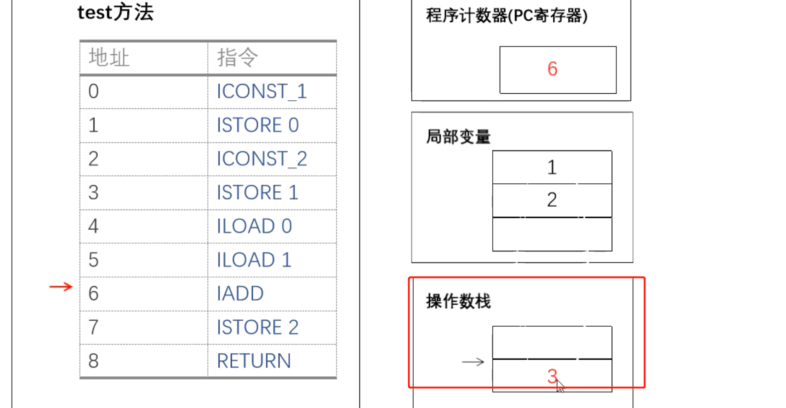
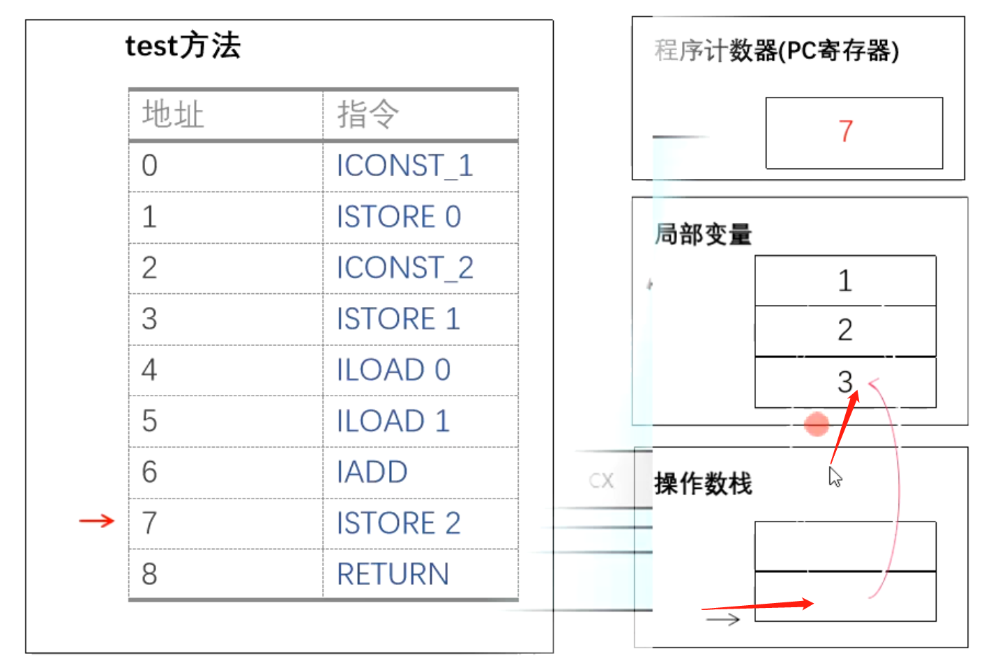

## 一、介绍
	- 1、每一个运行的线程都有一个独立的栈（虚拟机栈）每一个方法调用会多一个栈帧。
	- 2、栈帧包括（局部变量表，操作数栈，动态链接，返回地址）
	- 3、基于栈的虚拟机说的是基于操作数栈，它是通过操作数栈进行所有操作
	- [[#red]]==**总结：**==
		- 执行指令主要涉及局部变量表 和 操作数栈 来回加载
		- 栈式虚拟机在进行真正的运算时都是直接与操作数栈进行交互，也就是说[[#red]]==**不管进行何种操作都要通过操作数栈来进行**==，即使是数据传递这种简单的操作
- ## 二、栈式虚拟机，执行字节码指令流程
  collapsed:: true
	- 
	- ## 1、加载int a = 1 图解
	  collapsed:: true
		- 
		- 首先：[[#red]]==**程序计算器指向0**==位置的字节码指令，开始执行
		- 1、执行ICONST_1:将int类型[[#red]]==**常量1压入操作数栈**== (因为是个局部变量，需要存入局部变量表中）
		- 2、ISTORE_0将栈顶int类型[[#red]]==**存入局部变量表**==0位置上  （L4那局部变量表 a）
	- ## 2、加载int b = 2 图解和1一样
	  collapsed:: true
		- 
	- > 执行a+b,需要从局部变量表加载到 操作数栈 才能进行计算
	- ## 3、执行int c = a+b 线执行ILOAD 0 和1 加载
	  collapsed:: true
		- 1、程序计数器指向 4、5
		- 2、ILOAD 0/1，将局部变量 0和1位置 对应的数字 1和2 加载到 操作数栈
		- 
	- ## 4、执行IADD 把 1和2相加 得3 ，把3存到局部变量表
	  collapsed:: true
		- 1、程序计数器指向 6执行IADD, 得3
		  collapsed:: true
			- 
		- 2、ISTORE2 把 3存入局部变量表的 2位置上
			- 
-