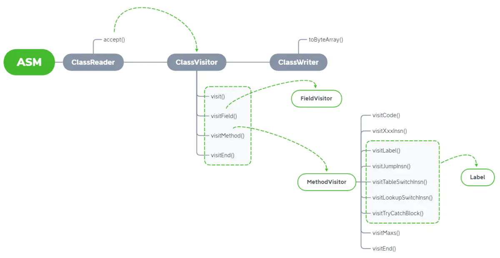

- ## 一、组成
	- Core API包括asm.jar、asm-util.jar和asm-commons.jar
- ## 二、常用的asm.jar 中api(ClassReader,classVisitor,ClassWrite)
  collapsed:: true
	- 我们常用的是asm.jar中的ClassReader,classVisitor,ClassWrite这三个类，他们的关系如下：
	- 
- ## 三、[[ASM-ClassReader]]
-