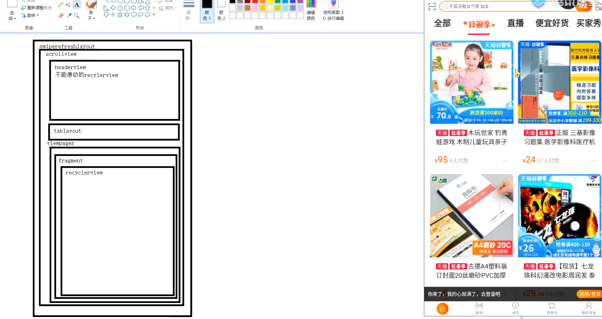

## 背景
	- 
- ## 问题1，ScrollView 嵌套 RecyclerView。滑动recyclerVIew 整体没有动
	- 现象：滑动RecyclerView 只有下边局部滑动
	  collapsed:: true
		- 
	- 原因：不是嵌套滑动组合，将ScrollView换成 NestedScrollView
- ## 问题2,改成上述那个后，可以整体滑动了。但是腰部没有吸顶
	- 问题1：是将滑动事件交给了NestedScrollView.
	- 吸顶问题方案：将tabLayout+RecyclerView 算成ScrollView的最后一个子view。且合起来高度 = 屏幕高度
	  collapsed:: true
		- ```java
		  package com.xiangxue.nestedscroll.c_fixedheight_viewpager_nestedscrollview_recyclerview;
		  
		  import android.content.Context;
		  import android.util.AttributeSet;
		  import android.view.ViewGroup;
		  
		  import androidx.annotation.Nullable;
		  import androidx.core.widget.NestedScrollView;
		  
		  public class NestedScrollLayoutTest extends NestedScrollView {
		      private ViewGroup contentView;
		      public NestedScrollLayoutTest(Context context) {
		          super(context);
		          init();
		      }
		  
		      public NestedScrollLayoutTest(Context context, @Nullable AttributeSet attrs) {
		          super(context, attrs);
		          init();
		      }
		  
		      public NestedScrollLayoutTest(Context context, @Nullable AttributeSet attrs, int defStyleAttr) {
		          super(context, attrs, defStyleAttr);
		          init();
		      }
		  
		      public NestedScrollLayoutTest(Context context, AttributeSet attrs, int defStyleAttr, int defStyleRes) {
		          super(context, attrs, defStyleAttr);
		          init();
		      }
		  
		      private void init() {
		      }
		  
		      @Override
		      protected void onFinishInflate() {
		          super.onFinishInflate();
		          // getChildAt(0) 先拿到 Scrollview里的最外层 LinearLayout
		          // 再拿里边的除去header  以外的tabLayout + 内部的recyclerView
		          contentView = (ViewGroup) ((ViewGroup) getChildAt(0)).getChildAt(1);
		      }
		  
		      @Override
		      protected void onMeasure(int widthMeasureSpec, int heightMeasureSpec) {
		          // 调整contentView的高度为父容器高度，使之填充布局，避免父容器滚动后出现空白
		          super.onMeasure(widthMeasureSpec, heightMeasureSpec);
		          ViewGroup.LayoutParams lp = contentView.getLayoutParams();
		          lp.height = getMeasuredHeight();
		          contentView.setLayoutParams(lp);
		      }
		  }
		  
		  ```
	- 解释：
	  collapsed:: true
		- 先不管recyclerview.以现在的逻辑。tabLayout+recyclerVIew 滑动顶的时候。NestedScroller。肯定是上划不动了。因为对于它来说到底了。造成吸顶效果
		- 
- ## 问题3、NestedView的 header不能滑动，应该嵌套滑动，父子view联动，
	- 思路：滑动开始时，先看父view还可以滑动吗，不可以滑动，子view再滑动
	- 主要是[[嵌套滑动父子view联动]][[嵌套滑动流程图]]
-
-