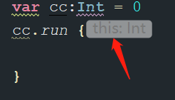

- # 1、T.run()源码及模拟
	- ```kotlin
	  @kotlin.internal.InlineOnly
	  public inline fun <T, R> T.run(block: T.() -> R): R {
	      contract {
	          callsInPlace(block, InvocationKind.EXACTLY_ONCE)
	      }
	      return block()
	  }
	  ```
	- ## 解读
	  collapsed:: true
		- 1、inline 内联函数，直接将内部代码插入到调用的地方
		- 2、<T，R> 定义泛型，对所有类型操作
		- 3、T.run  相当于给所有类型（方法也可以调用）添加扩展高阶函数run
		- 5、T.()相当于给所有类型 添加匿名函数
		- 4、> block 为 传入函数名，类型为匿名函数类型。下边的block()为执行匿名函数
		- 6、R，在表达式里  `block: T.() -> R` 里为 lamda的返回值类型
			- 在整个高阶run函数里，也是整个run的返回值类型
			- > 高阶函数里返回了block()，相当于高阶函数的返回值。就是lamda函数的返回值
	- ## 实际使用，作用域可以获取T的this,返回值为函数的返回值
		- 
	- ## 模拟自定义高阶
	  collapsed:: true
		- ```kotlin
		  // 这个只执行 lamda函数 整体不带返回值
		  fun <万能类型> 万能类型.myRunOk(  mm: 万能类型.() -> Boolean  ) {
		      mm() // 执行高阶
		  }
		  ```
	- ## 模拟1
	  collapsed:: true
		- ```kotlin
		  // TODO m: T.() -> R
		  // T.() == 给T来一个匿名函数
		  fun <T, R> T.myRun(m: T.() -> R) : R  = m()  // 调用高阶函数
		  
		  
		  ```
		- > 1、给所有类型扩展高阶函数myRun
		     2、返回值类型为lamda执行结果类型
- # 2、with源码及模拟
	- ```kotlin
	  @kotlin.internal.InlineOnly
	  public inline fun <T, R> with(receiver: T, block: T.() -> R): R {
	      contract {
	          callsInPlace(block, InvocationKind.EXACTLY_ONCE)
	      }
	      return receiver.block()
	  }
	  ```
	- ## 解读
		- 1、它和上边的不一样不是T.with不是给所有类型添加扩展。只能当函数调用
		- 2、参数 receiver：传入一个泛型T  名为receiver
		- 3、一个lamada高阶函数 block: T.() -> R，无参，返回值 R
		- 4、 T.()给所有类型添加匿名函数，下边才可以通过receiver.block()这样调用
		- 5、整体返回值 为R  通过第一个参数receiver，调用block这个lamda函数返回值执行
		- 所以使用的时候
	- ##
	- ## 实际使用，作用域可以获取T的this,返回值为{}的执行结果推断出来的
		- 