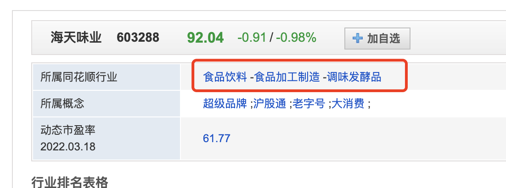
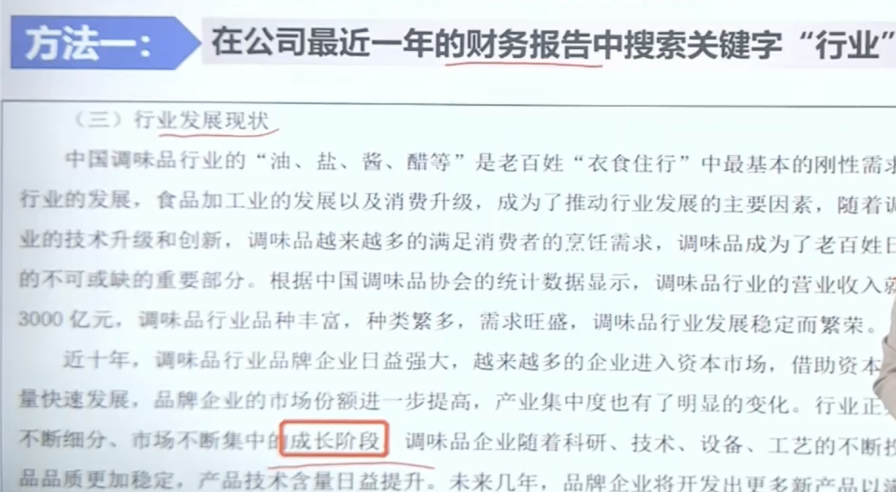

- # 一、海选
	-
- # 二、看选出股所处行业
	- 1、通过[爱问财](http://www.iwencai.com/)  输入海天味业所属行业
		- {:height 250, :width 650}
- # 三、看所属行业发展阶段
	- ## 1、在公司最近一年年报里搜索”行业“ 在行业发展现状中查找
		- 
	- ## 2、很多年报不写的话用:前瞻经济学人App
		- [前瞻经济学人网](https://www.qianzhan.com/analyst/list/220.html) 搜
		-
	-
- # 四、
-