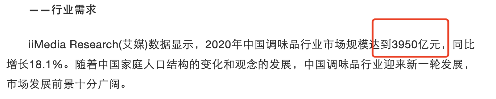

- # 一、海选
	-
- # 二、看选出股所处行业
	- 1、通过[爱问财](http://www.iwencai.com/)  输入海天味业所属行业
		- {:height 250, :width 650}
- # 三、看所属行业发展阶段
  collapsed:: true
	- ## 1、在公司最近一年年报里搜索”行业“ 在行业发展现状中查找
		- 
	- ## 2、很多年报不写的话用:前瞻经济学人App
		- [前瞻经济学人网](https://www.qianzhan.com/analyst/list/220.html) 搜调味品行业发展阶段
		-
	-
- # 四、所属行业市场规模
  collapsed:: true
	- 因为企业的营业收入，不可能超过行业总收入
	- [前瞻经济学人网](https://www.qianzhan.com/analyst/list/220.html) 搜调味品行业发展规模   找出行业总需求 (三级细分 需求超过100亿就可以)
	- 
- # 五、所属行业竞争格局
  collapsed:: true
	- 找出龙头企业
	- [前瞻经济学人网](https://www.qianzhan.com/analyst/list/220.html) 搜调味品行业竞争格局
- # 六、护城河分析(3个以上就比较宽)
  collapsed:: true
	- ## 6-1、高转换成本
	  collapsed:: true
		- 概念：用户因更换其他产品或服务而增加的成本
		- 看是否具备高转化成本： 定量+定性分析
			- 定量分析：
				- 看是否具备高毛利率  >40% 即为高
				- 毛利率看是否排前三
			- 定性分析：如果做饭时，超市没有海天的耗油，是否会买别的，肯定会
	- ## 6-2、品牌优势
	  collapsed:: true
		- 概念：如果企业的品牌产品涨价了，顾客仍然愿意买账，并且忠诚度不下降，说明企业拥有品牌护城河
		- 看是否有品牌优势：看品牌是否有定价权
			- 定性分析：品牌知名度和美誉度 ，知名品牌
			- 定量分析：毛利率 >40% 行业前三
	- ## 6-3、效率优势(规模经济 高规模)
	  collapsed:: true
		- 概念：相比同行业竞争对手有明显的==较低成本，主要来源于规模经济==
		- 判断方法：营业收入、总市值、毛利率 均在行业前三名 萝卜投研APP可以看某个股的行业对比
		-
	- ## 6-4、强网络效应
	  collapsed:: true
		- 一般出现在互联网公司，月活量等，通过线上销售
	- ## 6-5、独特的资源
	  collapsed:: true
		- 独特资源包括：专利、工艺、渠道、牌照、地理位置等
			- 1、判断专利
				- 去年报查找”专利“，”核心竞争力“
			- 2、判断牌照：被国家强管控
				- 烟草、免税、稀土矿产、金融(保险银行)
			- 3、判断工艺
				- 年报搜索==“工艺”==相关的，看是否有介绍
			- 4、判断地理位置，只有那个地理位置才有的
				- 判断：年报搜索“位置”，看是否有介绍
				- 比如茅台
			- 5、渠道
				- 强大的销售渠道
				- 年报搜索“渠道”
		-
	- ## 6-6、文化优势(比较虚，不用太纠结)
	  collapsed:: true
		- 分析方法
			- 1、符合真善美
			- 2、务实有长远的眼光
			- 3、核心竞争力中，“文化”多次出现在年报
-
-